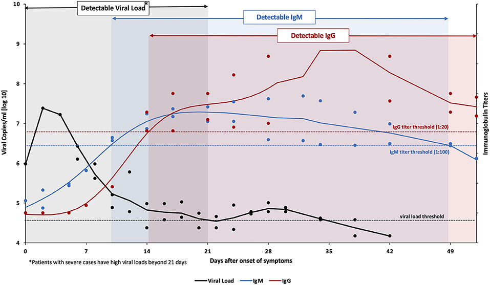
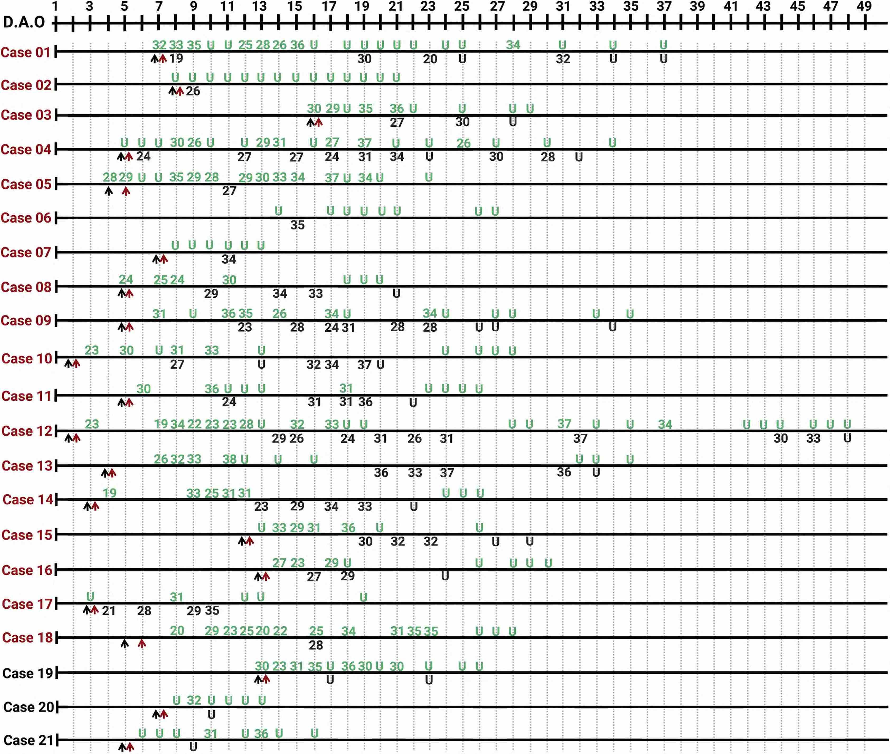
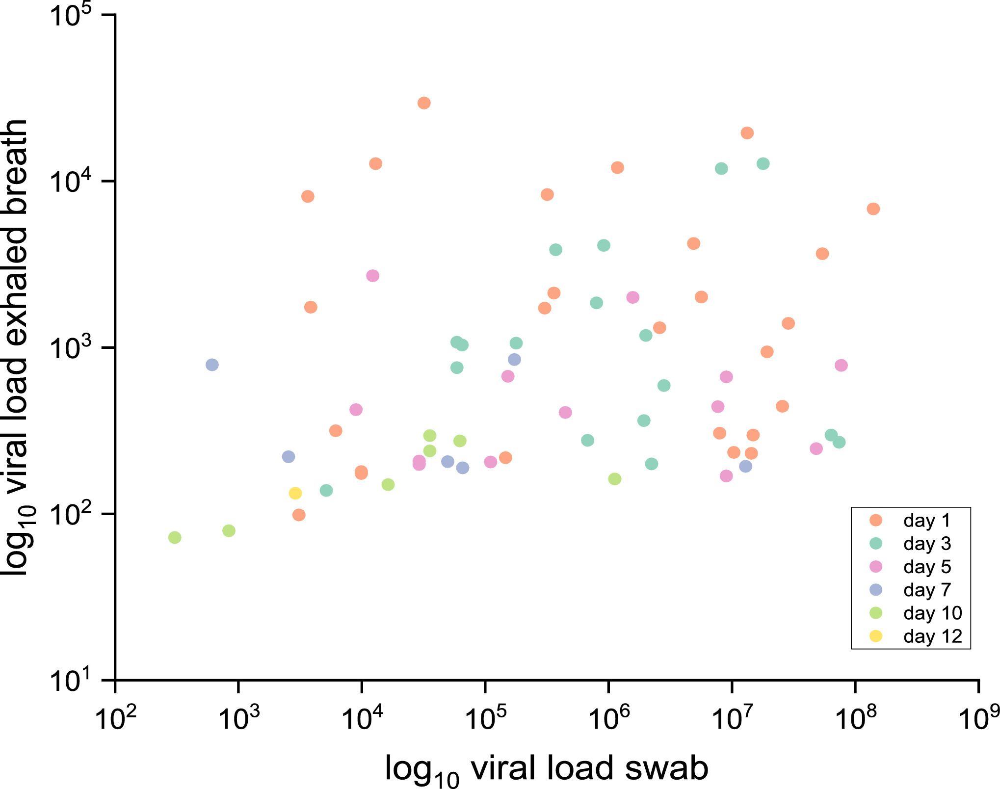
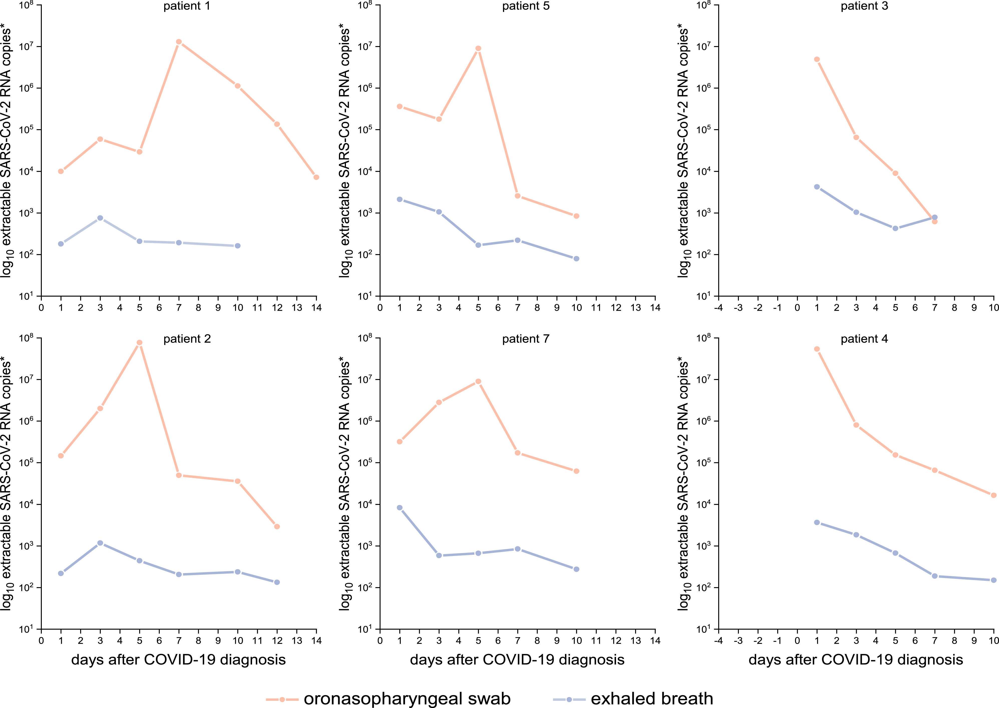
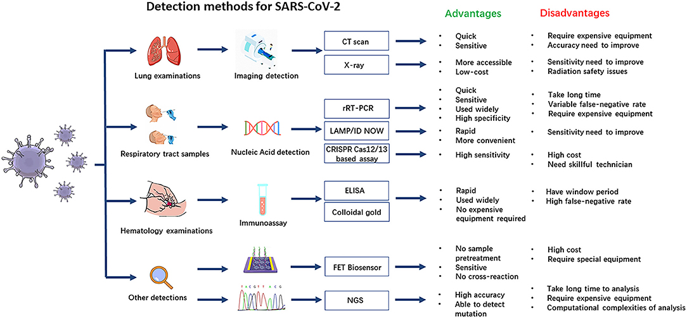

# Diagnosis and Viral Load

Methods and locations to diagnose SARS-CoV-2 infections are discussed. The focus is on the early diagnose of Covid-19 to initiate the right treatment. The significance of viral load for transmission is sketched. 

* [Summary](#summary)
* [Introduction](#introduction)
  * [Introducing Diagnosis](#introducing-diagnosis)
  * [History of Covid-19 Diagnosis](#history-of-covid-19-diagnosis)
  * [Overview Diagnosis Methods](#overview-diagnosis-methods)
  * [Overview Diagnosis Locations](#overview-diagnosis-locations)
* [Methods to directly Detect Viruses](#methods-to-directly-detect-viruses)
  * [Measure Virus Building Blocks](#measure-virus-building-blocks)
  * [Detect Infectious Virions](#detect-infectious-virions)
  * [Detect Metabolism of Viruses](#detect-metabolism-of-viruses)
* [Methods to Indirectly Detect Viruses](#methods-to-indirectly-detect-viruses)
  * [Detect Tissue damage](#detect-tissue-damage)
  * [Detect Immune Response](#detect-immune-response)
* [Diagnosis Suggestions by Goal](#diagnosis-suggestions-by-goal)
* [Introducing Viral Load](#introducing-viral-load)
  * [Locations with Viruses](#locations-with-viruses)
  * [Specimens with Viruses](#specimens-with-viruses)
* [Variation of the Viral Load](#variation-of-the-viral-load)
  * [Variation by Time and Location](#variation-by-time-and-location)
  * [Viral Load in Exhaled Air](#viral-load-in-exhaled-air)
  * [Temporal Variations](#temporal-variations)
* [Diagnosis at Different Locations with a Focus on Viral Load](#diagnosis-at-different-locations-with-a-focus-on-viral-load)
  * [Literature for Viral Load and Diagnosis](#literature-for-viral-load-and-diagnosis)
  * [Detection Rates](#detection-rates)
  * [Diagnosis in the Nose](#diagnosis-in-the-nose)
  * [Diagnosis in the Mouth](#diagnosis-in-the-mouth)
  * [Diagnosis in the Lungs](#diagnosis-in-the-lungs)
  * [Challenges and Biases regarding Viral Load](#challenges-and-biases-regarding-viral-load)
* [Viral Load in Saliva](#viral-load-in-saliva)
  * [Literature on the Viral Load in Saliva](#literature-on-the-viral-load-in-saliva)
  * [Saliva Sampling Methods](#saliva-sampling-methods)
  * [Notes on Saliva Tests](#notes-on-saliva-tests)
* [Refs on Diagnosis](#refs-on-diagnosis)
  * [Refs Overview of Covid-19 Diagnosis](#refs-overview-of-covid-19-diagnosis)
  * [Refs Diagnosis in different Situations](#refs-diagnosis-in-different-situations)
  * [Refs Antigen Tests](#refs-antigen-tests)
* [Refs on Viral Load](#refs-on-viral-load)
  * [Time Series Viral Load in URT and LRT Samples](#time-series-viral-load-in-urt-and-lrt-samples)
  * [Viral Load Series in URT](#viral-load-series-in-urt)
  * [Viral Load in URT and LRT Samples](#viral-load-in-urt-and-lrt-samples)
  * [Viral Load in Sputum](#viral-load-in-sputum)
  * [Refs Viral Load in BALF](#refs-viral-load-in-balf)
  * [Viral Load in URT](#viral-load-in-urt)
  * [Refs Viral Load in URT Review](#refs-viral-load-in-urt-review)
  * [Refs NPA Respiratory Viruses](#refs-npa-respiratory-viruses)
  * [Refs Viral Load in Saliva compared to NPA/NPS Respiratory Viruses](#refs-viral-load-in-saliva-compared-to-npanps-respiratory-viruses)
  * [Refs Viral Load in Saliva compared to NPS](#refs-viral-load-in-saliva-compared-to-nps)
  * [Refs RNA Stability for PCR](#refs-rna-stability-for-pcr)
  * [Refs Time Series of Viral Load in URT Samples](#refs-time-series-of-viral-load-in-urt-samples)
  * [Timing Specimen Collection](#timing-specimen-collection)
  * [Refs References Viral Load and Infectivity](#refs-references-viral-load-and-infectivity)
* [Appendix](#appendix)
  * [Specimen Collection](#specimen-collection)

## Summary
Different methods to diagnose a SARS-CoV-2 infection are discussed. A focus is on methods measuring the amount of viruses (viral load) at different locations. For this reason the topics diagnosis and viral load are discussed in the same chapter.

_Diagnosis Methods:_
There are different methods to diagnose a coronavirus infection:
* Detect the viruses directly. The presence of virus building blocks is detected/measured by antigen test or PCR tests ([viral load](#viral-load)). Detecting SARS-CoV-2 virus parts is highly specific to diagnose Covid-19. PCR tests quantify number of virus genomes per milliliter of specimen. Antigen tests usually just tell if there are virus proteins present. For both test methods a certain amount viruses needs to present for a positive test result. 
* Virus infections can cause cell or tissue changes and sometimes damage. Tissue changes in the lungs can be detected by X-ray images. In the upper respiratory tract coronaviruses usually don't cause visible changes.
* Detect an immune response to SARS-CoV-2. Antibodies is the immune response most easily detectable and most antibodies elicited are specific for SARS-CoV-2. 
* Detect typical symptoms which may occur as part of a SARS-CoV-2 infection.

_Diagnosis Locations and Specimen Types:_
SARS-CoV-2 infects the upper respiratory tract (nose, mouth, throat) and the lower respiratory tract (bronchi, lungs). Each location can have a different amount of viruses and at each location the amount of viruses varies during the disease. The viruses detection methods (e.g. PCR or antigen tests) detect viruses only above a certain amount (usually a couple of thousands viruses per milliliter of specimen. So according to the varying amount of viruses, the sensitivity (detection rate) is dependent on the sampling location, the sampling timing, the sampling method and the infected locations of the patient.
When the viral load peaks - for symptomatic infections, usually shortly after the symptom onset - the detection rate is highest. When the viral load is highest the detection rate by NPS/morning saliva reach detections rates above 90%. 

The relative values tend to be generally valid (new virus variants can induce small changes however). The absolute values are during the entire disease course. As noted shortly after symptom onset when the viral loads are highest the detection rates are higher. Additionally the higher viral loads are reported for the delta variant, so the absolute sensitivities can further increase.
* The standard method NPS analyzed by PCR has a detection rate of about  50 - 70 % across infections and the results can vary from sample to sample and day to day. //The detection is rate is higher for symptomatic infections shortly after symptom onset reaching values above 90%.
* Morning before eat saliva analyzed by PCR has a higher detection rate than NPS in the first days of symptom onset (about 10% higher, so 60% - 80%). The viral load, and thus the detection rate, is reduced if the salivary flow is increased (e.g. eating or chewing gums).
* Morning sputum and nasopharyngeal aspirate have high viral load and good detection rates. 
* The viral load in the sputum and in saliva indicates the disease progression (high viral low -> unfavorable prognosis). The viral load in NPS samples is not an indicator in the case of hospitalized patients.

_Assessment of Methods:_
* _Saliva_: Repeated morning or at least before eat saliva specimens yield reliable viral loads which even predict the course of the disease. Before eat saliva has shown is effectiveness in the surveillance system in Hong Kong. Sputum helps to diagnose lower respiratory tract infections and the viral load is a predictor for the prognosis. 
* _NPS_: The standard methods nasopharyngeal swabs (NPS) has a slightly lower detection rate than morning saliva.
* _NPA_: Nasopharyngeal aspirate has a good detection rate but is not so easy to sample. 
* _Tissue changes in the lungs:_ XRay/CTs of the lungs work to detect lung infections causing tissue damage (possible super spreaders) but there's radiation.

Which method is adequate depends on the purpose of the diagnosis. 
* _To initiate optimal treatment:_ This is the classical use case of diagnosis: determine the pathogen causing a disease to initiate an optimal treatment. Symptoms are useful and they also give hints which location in the respiratory tract is infected. To confirm the presence and determine the extent of a SARS-2 infection early morning saliva and possibly sputum analyzed by PCR are recommended. Saliva test are also adequate for screening to start treatments ahead of symptoms.
* _To determine infectivity:_ Antigen tests by nose or throat swabs combined with symptoms likely are suitable to detect highly infectious individuals, which carry the spread of severe Covid.
* _Community prevalence of Covid-19:_ Saliva and nose swabs analyzed with (pooled) PCR tests or antigen tests.
* Asymptomatic infections in the healthy are usually not detected due to absence of health effects and very low viral loads. Such infections rarely transmit and are discussed in the [virome of the respiratory tract](../5_epidemiological/virome.md) chapter.

_To keep in mind_: 
The viral load and the immune responses depend on the infection location, infection severity and the individual immune systems. Therefore there's no all catching diagnose location or method. For example, not to every infection in the upper respiratory tract the body responds with serum antibodies. On the other hand a lower respiratory tract infection one can be infectious and the infection induces an antibody response, but a single virus test in the upper respiratory tract can be negative.

## Introduction

### Introducing Diagnosis
A defined in the [Covid-19 chapter](../3_medical/covid19.md) a [disease](../3_medical/covid19.md#disease) is a disordering of the body which can be caused by pathogens. 
* Possible disordering/damage caused (e.g. tissue damage) and possible induced immune responses can be inspected and indicate indirectly a virus infection (section [Methods to Indirectly Detect Viruses](#methods-to-indirectly-detect-viruses)). 
* If there is tissue damage or many cells get damaged, the body usually initiates an immune response which causes symptoms. 
* For a virus disease, the cause (the viruses) can be detected directly section [Methods to Directly Detect Viruses](#methods-to-directly-detect-viruses)). With the latter method also infections which don't cause a disease can be detected.

> ###### Diagnosis
> Diagnosis comes from dia ‘apart’ + gignōskein ‘recognize, know’ (British English Thesaurus). Diagnose an illness is to figure out the causes i.e. determine which disease causes the illness. 

### History of Covid-19 Diagnosis
* In late 2019 and January 2020 Covid-19 was mostly diagnosed based on lung CT findings and sometime on virus culture since PCR/antigen was not yet available.
* In February 2020 PCR tests became more widely available and both specimens from the lower respiratory tract such as BALF or sputum and the upper respiratory tract were used. With these methods not only a disease but also asymptomatic infections are diagnosed.
* From February/March 2020 to December 2020 the standard SARS-CoV-2 tests are nasopharyngeal swabs in most locations of the world. The viral load is detected either by [PCR-Test](#pcr-test) or [Antigen-Tests](#antigen-test).

  > In early 2020, PCR test were scarce and antigen tests not available so the work for BALF/sputum sampling was not the bottleneck. In the next months PCR test became more widely available but still limited, nasopharyngeal swabs were used: NPS sampling was doable since testing capacity was still limited. Then one just kept on doing NPS even though there have been early studies pointing to the benefits of other methods such as self collected saliva. 
* Late 2020 antigen tests are getting more common.
* 2021? Alternate Locations? An overview is given in the section [Diagnosis Locations](#overview-diagnosis-locations) and a section considers [saliva based diagnosis](#viral-load-in-saliva).

### Overview Diagnosis Methods

* [Directly Detect Viruses](#directly-detect-viruses)
  * [Measure Virus Building Blocks](#measure-virus-building-blocks): The viral RNA is measured by PCR tests and the viral proteins are detected by antigen tests.
  * [Detect Infectious Virions](#detect-infectious-virions): Infecting virions can be measured by tissue or cell cultures tests. However this is tricky since coronavirus can be picky which cells they infect. This may even depend on the originating cell and tissue.
  * [Detect Metabolism of Viruses](#detect-metabolism-of-viruses):Detect subgenomic RNAs or proteins not built into virions. // The cell needs to release those which happens when the cell membrane is breached, which can happen on cell death. In the case of orderly cell death RNAs are often degraded. [to confirm and cite]
* [Methods to Indirectly Detect Viruses](#methods-to-indirectly-detect-viruses)
  * [Detect Tissue damage](#detect-tissue-damage): In the upper respiratory tract, tissue damage is hardly above the (visual) detection level. In the lower respiratory tract there's much more tissue damage and it can be even observed by X-ray or multiple x-ray images to construct a CT image.
  * [Detect Immune Response](#detect-immune-response): The immune system is sensible at detecting strange things going on. Once it detects cells inducing apoptosis and tissue damage, the immune system tries to figure out the causal agents and initiates immune responses. Against coronavirus infection this response includes antibodies which can be detected, however the immune system needs some days to produce antibodies in detectable amounts.

### Overview Diagnosis Locations
SARS-CoV-2 infections can diagnosed at the different locations they infect: [Diagnosis at Different Locations with a Focus on Viral Load](#diagnosis-at-different-locations-with-a-focus-on-viral-load). Important and frequently infected locations are:
* [Diagnosis in the Nose](#diagnosis-in-the-nose)
* [Diagnosis in the Mouth](#diagnosis-in-the-mouth)
* [Diagnosis in the Lungs](#diagnosis-in-the-lungs)

## Methods to directly Detect Viruses

### Measure Virus Building Blocks

In tissues containing infected cells or in the lining fluids protecting/cleaning these tissues the viral load can be measured by detecting building blocks of virions. The presence of such building blocks in detectable amounts indicate a current or recent virus infection; in the case of a recent infection, there are not necessarily infectious virions around i.e. the viruses are already defeated and there are just parts of viruses around. 

#### Genome Detection
Test for specific sequences in the genome of virions (positive single stranded RNA for coronaviruses). The amount of virions (called [viral load](#viral-load)) - can be determined with high specificity and sensitivity.

> ###### PCR Test
> A *PCR test* is a method to detect specific sequences of RNA or DNA. PCR doubles specific DNA/RNA strands in cycles called CT cycles. The concentration of the DNA/RNA doubles each round, at some point it gets high enough to be detected by some helper method e.g. by optical fluorescence. The doubling cycles needed are called CT values.

##### From CT-value to Concentration
The PCR method approximately doubles pieces of viral RNA present in cycles, until detectable by the helper method. To calculate to original viral load, one needs to undo the doubling-cycles. Thus a difference of 10 CT-cycles roughly corresponds to an amplification of 2^10=1024. Thus 10 additional CT cycles are needed, when the starting viral load was 1024 times smaller ([Calculation](./pcr_diagnosis.md#calculation-of-viral-load-from-ct_value) in the [PCR chapter](./pcr_diagnosis.md)).

##### PCR Detection Limit
In theory a single sequence of RNA/DNA can be amplified. Practically PCR apparatuses have a detection limit. Often this is in the order of a few thousand copies per milliliter. This corresponds to a maximal PCR cycle number (often 40) as discussed in the chapter [PCR diagnosis](pcr_diagnosis.md). 

#### Protein Detection
Methods detecting proteins of virions are usually called antigen tests (virus proteins are called antigens since these proteins can be recognized by the immune system as harmful).

> ###### Antigen Test
> Proteins have specific binding patterns to other proteins. This is used by vertebrates to produces specific proteins (called antibodies) which bind to foreign/unwanted proteins (called antigens). Antigen tests work similarly by detecting specific proteins of SARS-CoV-2 (antigens) and are therefore part of immune tests. How antigen test work is discussed in the chapter [Immuno Assays](immuno_assyas.md).

The sensitivity and specificity of antigen tests tend to be lower than PCR based tests. There are many different products of antigen tests which vary a lot in sensitivity and specificity. Specifically for the Roche SARS-CoV-2 rapid antigen test [Salvagno et al](#salvagno) find, that this test gives a positive result for nearly all samples below 30 PCR cycles. In numbers, the sensitivity is about 90% for less than 30 PCR cycles. The PCR test is done for 3 different genes: the E gene, the RdRP gene and the N gene whereas always the same antigen test (from Roche) is used. The PCR test results vary across the genes. The rapid antigen test agrees best with the PCR test for the RdRP gene (shown the middle).

)

### Detect Infectious Virions
[in work: to be checked and incomplete]
Samples, which possibly contain virions, can be put on cell or organ cultures. These cell or organ cultures then can be inspected e.g. by cell damage (cytophatic effects), by detecting tissue change/damage or detecting RNA to see whether and how much the viral load increased. Virus and especially coronavirus culturing is tricky and often requires strict lab security measures, therefore for routine diagnosis virus culturing is not suitable. However virus culturing is very useful for research purposes: e.g. to detect whether and how long infected individuals shed infectious virions. 

##### Cell Cultures
Cell cultures are cells of an organism which are grown and kept alive in laboratory settings. 
* Usually a single cell type is used.
* Usually cells from immortal cell line are used.

##### Organ Cultures
Coronaviruses often have a well defined tropism and infect only certain cell in the right environment ([Coronavirus behavior](../2_biological/coronavirus.md#behaviors-of-coronaviruses))

##### Plague Assays
Plague assays is a method to determine to amount of infectious virions. The samples can be diluted to the point, new virus colonies originating from a single virion can be distinguished on cell or organ cultures (practically always used with cell cultures). The number of virions in the dilution is then equal to the number of colonies.

### Detect Metabolism of Viruses
Coronaviruses produce temporary RNA similar to mRNA of DNA based life forms. This temporary RNA can be detected by [PCR-Tests](#pcr-test). The temporary RNA is *not* packaged into virions and therefore is degraded quickly. Because of the fast degradation, detection of temporary RNA means there are viruses with a running metabolism.

## Methods to Indirectly Detect Viruses

### Detect Tissue damage
Detecting tissue damage is not very specific since other diseases e.g. other virus infections cause similar tissue damage.

#### Biochemical 
E.g. detecting cell damage through cell decay products. This is useful in combination with other methods: If at a location, many SARS-2 viruses are detected combined with above average cell decay products then SARS-2 likely replicates at this location.

#### Optical 
[in work]
E.g. CT (quite sensitive to detect lung changes but high radiation to sensible locations upon a lung CT) or Xray (less radiation but also less accurate than CT): round glassy occupancies in the lung are characteristic for Covid-19 involving the lungs. Other (viral) lung infections look similar so usually used to determine the lung involvement upon a positive virus test. Determine the exact virus is not always necessary:
* Regarding Treatment: Many respiratory virus infections are treated similarly. 
* When SARS-CoV-2 is the most prevalent pneumonia causing agent, the probability for SARS-CoV-2 as the causing agent is high.

### Detect Immune Response

#### Antibody Test
For infections triggering certain alarms, the immune response involves antibodies which can be detected in the blood or in the respiratory tract fluids. Antibodies are detected by [immunological methods](immuno_assyas.md). By "tradition" antibodies are measured in the serum of the blood.

> ###### Serology
> Methods analyzing the blood serum are called *serology*. Antibody detection is referred as serological (Covid) tests. 

However antibodies are also in secreted body fluids such as the mucus. In the mucus mainly antibodies of the class IgA are secreted.

The types of antibodies not only vary by location but also by time: Different classes of antibodies are produced at different stages during and after an infection e.g. IgM and IgG. Only infections in later stages and past infections can be diagnosed by this method since the viruses need first to replicate to high enough titers to trigger an immune response involving antibodies and then a couple of days are needed to produce a detectable amount of antibodies.

The following graphics from [Habli et al](#habli) shows a representative course of the detection by IgM, IgG and Viral Load:

## Diagnosis Suggestions by Goal
> partly subjective

The optimal diagnosis method depends on the purpose of diagnosis (also addressed also in [Mina and Anderson](#mina)):
* Diagnosis of individuals at risk for severe Covid: Multiple early morning salvia. Optionally upon infection, the lower respiratory tract involvement can be diagnosed with sputum  or x-ray. Possibly CT (for patients at high risk and of high age) to check lung involvement.

_Scientific analyses:_
  * Epidemiological analysis e.g. to determine spread patterns: Ideally a combination of methods including saliva, NPS swabs and symptoms to detect acute infections and serology for past infections. 
  * Medical analyses to assess the effectiveness of treatment methods and prevention methods: Same as epidemiological analyses and additionally sputum and exhaled aerosol are also very helpful at least in sub samples.

  > Test for cohort testing and community studies are also discussed in the chapter [individual susceptibility and transmission](../5_epidemiological/individual_susceptibility_and_transmission.md).

_Routine Screening:_
* Routine screening of health/care home personal: Twice per week early morning saliva analyzed with pooled PCR.
* Household samples to have an overview: PCR or antigen.
* Airplane personal: saliva antigen tests. Travellers too if hospitalizations rates are high.

_Routine Screening when hospitalization rates are high:_
* Routine screening of personal in public settings such as supermarkets/public offices: Early morning saliva combined with do it yourself antigen tests once a week during moderate to high incidence of hospitalized cases. Confirmation with PCR.
* Companies, Educational Settings: Pooled saliva to have an overview. 
  
  > Quarantine should be waved for children since children rarely transmit SARS-CoV-2 and quarantine can be especially hard for them and quarantine can contribute to long Covid & possibly to PIMS.

## Introducing Viral Load 

> ##### Viral Load
> The *viral load* denotes how many viruses are present in specimen of tissue or body fluid.

The viral load is measured by the [methods to directly detect viruses](#methods-to-directly-detect-viruses). Mostly PCR is used.

#### Relevance of Viral Load
Knowing the viral load observed in different fluids and tissues is relevant for:
* __Diagnosis__: The temporal development and the locations with viral load help to predict the prognosis and to initiate optimal treatments.
* __Transmission__: Knowing the viral load in different locations helps to understand and prevent transmissions of SARS-CoV-2 virions. In theory a viral load 1000 times higher can increase transmission a 1000 fold.
* __Understanding Covid-19__: Knowing at which stages which locations are infected helps to understand the pathogenesis.

### Locations with Viruses
A viral load can be observed at a specific location for the following reasons:
* __Primary infection locations__: the viruses replicate to high numbers and spread to other locations inside the organism and other organisms. Mainly the conducting airways and in severe cases also the alveoli in the lungs. The relevance of oral infections (e.g. salivary glands) is unclear.
* __Minor infection locations__: Deposited virions can infect local cells and thus the viral load is amplified. However these locations play only a minor role in the disease and transmission of the viruses. In the nose and the mouth are susceptible cells amplifying the viral load.
* __Deposit only locations__: Virions are deposited but do *not* replicate: They are either inactivated or there are no susceptible cells. E.g. fluids from the respiratory tract are cleared towards the stomach where the virions are destroyed by the stomach acid. Therefore in the stomach, respiratory parasites can be detected but usually they do not infect the stomach. Often the viral load in deposit only location is not detectable.

### Specimens with Viruses
Since coronaviruses including SARS-CoV-2 mostly release their virions on the apical side, the virions end up on the apical surfaces. The apical surfaces can be either sampled directly with swabs or aspirates of washing or covering fluids can be taken ([Specimen Collection](#specimen-collection).
* __Viral Load on Tissue Surfaces:__ Coronaviruses usually release their virions on the apical side of cells in epithelium tissues ([ Cell Orientation](../2_biological/coronavirus.md#respiratory-tract-tropism)). If the tissue surfaces are not naturally covered by collectable fluids, the surfaces can be washed with an appropriate fluid and collected by aspiration.
* __Viral Load in Body Fluids__
  Fluid specimens can be collected either by [swabs](#swab) or by [aspiration](#aspirate).
  Body fluids can contain viruses since
  * Body fluids cover tissues of virus replication
  * Viruses can be transported to the body fluids. E.g. exhaled virions get deposited to the respiratory tract lining fluids. 
  * Body fluids often contain cells supporting virus replication. Macrophages are susceptible to SARS-2 replication and are present in some body fluids. Even though the blood contain macrophages, SARS-2 replication rarely occurs in the blood since there are strong immune mechanisms.
* __Viral Load in Tissues__ Tissues biopsies/autopsies show the replication of viruses inside tissues and organs and how much the viruses penetrate to tissues. 

## Variation of the Viral Load

### Variation by Time and Location
The viral load varies both across the different locations and across time. The graphics by [Yang et al](#summary-yang) visualizes how the viral load changes from day to day and varies between URT and LRT samples (URT in green, LRT in black; black arrow: hospital admission, red arrow: anti viral treatment started; severe cases in red and mild cases in black):

### Viral Load in Exhaled Air

How many virions are at the different locations in the respiratory tract and how much particulates are exhaled from each location determine the amount of virions exhaled. The virus exhaled are mostly from the conducting airways or the lungs but not from the nose. 

`Infectiousness = amount of exhaled particles * viral load at the source of the particles`

The exhaled aerosol mostly originates from the lower respiratory tract. URI specimens usually do *not* correlate well with the amount of exhaled aerosol:

[Malik et al](#summary-malik) observe for patients hospitalized with Covid nearly no correlation between the viral load in NPS specimens and in exhaled breath:

In the case of symptomatic influenza infections, the viral load in the nose does not well predict the of exhaled infectious aerosol as shown by [Yan et al](../5_epidemiological/transmission.md#summary-yan-2018)). Also it is observed that vaccination increases the amount of exhaled infectious aerosol for symptomatic influenza A infections (across influenza A and B the viral load in NPS samples and course aerosol didn't change much).

Sputum is from the lower airways and may better predict the exhaled aerosol than NPS. Early morning saliva samples (as sputum) predict the disease progression, which likely corresponds to the viral load in the lower airways.

### Temporal Variations
The metabolisms of organism vary across situation/activities performed. Many metabolic functions follow also a daily=circadian (circa = about, dies=day) cycle. The fluids used for disease diagnosis often have a daily cycle e.g. sputum and saliva.

#### Saliva Collection Timing
The saliva is secreted from different glands in the mouth. How much each of these glands secrets depends on activities such as sleeping or eating (very readable described in [Dawes](#summary-dawes)). The saliva flow rate, location and source give rise to different micro-habitats for bacteria and viruses. 
* [Carlson-Jones et al](#carlson-jones) investigated these habitats with flow cytometry and observe that both  virus like particles and bacteria concentrations peak in the morning after sleep.
* A morning peak is also observed for the SARS-CoV-2 viral load as observed by [Hung et al](#summary-hung).

#### Temporal NPS Variations
[Malik et al](#summary-malik) observed quite some variation for NPS samples whereas exhaled breath samples are more stable:

## Diagnosis at Different Locations with a Focus on Viral Load
SARS-CoV-2 can infect different compartments in the respiratory tract. Depending on the infection pathway and the individual susceptibility at the different locations, the infection severity varies for the different locations vary: E.g. for children usually the upper respiratory tract or the conducting airways are infected while for adults infections of all compartments in the respiratory tract are possible. 

* *Upper Respiratory Tract:* For accessibility reasons investigating the upper respiratory is preferred. The viruses cause few (detectable) tissue damage. Sensitive virus detection methods such as PCR test/Antigen tests are able to detect viruses in the URT e.g. in nose mucus or saliva.
* *Lower Respiratory Tract:* The largest number of susceptible cells to SARS-CoV-2 are in the lower respiratory tract. 
  * Tissue damage can be observed there by imaging (CT/Xray).
  * The viral load can be estimated by analyzing sputum, endotracheal aspirate or bronchoalveolar lavage. To some extent back of throat early morning saliva works too (since the lower respiratory tract fluids are cleared via the laryngopharynx towards the stomach. In lying positions these fluids can flow up to the back of the throat).

### Literature for Viral Load and Diagnosis
* A recommended review for the viral load in upper respiratory tract specimens is [Lee et al](#summarized-review-lee).
* [Yang et al](#summary-yang) investigated the viral load across locations the respiratory tract.

### Detection Rates
Sensitivity of Different Specimens freely estimated (if no direct data are available then the specimen is estimated from differences to known specimens. E.g. Nasal Swabs have about 10% lower detection rates than NPS so a rounded value of 0.9 * NPS rate is taken). In first week of a SARS-CoV-2 disease with severe or with mild symptoms. 

> The absolute viral loads vary according during the seasons, the variants present and there's even evidence that the precaution measures in place influence the viral load (argumentation in planned). Very high viral loads are nearly always detected while viral loads towards the detection limit of a the given test method have a certain probability to give a negative test. Accordingly the sensitivities are very high when the distribution of the viral is centered at high values and the sensitivity decreases when low viral loads are excepted. Thus the following values are mostly valid as relative values, the absolute percentages given can vary however (e.g. the detection rate by NPS samples shortly after symptom onset reach values above 90% in many situations). 

Severe  | Mild  | Specimen
--|--|--
65      | 50    | [oropharyngeal](#oropharyngeal-swabs)
85      | 70    | [morning saliva](#saliva-sampling-methods)
70      | 50    | [saliva](#saliva-sampling-methods)
75      | 60    | [NPS](#nasopharyngeal-swabs) 
65      | 50    | [Nasal Swab](#nasal-swab)
90      | 80    | [sputum](#sputum)
90      | 30    | [BALF](#balf)
75      | 25    | [Lung XRay](#xray-imaging) 

Sources: Mainly the [recommended literature](#literature-for-viral-load-and-diagnosis) above but also from other [summarized references](#summarized-references).

### Diagnosis in the Nose

#### Nasopharyngeal Swabs
Nasopharyngeal Swabs (NPS) sample posterior nasopharyngeal mucus and are, as of December 2020, often used as 'gold standard' for Covid-19 diagnosis. NPS samples can be analyzed either by PCR or antigen tests.
* quite easy to take but trained persons are needed
* Sensitivity:
  * [Yang et al](#summary-yang) observe the sensitivities: 85% for severe cases and 62 % for mild cases in first week of illness. In the second week 69% for severe and 53 % for mild cases.
  * 71% in the first 5 days of hospitalization [Wyllie](#summary-wyllie-letter)
  //patients initially positive by NPS so results possibly biased (the study is about evaluating saliva and comparing it to NPS)
* Slow decrease of viral load and high variability across specimens and days ([Zhou](#summary-zhou), Figure B and D in [Wyllie](#summary-wyllie-letter)). (The slow decrease likely since the cleaning of dead cells and dirt is not very fast at the back of the nose. The variability can be explained by a small sampling area).
* Specificity: The specificity to detect infectiousness is low in mild cases (rough estimate about 50%) since the infectiousness peaks early (according to virus culture investigations) and viral RNA decreases slowly in NPS.
 
#### Nasopharyngeal Aspirate
[in work] As NPS nasopharyngeal aspirates samples the back of the nose. Compared to swabs, apirates contain mucus from a much larger area. The large area reduces the randomness and the viral load less variable and a better detection rate than NPS is observed for other respiratory tract viruses, especially viruses with a lower respiratory tract tropism such as RSV ([Ahluwalia et al](#summary-ahluwalia), [Sung et al](#summary-sung)).

#### Nasal Swab
The anterior or mid-turbinate mucus can be swabbed. Overall detection rates tend to about 10% lower than NPS (Figure 5 in [Lee et al](#summarized-review-lee)). [Hanson et al](#summary-hanson) observed about a 10% lower detection for anterior nasal swabs compared to NPS or saliva. 

### Diagnosis in the Mouth
The sensitivity depends on the timing (e.g. before or after eat), the location (e.g. back of the throat, normal spitting) and the exact protocol (e.g. gargling or coughing up sputum). Early morning saliva has high viral loads and good detection rates as described in [Saliva Sampling Methods](#saliva-sampling-methods) in the section [Saliva Diagnosis section](#viral-load-in-saliva). 

> Separate section since it is a good option for routine Covid diagnosis and thus discussed in more than detail than other diagnosis methods. 

#### Oropharyngeal Swabs
[Zhou et al](#summary-zhou) compared oropharyngeal swabs to NPS: OPS are more variables and have lower sensitivity. 

### Diagnosis in the Lungs 

#### XRay-Imaging
Conventional XRay or computer tomography (essentially multiple XRay pictures enabling computer assisted construction of 3d image[to check])
Round glassy occupancies in the lung are characteristic for Covid [to check and cite]
(+) specific (at least that a RNA virus infection is present and treatments are often similar)
(+) detects infection of the lung regardless whether there are viruses in the upper respiratory tract
(-) radiation exposure for patient
(-) only in diseases involving the lung significantly and thus sensitivity low

=> recommended for symptomatic risk patients of very high age (radiation exposure less relevant) with negative test in the upper respiratory tract.

#### Sputum
Sputum has a high detection rate: 
* over 80% in the first week of symptoms and over 70% in the second [Yang et al](#summary-yang) both for mild and severe cases. 
* [Wang et al](#summary-wang) observed a detection rate over 70%.
* [Yu et al](#summary-yu) find that sputum predicts the prognosis.

#### Endotracheal Aspirate
[in work]

#### BALF 
Broncho-alveolar-lavage fluid (BALF). Even though the lower respiratory tract is the most relevant location for pathogenesis, the viral load is less known especially for mild cases since sampling is complicated. For severe cases BALF can be sampled during the  

* [Yang et al](#summary-yang) detected a viral load in all severe cases. The BALF of two mild cases was analyzed in the second week of illness and negative. // Which doesn't exclude there where viruses in the lungs: BALF sampling only collects from a limited area of the lungs and for mild cases it is known from XRay that the lungs are often only locally infected.
* [Blot et al](#summary-blot) find that in intubated patients, a high viral load in the BALF indicates subsequent clinical worsening.

### Challenges and Biases regarding Viral Load
Often investigations for viral load are biased.

#### Bias towards Symptomatic Patients
Sampling is biased towards symptomatic patients. // Not necessarily bad since symptomatic patients tend to are more infectious ([Chapter Individual Susceptibility](../5_epidemiological/individual_susceptibility_and_transmission.md)), are at increased risk for severe disease and tend to have a higher viral load which is associated to infectiousness with a correlate to exhaled breath. For low viral loads the detection rate is usually lower which needs to be considered e.g. estimate to prevalence of SARS-CoV-2 or to estimate the effectiveness of intervention methods such as vaccination since both the symptoms and the infected locations can change, also discussed in [Individual Susceptibility](../5_epidemiological/individual_susceptibility_and_transmission.md).

#### Bias towards NPS Sampling
Often NPS samples are taking as a 'Gold Standard' to diagnose Covid-19. Measuring viral load e.g. in saliva is often compared to NPS viral load. Sometimes NPS sampling is assigned a sensitivity of 100%. However the sensitivity of NPS is not 100%.

## Viral Load in Saliva
Notable features of the viral load in saliva:
* The viral load in saliva depends on the exact method and location of sampling (e.g. throat wash, coughing up sputum) and the time taken (e.g. the saliva flow is increased during eating and decreased at night). Overall the viral load is similar to the viral load in the nose with an agreement of about 90%. The results vary across studies and the collections methods they use ([Sampling Methods](#viral-load-for-different-saliva-sampling-methods)). 
* The optimal [collection time](#saliva-collection-timing) is upon waking up and before eating. In this case the viral load and the detection rate is about 10% higher than in NPS specimens ([Upon Waking Saliva](#upon-waking-saliva))
* The viral load decrease in saliva is a predictor for the pathogenesis [Silva et al](#summary-silva).

The viral load in saliva is suitable for diagnosis since:

Handling: The load of SARS-CoV-2 RNA stays stable and is detectable in saliva after some days ([Matic et al](#summary-matic); [Ott et al](#summary-ott))) with and without virus transport media (about half of the studies use some transport media).
Easy Sampling: Saliva is simpler than NPS and suitable for self collection. Pooled analysis is easy.

The above features make saliva a suitable method for (possibly pooled) routine screening (e.g. in hospitality, offices, care homes).

### Literature on the Viral Load in Saliva
Summaries of the papers are in the section [Summarized References](#summarized-references).
* Saliva and other diagnosis forms for Covid-19 are concisely described in the recommended introduction of ([Matic et al](#summary-matic)
* Reviews are
  * [Lee et al](#summarized-review-lee)(has nice plots comparing the different sampling methods) 
  * [da Silva](#summarized-review-dasilva)(helpful summaries of studies).
  * [Manabe et al](#summary-manabe) investigate crevicular fluid and review the literature on saliva diagnosis. 
* Well specified and carefully carried out investigations are:
  * [Wong](#summary-wong). Early morning before eat saliva. Retrospective comparison of saliva to nasopharyngeal samples (mainly swabs but also some aspirates) from testing centers in Hong Kong. 
  * [Wyllie](#summary-wyllie-letter). Early morning before eat saliva with illustrative plots. A follow up analyses in [Silva](#summary-silva) where it is shown that the prognostic value of saliva is higher than NPS samples. // Likely since early morning saliva samples correlate better to the viral load in the lungs.
  * [Rao](#summary-rao). Early morning before eat saliva.
  * [Huber](#summary-huber). Throat wash specimens.
* Of interest
  * An interesting read is [Yokota 2](#summary-yokota-2). In his [Opinion Paper](#summary-opinion-by-azzi) L. Azzi opts for saliva based diagnosis and summarizes key points of [Yokota et al](#summary-yokota-2).
  * [Hung et al](#summary-hung) describe the SARS-CoV-2 viral load in saliva at 5 different time point during the day and observe that the viral load peaks in the morning.

### Saliva Sampling Methods
[in work]
Different [saliva Sampling Procedures](#saliva-sampling-procedures) yield different results:
* Different sampling procedures (e.g. throat wash, coughing up sputum) collect saliva from different locations. 
* The timing matters since at a low saliva flow rate (e.g. during night) virus material can accumulate and [the saliva flow is higher after eating and lower during night](#saliva-collection-timing)). 

#### Upon Waking Saliva
* [Wyllie et al](#summary-wyllie-letter) analyze saliva samples from hospitalized patients given each couple of days:
  * A viral load is detected in about 80% of the cases in the first 5 days after hospital admission of NPS confirmed Covid-19 cases.
  * Both the viral load and the detection rate observed are higher than for NPS in day 0 to 5 and day 5 to 10 days after hospital admission. From day 11 and onwards about 50% are positive in NPS
* [Wong](#summary-wong) the detection rate of saliva is on average about 10 % better than nasopharyngeal samples (NPS, NPA and sometimes even mixed with throat swabs).
* [Rao et al](#summary-rao) observed much higher detection rates from early morning saliva than from NPS specimens in male recruits asymptomatic at the time of testing (average age 27) on day 8-10 in isolation after an initial positive NPS test.

#### Coughing up Sputum/Nasal Secretions by sniffing
* [Procop et al](#summary-procop): 216 Covid-19 symptomatic patients had enhanced saliva (provide different secretions: strong sniff, elicited cough) collected and PCR analyzed. 38 were positive both for NPS and saliva. 1 testee had only saliva tested positive. 

#### Coughing up
* [Otto et al](#summary-otto)

#### Throat saliva
Testees (mostly symptomatic or exposed) in [Huber et al](#summary-huber) were asked to clear the throat and then provide a saliva. The viral load and detection rate in NPS were higher but about 90% of NPS positive were also positive in saliva. A tendency for increasing the saliva sensitivity for triple throat washing is observed. 

#### Saline Gargle
[Berenger et al](#summary-berenger): Testees in a first group gargle saline water. Testees in a second group accumulate and then spit saliva which is then mixed with universal transport medium (UTM). The sensitivity observed in the UTM method is higher than in the saline gargle method.

#### Crevicular Fluid
Gingival crevicular fluid (GCF) sampling is usually used to diagnose periodontal diseases [citation in work]. For Covid diagnosis, the sensitivity is lower than NPS:
* [Manabe et al](#summary-manabe) investigated the effectiveness of crevicular fluid for Covid-19 diagnosis. About 10% lower than NPS in the first 5 days after symptom onset. From days 5 - 10 about 60% of NPS positive samples were positive by GCF.
* [Gupta et al](#summary-gupta) observe a detection rate about 35% lower than NPS (21 positive out of 33 positive by NPS). 

### Notes on Saliva Tests
* The validity of saliva and most other specimens can be validated by detecting the RNaseP enzyme (enzyme made from RNA and proteins which degrades extracellular RNA). RNaseP is only contained in correctly taken specimens since: RNaseP is an enzyme which is mostly consisting of RNA and some proteins. RNaseP is released from the cells to extracellular fluids such as mucus, blood or saliva. Its RNA parts can be amplified & detected by PCR.
* Saliva tests can be tricked by increasing the saliva flow ([Dawes](#summary-dawes)). 

  > One reason more to relax the often overly strict [quarantine and isolation rules](../7_social/controlling.md#covid-19-cases-and-quarantine). Across the world the [detection rate](../3_medical/covid19.md#comparing-case-and-infection-fatality) is often below 10%. So 90% aren't sure or even don't know whether they are infected. With a positive test, most are likely careful (even without requirements).

  To determine useful sampling/cheating an option is: Detection of members of the oral flora, since not only coronaviruses but also most other bacteria and viruses peak after sleep ([Carlson-Jones](#carlson-jones)). RNaseP likely does not help: Saliva is essentially ultra-filtrated blood enriched with some enzymes and electrolytes and is secreted from cells in the different salivary glands ([Dawes](#summary-dawes)). Since RNaseP is both in the blood and in the secretory cells, RNaseP does not decrease much on an increased flow rate [to confirm and cite].

## Refs on Diagnosis

### Refs Overview of Covid-19 Diagnosis

#### Guglielmi
Rapid coronavirus tests: a guide for the perplexed
Scientists still debate whether millions of cheap, fast diagnostic kits will help control the pandemic. Here’s why.
Giorgia Guglielmi
Nature 590, 202-205 (2021)
doi: https://doi.org/10.1038/d41586-021-00332-4
// Giorgia Guglielmi gives a readable introduction and overview of different diagnosis methods.

#### Kilic
Kilic, T., Weissleder, R., & Lee, H. (2020). Molecular and Immunological Diagnostic Tests of COVID-19: Current Status and Challenges. iScience, 23(8), 101406. https://doi.org/10.1016/j.isci.2020.101406

#### Augustine
Augustine, R., Das, S., Hasan, A., S, A., Abdul Salam, S., Augustine, P., Dalvi, Y. B., Varghese, R., Primavera, R., Yassine, H. M., Thakor, A. S., & Kevadiya, B. D. (2020). Rapid Antibody-Based COVID-19 Mass Surveillance: Relevance, Challenges, and Prospects in a Pandemic and Post-Pandemic World. Journal of clinical medicine, 9(10), 3372. https://doi.org/10.3390/jcm9103372

#### Liu
Liu S, Li Q, Chu X, Zeng M, Liu M, He X, Zou H, Zheng J, Corpe C, Zhang X, Xu J and Wang J (2021) Monitoring Coronavirus Disease 2019: A Review of Available Diagnostic Tools. Front. Public Health 9:672215. doi: 10.3389/fpubh.2021.672215

Liu et al illustratively describe nearly the whole range of diagnosis methods and provide an overview graphics:

#### Falzone
Current and innovative methods for the diagnosis of COVID‐19 infection (Review)

// Overview focussed on molecular methods (published in April 2021). The graphics below, copied from the paper, is an overview of the topics discussed.

#### Habli
Habli Z, Saleh S, Zaraket H and Khraiche ML (2021) COVID-19 in-vitro Diagnostics: State-of-the-Art and Challenges for Rapid, Scalable, and High-Accuracy Screening. Front. Bioeng. Biotechnol. 8:605702. doi: 10.3389/fbioe.2020.605702

#### Drobysh
Drobysh,M.; Ramanaviciene, A.; Viter, R.; Ramanavicius, A. Affinity Sensors for the Diagnosis of COVID-19. Micromachines2021,12,390. https:// doi.org/10.3390/mi12040390

### Refs Diagnosis in different Situations

#### Mina
M. J. Mina and K. G. Andersen, Science 10.1126/science.abe9187 (2020).

### Refs Antigen Tests

#### Salvagno
Salvagno, Gian Luca, Gianfilippi, Gianluca, Bragantini, Damiano, Henry, Brandon M. and Lippi, Giuseppe. "Clinical assessment of the Roche SARS-CoV-2 rapid antigen test" Diagnosis, vol. 8, no. 3, 2021, pp. 322-326. https://doi.org/10.1515/dx-2020-0154

## Refs on Viral Load

As usually for summarized references:
* in "..." are word-for-word extracts. 
* "Figure 1" and similar refer to figures in the corresponding paper. 
* While trying to capture the key findings of the investigations, the summaries are biased towards the findings referred on this page. 

### Time Series Viral Load in URT and LRT Samples

#### Savela
Savela ES, Winnett A, Romano AE, Porter MK, Shelby N, Akana R, Ji J, Cooper MM, Schlenker NW, Reyes JA, Carter AM. Quantitative SARS-CoV-2 viral-load curves in paired saliva and nasal swabs inform appropriate respiratory sampling site and analytical test sensitivity required for earliest viral detection. medRxiv. 2021 Apr 7:2021-04.

#### Summary Yang
Yang Y, Yang M, Yuan J, Wang F, Wang Z, Li J, Zhang M, Xing L, Wei J, Peng L, Wong G. Laboratory diagnosis and monitoring the viral shedding of SARS-CoV-2 infection. The innovation. 2020 Nov 25;1(3):100061.
<https://doi.org/10.1016/j.xinn.2020.100061>

> An early version of this article with fewer patients has the title "Evaluating the accuracy of different respiratory specimens in the laboratory diagnosis and monitoring the viral shedding of 2019-nCoV infections" by Yang Yang et al and published at <https://doi.org/10.1101/2020.02.11.20021493>

Location: Shenzhen, Guangdong, China; Date: written in May, patients likely from January to March

##### Methods
* Participants: "Four hundred and ten patients with confirmed COVID-19 from the Guangdong CDC (Center for Disease Control and Prevention), who were hospitalized in Shenzhen Third People’s Hospital, were included."
* "3,552 respiratory specimens from 410 patients were serially collected during hospitalization, including 559 oropharyngeal swabs, 2,231 nasopharyngeal swabs, 696 sputum samples, and 66 BALF samples."
* "The different types of specimens from laboratory-confirmed COVID-19 cases were stratified into three groups based on the collection times: 0–7, 8–14, and R15 d.a.o."

##### Results
It is observed that NPS have quite a low detection rate (only about 60% for mild cases) and sputum has a high detection rate for both mild and severe cases (about 80%). Detection rates adapted and shortened from Table 1 in the paper:

###### Positive rate (n/N, %) during day 0 - 7 of illness

Specimen      | Severe Cases | Mild Cases
--|--|--
oropharyngeal | 40/55 (72.7) | 84/158 (53.2)
nasopharyngeal| 58/68 (85.3) | 195/314 (62.1)
sputum        | 14/16 (87.5) | 38/46 (82.6)
BALF          | 2/2 (100.0)  | 0/0 (0)

###### Positive rate (n/N, %) during day 8 - 14

Specimen      | Severe Cases | Mild Cases
--|--|--
oropharyngeal | 39/81 (48.1) | 48/105 (45.7)
nasopharyngeal| 117/170(68.8)| 241/454 (53.1) 
sputum        | 29/39 (74.4) | 80/109 (73.4)
BALF          | 13/13 (100)  | 0/2 (0)

###### Ct values (median, range) during day 0 - 7

Specimen      | Severe Cases | Mild Cases
--|--|--
oropharyngeal | 29.5 (18-36) | 29.5 (15-37)
nasopharyngeal| 29.3 (19-38) | 29 (15-38)
sputum        | 26 (19-32)   | 28 (18-38)
BALF          | 22.5 (21-24) | -

###### Yang Figure 1
It is visible that the average viral load and the detection rate correlate: BAL>Sputum>NPS~OPS and severe cases have a slightly higher viral load especially in sputum.

###### Yang Figure 2
>  displayed in the section [Viral Load Variations](#variation-by-time-and-location)

Figure 2 shows time series of viral loads for a series 21 individuals (18 severe and 3 mild patients). The detection rates vary for different time points, for different patients and for different locations:
* While *no* viral RNA was detected in the upper respiratory tract, at the *same* time it was positive in BALF for the cases 01, 03, 07, 11, 12, 13, and 16.  
* "Viral RNA was tested negative in the first three or all of the upper respiratory samples. However, viral RNA was detected either by the further detection of upper respiratory samples (cases 21–28) or BALF samples (cases 02, 04, 06, and 07) (Figures 2 and S1)."

###### Yang Figure 3
Figure 3 shows CT Scans of the mentioned 11 cases (02, 04, 06, 07 and 21-28) tested negative at least 3 time in the upper respiratory tract. The CT  show typical ground-glass opacity in the lungs, suggesting a viral pneumonia. //not displayed here.

#### Summary Zhang
**The SARS-CoV-2 RNA with mild pulmonary consolidation lasts longer in non- severe COVID-19 patients: an observational study**
[in work]

#### Tan
Tan, W., Lu, Y., Zhang, J., Wang, J., Dan, Y., Tan, Z., et al. (2020). Viral kinetics and antibody responses in patients with COVID-19.
medRxiv 2020.03.24.20042382; 
doi: https://doi.org/10.1101/2020.03.24.20042382

##### Notes
* Figure 1 G shows that in the first week after symptom onset the accuracy of sputum and NP swabs are near the same. After the first week the accuracy of sputum increases to near 100% while NPS stays at 80% and starts to decrease at 10 days post symptom onset.

### Viral Load Series in URT

#### Summary Yilmaz
**Upper Respiratory Tract Levels of Severe Acute Respiratory Syndrome Coronavirus 2 RNA and Duration of Viral RNA Shedding Do Not Differ Between Patients With Mild and Severe/Critical Coronavirus Disease 2019**
##### Methods
* "We collected serial upper respiratory tract samples (1 nasopharyngeal swab and 1 throat swab put in a single collection tube with 1 mL of transport medium) for real-time PCR of SARS-CoV-2 RNA for all patients."
* " Severe/critical patients were defined as those requiring invasive mechanical ventilation or high-flow nasal oxygen and mild as those not requiring supplementary oxygen or hospitalization."
* "Viral load, expressed as log10 of viral RNA per swab, was calculated as (47 – observed cycle threshold value) / 3.4. This formula applies the average of the parameters (slope and constant) that we observe when we quantify viruses in serum using quantitative PCR with serial dilution of quantification standards (plasmid carrying target sequence) and presumes a 10-μL sample volume in the reaction and a 97% efficiency in the PCR."
  > -> [Calculation of Viral Load](./pcr_diagnosis.md#calculation-of-viral-load); 1/3.4 transforms from a approximate log2 scale to a log10 scale since log2(10) = 3.322 ~ 3.4

##### Results
* "The highest viral loads were observed early after onset of symptoms in both groups of participants (Figure 1A and 1B). At 7 days, mean viral load among virus-positive patients was 5.8 log10 copies/swab for those with mild disease (n = 37) and 5.5 log10 copies/swab for those with severe/critical disease (n = 12) (P = .53). At 14 days, mean viral load was 4.4 log10 copies/swab for those with mild disease (n = 38) and 4.2 log10 copies/swab for those with severe/critical disease (n = 14) (P = .56)."
* "The median duration of viral RNA shedding was 24.0 days in patients with mild disease and 22.5 days in patients with severe/critical disease (Figure 1C)."
* "We recorded clinical symptoms for 34 of the 39 participants with mild disease. Follow-up was done by regular phone calls. The most common presenting symptom was cough and fever, both occurring in 27 of 34 participants (79%), followed by muscle pain in 22 (65%), rhinitis in 20 (59%), and sore throat in 16 (47%)."

#### Summary Zhou
**SARS-CoV-2 Viral Load in Upper Respiratory Specimens of Infected Patients**
##### Methods
"We analyzed the viral load in nasal and throat swabs obtained from the 17 symptomatic patients in relation to day of onset of any symptoms (Fig. 1C)." 
##### Results
* "Higher viral loads (inversely related to Ct value) were detected soon after symptom onset, with higher viral loads detected in the nose than in the throat." 
* "Our analysis suggests that the viral nucleic acid shedding pattern of patients infected with SARS-CoV-2 resembles that of patients with influenza[4] and appears different from that seen in patients infected with SARS-CoV."
* "The viral load that was detected in the asymptomatic patient was similar to that in the symptomatic patients, which suggests the transmission potential of asymptomatic or minimally symptomatic patients." //not necessarily the lower respiratory tract is likely more relevant for spread
* For many patients the time series of their nasal and throat swabs are varying and don't have single local maxima but several. The viral load can even be undetectable one day and be positive the next day. //=> to exclude infection several negative samples are needed.

### Viral Load in URT and LRT Samples

#### Summary Malik
Malik, M., Kunze, A. C., Bahmer, T., Herget-Rosenthal, S., & Kunze, T. (2021). SARS-CoV-2: Viral Loads of Exhaled Breath and Oronasopharyngeal Specimens in Hospitalized Patients with COVID-19. International journal of infectious diseases : IJID : official publication of the International Society for Infectious Diseases, 110, 105–110. 
<https://doi.org/10.1016/j.ijid.2021.07.012>

##### Methods
"Paired oronasopharyngeal swab and EB specimens were taken at differ- ent days of hospitalization. EB collection was performed through a simple, noninvasive method using an electret air filter-based device. SARS-CoV-2 RNA detection was determined with real-time quantitative reverse transcription polymerase chain reaction."

##### Results
"The mean viral load per swab was 7.97 × 106 (1.65 × 102-1.4 × 108), whereas EB samples showed 2.47 × 103 (7.19 × 101- 2.94 × 104) copies per 20 times exhaling. Viral loads of paired oronasopharyngeal swab and EB samples showed no correlation."

#### Summarized Review Mazumder
**Diagnostic tests for SARS-CoV-2: current status and issues**
Different diagnostic tests for Covid-19 are reviewed and pro & contras discussed:

Virus culture:
Not recommended for routine diagnosis since: Requires skilled workers, high biosafety & 3-6 days for SARS-CoV-2 to cause apparent cytopathic effects.

PCR Tests:
(sources for each specimen in the paper, the investigation from [Wang et al](#summary-wang) is one of those)

Specimen              | % positive
--|--
Nasopharyngeal swab   | 63 – 89
Oropharyngeal swab    | 32 – 84
Bronchoalveolar lavage| 93
Sputum                | 72
Blood                 | 3 – 15
Feces                 | 10
Anal swab             | 10-21.2

Immunoassays (antigen tests):
A challenge is especially specificity since: "Within a genus, antibodies against other coronaviruses might cross-react and such cross-reactive conserved viral proteins limit the use of whole virus–based assays, for example, immunofluorescence assay (IFA) [7]."

#### Mohammadi
Abbas Mohammadi, Elmira Esmaeilzadeh, Yijia Li, Ronald J. Bosch, Jonathan Z. Li,
SARS-CoV-2 detection in different respiratory sites: A systematic review and meta-analysis,
EBioMedicine,Volume 59,2020,102903,ISSN 2352-3964,https://doi.org/10.1016/j.ebiom.2020.102903.

The find that the sensitivity of all methods is highest in the early course of the disease:

> The higher detection rate soon after symptom onset is likely due to higher viral loads.

#### Poukka
Poukka E, Mäkelä H, Hagberg L, Vo T, Nohynek H, Ikonen N, Liitsola K, Helve O, Savolainen-Kopra C, Dub T. Detection of SARS-CoV-2 Infection in Gargle, Spit, and Sputum Specimens. Microbiology spectrum. 2021 Sep 1;9(1):e00035-21.

### Viral Load in Sputum

#### Summary Yu
Yu et al. 
*SARS-CoV-2 viral load in sputum correlates with risk of COVID-19 progression*
Critical Care (2020) 24:170 https://doi.org/10.1186/s13054-020-02893-8

##### Methods
* Total 92 patients
  * 30 were severe at hospitalization. 
  * 62 mild-moderate cases at hospitalization, 11 cases became severe during hospitalization.
* "The sputum specimens were collected from the lower respiratory tract of each patient at admission and the levels of viral nuclei acid were determined by a real-time PCR (RT- PCR) approach and indicated by the cycle threshold (Ct) values of RT-PCR assays [2]."
##### Results
"We found that the viral load of the sputum specimen in the lower respiratory tract tested at baseline is closely related to the severity of COVID-19. More importantly, patients with a higher baseline viral load are more likely to become severe." //shown in Figure 1 of the paper. 

#### Lin 
Lin, C., Xiang, J., Yan, M., Li, H., Huang, S., & Shen, C. (2020). *Comparison of throat swabs and sputum specimens for viral nucleic acid detection in 52 cases of novel coronavirus (SARS-Cov-2)-infected pneumonia (COVID-19).* Clinical chemistry and laboratory medicine, 58(7), 1089–1094. <https://doi.org/10.1515/cclm-2020-0187>

#### Summary Lai
Lai, C., Chen, Z., Lui, G., Ling, L., Li, T., Wong, M., Ng, R., Tso, E., Ho, T., Fung, K., Ng, S. T., Wong, B., Boon, S. S., Hui, D., & Chan, P. (2020). 
*Prospective Study Comparing Deep Throat Saliva With Other Respiratory Tract Specimens in the Diagnosis of Novel Coronavirus Disease 2019.* 
The Journal of infectious diseases, 222(10), 1612–1619. <https://doi.org/10.1093/infdis/jiaa487>

##### Findings
Most findings agree with those of [Yang et al](#summary-yang):
* Sputum has a very high detection rate and higher than NPS or DTS.
* The detection rate is highest in the early days. //astonishingly the viral load from day 6 to 10, but possibly there was a bias to sample severe cases multiple times.
* For mild cases the viral load from sputum and NPS is similar, where as for severe cases the viral load is much higher in sputum (Figure 2). //as observed by Yang et al in [Figure 1](#yang-figure-1). //The observation is more pronounced than in Yang et al.

However unlike in [Yang et al](#summary-yang) and many other investigations (e.g. review [Mohammadi et al](#mohammadi) the viral load increases in the first days.

### Refs Viral Load in BALF

#### Summary Blot
Mathieu Blot, Marine Jacquier, Catherine Manoha, Lionel Piroth, Pierre-Emmanuel Charles, Pneumochondrie study group, Alveolar SARS-CoV-2 Viral Load Is Tightly Correlated With Severity in COVID-19 ARDS, Clinical Infectious Diseases, Volume 72, Issue 9, 1 May 2021, Pages e446–e447, 
<https://doi.org/10.1093/cid/ciaa1172>

##### Methods
"A bronchoalveolar lavage (BAL) was performed shortly after intubation. The number of RNA copies of SARS-CoV-2 was quantified by RT-PCR targeting RNA-dependent RNA polymerase IP4 region. To correct for dilution, the epithelial lining fluid (ELF) concentration of SARS-CoV-2 RNA was calculated by multiplying BALF concentration with the [urea]BALF/[urea]plasma [4]."

##### Results
"Although no correlation was found with baseline SOFA scores or baseline PaO2:FiO2, on day 2 there was a significant positive correlation with SOFA score values (r = 0.658; P = .013) (Figure 1) and a negative correlation with the PaO2:FiO2 ratio (r = −0.556; P = .042).
In line with the findings of Magleby et al, we showed that the alveolar viral load at the onset of ARDS is tightly correlated with subsequent clinical worsening, especially in terms of hypoxemia." //[Magleby]    (todo add ref)

### Viral Load in URT

#### Summary Wong
Sally Cheuk Ying Wong, Herman Tse, Hon Kei Siu, Tsz Shan Kwong, Man Yee Chu, Felix Yat Sun Yau, Ingrid Yu Ying Cheung, Cindy Wing Sze Tse, Kin Chiu Poon, Kwok Chi Cheung, Tak Chiu Wu, Johnny Wai Man Chan, Wah Cheuk, David Christopher Lung
**Posterior Oropharyngeal Saliva for the Detection of Severe Acute Respiratory Syndrome Coronavirus 2 (SARS-CoV-2)**
Clinical Infectious Diseases, Volume 71, Issue 11, 1 December 2020, Pages 2939–2946, <https://doi.org/10.1093/cid/ciaa797>

##### Abbreviations 
POPS = posterior oropharyngeal Saliva = Deep throat saliva
NPsp = Nasopharyngeal specimens (NPsp) = NPS or NPA
NPS = nasopharyngeal swabs  
NPA = nasopharyngeal aspirate //in the paper NPA also denotes negative percent agreement
x/T = specimen x pooled with throat swab

##### Methods
* Participants: Inpatients, ambulatory patients, and symptomatic and asymptomatic outpatients from different surveillance programs and settings e.g. returned travellers. (Table 1)
* Saliva Collection: "In brief, patients were asked to clear saliva from back of the throat into a sterile container as soon as possible after waking up, before any eating, drinking, or teeth brushing."
* NPsp Collection: "... patients were instructed to blow their nose to clear the nostrils..."
  * NPS Collection: "NPS was collected by insertion of a flock swab into the nostril parallel to the palate with a rotatory motion to a depth equal to the distance from the nostril to the tragus [4]. The flock swab was left in the position for a few seconds before removal with a rotatory motion.
  * NPA Collection: "NPA was collected using a catheter connected one end to a mucus trap and the other end to a vacuum source, which is then inserted into the nasopharynx similar to NPS to the nasopharynx for aspiration of nasopharyngeal secretion into the mucus trap.

##### Results

###### Paired NPsp Saliva
Out of all specimens analyzed 229 were nose sample - saliva pairs (specifically: 4 POPS - NPA, 161 POPS - NPS, 49 POPS - NPA/T, 15 POPS - NPS/T):
  
Saliva\Swab   | NPsp + | NPsp -| Total
--|--|--|--
Saliva +      |  104 |    37  | 141
Saliva -      |   18 |    70  |  88
Total         |  122 |   107  | 229 

###### All Specimens
* "A total of 13772 POPS and respiratory specimens from 8596 patients were received for SARS-CoV-2 RNA detection between 1 February 2020 and 15 April 2020, of which 12700 were performed for diagnostic purpose, with an overall positive rate of 1.55%. In particular, the positive rate of specimens sent from “Tier 1” patients and testing centers for symptomatic returned travelers were 8.34% and 6.18%, respectively. " //Tier 1 = Symptomatic patients with epidemiological risk factors.

##### Discussion
* "Hong Kong was the first region in the world to adopt POPS for mass screening in the COVID-19 pandemic. “Deep throat saliva” was the official term used by the government of HKSAR and HA in the promotion materials, but we have used POPS here as per previous publications that better describe the anatomical origin (posterior oropharynx) of the specimen [14]."
* "Our finding might be explained by several reasons. First, POPS specimens might contain both bronchopulmonary secretions and nasopharyngeal secretions [14], that is, a mixed upper and lower respiratory specimen, hence increasing the detection probability of SARS-CoV-2 RNA which affects both upper and lower respiratory tracts. Compared with saliva straight from salivary glands, posterior oropharyngeal saliva appeared to have higher sensitivity [12– 14]."
* "As expected, the percent agreement of POPS-NPsp is higher during the first 7 days of illness [12, 14, 31, 32] which adds to the support that POPS is suitable for the diagnosis of patients presenting during early infection."
* "Moreover, no difference in categorical agreement was noted between POPS collected during early morning compared with other times of the day, implying that “early morning” collection of POPS may not be mandatory. However, it must be noted that all patients included had refrained from eating, drinking and teeth brushing for at least 2 hours before obtaining POPS regardless of actual collection time."

#### Summary Hanson
Hanson KE, Barker AP, Hillyard DR, Gilmore N, Barrett JW, Orlandi RR, Shakir SM. 2020. **Self-collected anterior nasal and saliva specimens versus health care worker-collected nasopharyngeal swabs for the molecular detection of SARS-CoV-2.** J Clin Microbiol 58:e01824-20. <https://doi.org/10.1128/JCM .01824-20.>
##### Methods
* Participants: " Adult patients presenting to a drive-through test center with symptoms suggestive of coronavirus disease 2019 (COVID-19) were included. Criteria for testing included the presence of at least one of the following: fever, cough, shortness of breath, sore throat, malaise, chills, and/or a decreased sense of smell or taste."
* Sample Collection: "Flocked minitip and foam swabs (Puritan Medical Products) were used for the nasopharyngeal and nasal swab collections, respectively. Swabs placed in 3 ml of sterile 1 phosphate-buffered saline (ARUP Laboratories) and straight saliva collected in a sterile empty 50-ml Falcon tube (without prealiquoted stabilization medium) were transported to the clinical laboratory at 4 degree."
* "We did not include a host genomic marker to ensure the presence of respiratory epithelial cells on the swab, nor did we compare patient self-collected ANS to health care provider-collected ANS."
##### Results

Saliva\Swab   | Swab + | Swab -| Total
--|--|--|--
Saliva +      |  75 |       6  |  81
Saliva -      |   5 |     268  | 273
Total         |  80 |     274  | 354 

ANasal = Anterior Nasal Sample

ANasal\Swab | Swab + | Swab -| Total
--|--|--|--
ANasal +      |  69 |     1    |  70
ANasal -      |  11 |   273    | 284
Total         |  80 |   274    | 354 

Saliva\ANasal| ANasal +| ANasal - | Total
--|--|--|--
Saliva +      |  67 |      14  |  81
Saliva -      |   3 |     270  | 273
Total         |  70 |     284  | 354 

* Viral load of NPS and ANasal are positively correlated with ANasal being lower. Saliva values are in some cases very different. (Fig 2)

##### Discussion
* "Additionally, the level of viral replication in the nasopharynx or posterior oropharynx/salivary glands may vary over the course of infection. We did not collect information on the duration or type of symptoms at the time of specimen collection, which is an additional limitation of the study."
* "Lastly, in an attempt to exclude the possibility of RNA degradation in straight saliva as a potential explanation for false-negative results, we performed stability studies at ambient and refrigerated temperatures for up to 5 days and saw no reduced TMA or PCR signal (data not shown)."

#### Summary Gupta
**SARS-CoV-2 Detection in Gingival Crevicular Fluid**
##### Methods
* Participants: 
  * "A total of 33 patients presenting to the Communicable Diseases Ward of the institution between July 1, 2020, and July 25, 2020, were recruited into the study after their COVID-19 status was confirmed by nasopharyngeal swab testing."
  * "As far as COVID-19 status is concerned, 20 of these 33 patients were asymptomatic carriers (60.60%) and 13 presented with mild symptoms of fever, cough, and/or sore throat (39.4%). Fourteen of these 33 patients (42.42%) were deemed to have gum disease upon examination."
* "GCF and saliva samples were collected from 33 COVID-19– confirmed patients by trained health care personnel by taking adequate protective measures as per the institute’s guidelines."
##### Results
Table 1 show the patients characteristics including the E-gene Ct-values for NPS, GCF and Saliva. // very nice to have complete data
* Viral Load: 
  * Averages: NPS about 24 Ct-value, GCF about 27 and Saliva about 28 (Figure in Paper)
  * Variability: Larger in NPS (6.3 std) and saliva (5.4). Smaller in GCF (3.9). 
* Detection Rate:
  * 21/33 (64%) by GCF
  * 21/31 (67%) by Saliva
* "Saliva samples tested positive in 3 of the 12 patients whose GCF tested negative, and likewise, GCF tested positive for 2 of the 11 patients whose saliva tested negative on real-time reverse transcription polymerase chain reaction (rRT-PCR). "
##### Notes
"Periodontal health has been known to be reflective of sys- temic health. By this extension, GCF has been used in a num- ber of studies to gauge the systemic status of individuals in terms of being indicative of the serum level of immune response. GCF sampling has also been used to reliably deter- mine viral loads while studying periodontal conditions (Grenier et al. 2009)."

<!--
  * "Considering the presence of SARS-CoV-2 RNA in the NPS swabs as gold standard, the sensitivity of GCF and saliva, respectively, was found to be 63.64% (CI, 45.1% to 79.60%) and 64.52% (CI, 45.37% to 80.77%)."  
-->

#### Kerneis
Kernéis S, Elie C, Fourgeaud J, Choupeaux L, Delarue SM, Alby ML, Quentin P, Pavie J, Brazille P, Néré ML, Minier M. Accuracy of saliva and nasopharyngeal sampling for detection of SARS-CoV-2 in community screening: a multicentric cohort study. European Journal of Clinical Microbiology & Infectious Diseases. 2021 Nov;40(11):2379-88.

#### Kerimov
Kerimov D, Tamminen P, Viskari H, Lehtimäki L, Aittoniemi J. Sampling site for SARS-CoV-2 RT-PCR—An intrapatient four-site comparison from Tampere, Finland. PloS one. 2021 Nov 16;16(11):e0260184.

### Refs Viral Load in URT Review

#### Summarized Review Lee
Lee, Rose & Herigon, Joshua & Benedetti, Andrea & Pollock, Nira & Denkinger, Claudia. (2020). **Performance of Saliva, Oropharyngeal Swabs, and Nasal Swabs for SARS-CoV-2 Molecular Detection: A Systematic Review and Meta-analysis.** 10.1101/2020.11.12.20230748. 
A review and meta analysis. Helpful plots showing uniformly the detection rates of SARS-CoV-2 in NPS/saliva/NS for the reviewed studies and aggregated detection rates for different features (e.g. symptomatic) and different collection methods (NPS/saliva/NS).

##### Methods
"We systematically searched PubMed, Google Scholar, medRxiv, and bioRxiv (last retrieval October 1st, 2020) for comparative studies of alternative specimen types [saliva, oropharyngeal (OP), and nasal (NS) swabs] versus NP swabs for SARS-CoV-2 diagnosis using nucleic acid amplification testing (NAAT)." => "From 1,253 unique citations, we identified 25 saliva, 11 NS, 6 OP, and 4 OP/NS studies meeting 15 inclusion criteria."

##### Findings
The results from the different studies/data aggregated by feature are summarized to a figure which shows % positive alternate specimens, % positive NP specimens and (if available) % specimens where both NP and alternate are positive. 
Selected aggregated results, the complete list is found in Figure 2 in the paper

> Note: Sensitivity values should be taken as a score and *not* as detection rates in percentages since diagnosis by upper respiratory specimens alone misses many cases [Yang](#summary-yang), [Wang](#summary-wang), [Wyllie](#summary-wyllie-letter)

* Overall saliva has a score of 88 compared to one of 94 for NPS 
* Cough or deep  throat saliva have a score of 94 while NPS have 89.
* Asymptomatic patients have a score of 87 in saliva and 73 in NPS
* Symptomatic Patients have a score of 88 in saliva and 96 in NPS

### Refs NPA Respiratory Viruses
[in work]
#### Summary Sung
**Comparative Study of Nasopharyngeal Aspirate and Nasal Swab Specimens for Diagnosis of Acute Viral Respiratory Infection**
##### Methods
"Paired nasopharyngeal aspirate (NPA) and nasal swab (NS) samples from 475 children hospitalized for acute respiratory infection were studied for the detection of influenza virus, parainfluenza virus, respiratory syncytial virus, and adenovirus by immunofluorescence test, viral culture, and multiplex PCR assay." 
##### Results
"The overall sensitivity of viral detection with NPA specimens was higher than that obtained with NS specimens."

#### Summary AHLUWALIA
**Comparison ofNasopharyngeal Aspirate and Nasopharyngeal Swab Specimens for Respiratory Syncytial Virus Diagnosis by Cell Culture, Indirect Immunofluorescence Assay, and Enzyme-Linked Immunosorbent Assay**

##### Methods
"Paired nasopharyngeal aspirate (NPA) and nasopharyngeal swab (NPS) specimens obtained from each of 32 hospitalized infants with X-ray-confirmed  pneumonia (91%) or bronchiolitis were tested for respiratory syncytial virus (RSV) infection by virus culture, the indirect immunofluorescent-antibody (IFA) technique, enzyme-linked immunosorbent assay ..."

##### Results 
"RSV was isolated in cell cultures from 72% (23 of 32) of patients by using NPA specimens compared with 47% (15 of 32) by using NPS specimens."

### Refs Viral Load in Saliva compared to NPA/NPS Respiratory Viruses
##### KW To
Kelvin KW To, Lu Lu, Cyril CY Yip, Rosana WS Poon, Ami MY Fung, Andrew Cheng, Daniel HK Lui, Deborah TY Ho, Ivan FN Hung, Kwok-Hung Chan & Kwok-Yung Yuen (2017) Additional molecular testing of saliva specimens improves the detection of respiratory viruses, Emerging Microbes & Infections, 6:1, 1-7, DOI: 10.1038/emi.2017.35

##### Hammitt
Added Value of an Oropharyngeal Swab in Detection of
Viruses in Children Hospitalized with
Lower Respiratory Tract Infection

### Refs Viral Load in Saliva compared to NPS

#### Summarized Review daSilva 
Medeiros da Silva, R. C., Nogueira Marinho, L. C., de Araújo Silva, D. N., Costa de Lima, K., Pirih, F. Q., & Luz de Aquino Martins, A. R. (2020). **Saliva as a possible tool for the SARS-CoV-2 detection: A review.** Travel medicine and infectious disease, 38, 101920. 

Helpful summaries of 39 studies, which analyze the viral load in saliva. 
##### Methods
Search for (“saliva”) and (“SARS-CoV-2” or “coronavirus” or “COVID-1”) in PubMed, Medline, Cochrane Library, Web of Science, Embase and Scopus yielded:
"A total of 363 studies were identified by  and 39 were selected for review."
##### Findings
* For most studies: Saliva samples yielded a viral load and positivity rate similar to NPS samples. 
* For most studies: If NPS samples were positive, saliva samples were positive in 70% or more cases. 
* "Salivary samples for SARS-CoV-2 detection was as consistent and sensitive as the nasopharyngeal swabs in most studies, having been effective in detecting asymptomatic infections previously tested negative in nasopharyngeal samples."

#### Summary Manabe
**Self-collected oral fluid saliva is insensitive compared to nasal-oropharyngeal swabs in the detection of SARS-CoV-2 in outpatients**

##### Methods
* Self-collected Swabs: "Participants self-collected mid-turbinate nasal and oropharyngeal (nasal-OP) swabs; both swabs were placed in 3ml viral transport medium (VTM, 11).
* Saliva Collection: 
  * "Participants were instructed to open and remove the saliva collection sponge from the device container, rub their gums for 1-2 minutes with the sponge, then reinsert the swab back into the device container and closes the container. This collection method targets gingival crevicular fluid, which leaks from the space between the gums and teeth and is enriched with IgG antibodies derived from blood."
  * "Midway through enrolment, participants were asked to add spit into the Oracol collection tube to evaluate if that might enhance sensitivity."
* "VeroE6-TMPRSS2 [16] cell culture model was used to assess viable virus when incubated with VTM (nasal-OP samples only). SARS-CoV-2 specific growth was verified by indirect immunofluorescence for SARS-CoV-2 antigen (nucleocapsid and spike proteins).[17]"

##### Results
* In the first 5 days after symptom onset the agreement for positive samples was about 90%. But in days 5 to 10 only about 60% of crevicular fluid samples where positive of the swab positive ones (as shown in Figure 3). 
* "We cultured all rRT-PCR positive nasal-OP specimens on VeroE6 TMPRSS2 cells. All culture positive samples (n=16) were obtained within 11 days of symptom onset. In all matched samples in which SARS-CoV-2 was culture positive (n=9), SARS-CoV-2 RNA was detected by rRT-PCR in both nasal-OP and oral fluid samples."

##### Discussion
* "In our study, we found that spit added to the oral fluid did increase sensitivity. Taken together spit/drool sample type is better than oral fluid from the gumline. These differences are important since many in vitro devices that are currently being tested for the direct detection of SARS-CoV-2 use different salivary sample types including passive drool, spit, oral fluid collected with a sponge, and sputum from clearing the throat."

#### Summary Senok
**Saliva as an Alternative Specimen for Molecular COVID- 19 Testing in Community Settings and Population-Based Screening**
https://doi.org/10.2147/IDR.S275152

##### Methods
* Location: Dubai, 29th June−14th July 2020 at the Al Khawaneej Health Center in Dubai, United Arab Emirates (UAE).
* Participants: 
  * "An average of 235 patients are screened daily at the center, including contacts of confirmed positive cases, those with presumptive symptoms with or without history of exposure as well as individuals concerned about possible infection." 
  * "The median (IQR) onset of symptoms prior to the test was 2.5 (1–14) days. Table 1 shows the demographic and clinical characteristics of all patients who tested positive for SARS-CoV-2."
* NPS Collection: Nasopharyngeal swab in universal transport media 
* Saliva Collection: " To ensure consistency in saliva collection, the healthcare personnel were trained in giving instructions to the patients for saliva collection and a unified script was used. Saliva was collected using sterile containers without transport medium and samples were obtained at least one hour after the patient last consumed food, fluid, or smoked tobacco. Patients were asked to pool saliva in their mouth for 1–2 minutes and then gently spit 2–4 mL of saliva into the provided sterile container."

##### Results
"A total of 35 (8.7%) patients showed viral detection by SARS-CoV-2 RT-PCR from at least one specimen type and both the RdRp and N gene targets were detectable in all positive samples. The overall prevalence for COVID-19 diagnosis by swab RT-PCR was 6.5% (n/N=26/401) and 7.0% by saliva RT-PCR (n/N=28/401)."

Saliva\Swab   | Swab + | Swab -| Total
--|--|--|--
Saliva +      | 19     |   9   |  28
Saliva -      |  7     | 366   | 373
Total         | 26     | 375   | 401

* The average body temperatures are  for Swab+/Saliva+:36.9 (.5), for Swab+/Saliva-: 36.9(0.6) and for Swab-/Saliva+: 36.4 (.3)  (Table 1)
* "Among the 19 patients with paired positive samples, the median cycle threshold (Ct) values for RdRp and N gene targets were 29.6 (IQR 24.8–35.0) and 28.9 (IQR 24.5–35.0), respectively, in saliva; while the swab Ct values were RdRp 28.1 (IQR 22.6–31.8) and 28.0 (IQR 23.1–32.3) N gene target (Figure 1 shows the Ct values for paired samples)."
* "RdRp and N gene median Ct of 36.1 (IQR 33.9–37.1) and 36.3 (IQR 34.0–37.5), respectively, were found in saliva samples (n=9) which had a negative paired swab. Similarly, median RdRp and N gene Ct was 36.4 (IQR 35.1–38.6) and 37.5 (IQR 32.5–38.2), respectively for swab samples (n=7) which had paired negative saliva."

#### Summary Otto
**Posterior Oropharyngeal Saliva for the Detection of Severe Acute Respiratory Syndrome Coronavirus 2 (SARS-CoV-2)**

##### Methods
* Participants: "Both POPS and NPsp were collected and tested from 92 outpatient adults attending the coronavirus disease-19 (COVID-19) consultation unit. All patients presented symptoms compatible with COVID-19 infection but none had a productive cough."
* Saliva Sampling: ".POPS were collected by asking the patients to cough while wearing their surgical masks and then to collect saliva themselves into a sterile container, without VMT."
* Analysis: "RT-PCR assay targeting the IP2 and IP4 regions of RdRp gene of SARS-CoV-2 was performed according to the French National Center protocol in a Light-Cycler 480 Real- Time PCR System (Roche)."

##### Results

Saliva\Swab | Swab + | Swab -| Total
--|--|--|--
Saliva +    |  45 |      4   | 49
Saliva -    |   0 |     43   | 43
Total       |  45 |     47   | 92 

#### Summary Azzi
Azzi, L., Carcano, G., Gianfagna, F., Grossi, P., Gasperina, D. D., Genoni, A., Fasano, M., Sessa, F., Tettamanti, L., Carinci, F., Maurino, V., Rossi, A., Tagliabue, A., & Baj, A. (2020). **Saliva is a reliable tool to detect SARS-CoV-2. The Journal of infection,** 81(1), e45–e50. https://doi.org/10.1016/j.jinf.2020.04.005

##### Methods
Saliva samples of 25 patients with severe COVID-19 are analyzed by rRT-PCR.

##### Results
* "SARS-CoV-2 was detected in all 25 patients first salivary swab, with different Ct values (range 18.12–32.23, mean value 27.16 +/− 3.07), but all of them were under the Ct value of 33."
* "Interestingly, there was an inverse correlation between the LDH values recorded in the haematochemical analyses and the Ct values, thus the viral load detected in the saliva was correlated to the tissue damage reported by biomarkers (p = 0.04) (Table 2) (Fig. 1a and b)."
* "In contrast, there was not a significant correlation between usRCT and the Ct values (p = 0.07), but an inverse tendency between this inflammatory index and the viral load detected in saliva (Fig. 1c and d) was observed."
* "A striking feature was highlighted in two patients who showed positive salivary results on the same days when their pharyngeal or bronchoalveolar swabs proved to be negative."

#### Summary Opinion by Azzi
**SALIVA IS THE KEY ELEMENT FOR SARS-CoV-2 MASS SCREENING**
Lorenzo Azzi (author of the [paper above](#summary-azzi)) gives arguments for saliva based diagnosis and possible applications such as mass screening. Key points of the [paper by Yokota et al](#summary-yokota-2) are summarized.

#### Summary Berenger
Berenger BM et al., 
**Saliva collected in universal transport media is an effective, simple and high-volume amenable method to detect SARS-CoV-2**, 
Clinical Microbiology and Infection, https://doi.org/10.1016/j.cmi.2020.10.035

##### Methods
* "PCR-positive individuals admitted to the hospital or in the community diagnosed by a NP or OP swab gave their consent"
* Collection Methods:
  1. __saliva Saline gargle__:
     * "For the saline gargle and spit method, participants took 3 mL of 0.85% sterile saline into their mouth, moved it back and forth to each side of the mouth twice, then gargled for 3 s and spat into a sterile polypropylene urine collection container (~4 cm wide)."
     * "Twenty-nine participants (58.6% hospitalized) had a saline gargle sample collected."
  2. __saliva UTM method__:
     * "[Pasomsub et al.](#summary-pasomsub) report on a low number of patients (n = 21 positives), finding a sensitivity of 84.2% for saliva collected in UTM compared with NP and oropharyngeal/throat (OP) swabs for the detection of SARS-CoV-2. We therefore decided to test the method of Pasomsub et al. in a larger number of patients." 
     * "For the UTM (universal transport medium) method, participants accumulated saliva for 1 - 2 min (no specific volume) and spat into an empty urine container, and then 3 mL of Copan Italia UTM-RT (Code 330C) was immediately added."
  3. __NP Swap__:
  "A NP swab (Flexible Mini-tip FloqSwab in 3 mL of UTM, Copan) was concomitantly collected from all patients by an infectious disease physician or a paramedic trained in NP swab collections."

##### Results
###### Saline Gargle Method
"Twenty-nine participants (58.6% hospitalized) had a saline gargle sample collected. Using a reference standard of either sample positive (n = 24), the positive agreement (95% confidence interval (CI)) for the saline gargle was 70.8% (50.8-85.1) and NP swab 95.8% (79.8-99.8). In one case, only saliva was positive. The mean time from symptom onset and study collection was 11.6 days (range 3-44)."

saliva\Swab     | Swab + | Swab - | Total
--|--|--|--
Saliva-Gargle + |     16 |     1  |  17 
saliva-Gargle - |      7 |     5  |  12
Total           |     23 |     6  |  29 

###### saliva-UTM Method
"Seventy-five patients (9.5% hospitalized) had saliva in UTM collected. The positive agreement for saliva was 84.1% (73.7-90.9) and NP swab 91.3% (82.3-95.9)"

saliva\Swab  |   Swab + | Swab - | Total
--|--|--|--
Saliva-UTM + |       52 |    6   |  58 
saliva-UTM - |       11 |    6   |  17
Total        |       63 |   12   |  75 

#### Summary Iwasaki
Iwasaki, S., Fujisawa, S., Nakakubo, S., Kamada, K., Yamashita, Y., Fukumoto, T., Sato, K., Oguri, S., Taki, K., Senjo, H., Sugita, J., Hayasaka, K., Konno, S., Nishida, M., & Teshima, T. (2020). **Comparison of SARS-CoV-2 detection in nasopharyngeal swab and saliva.** The Journal of infection, 81(2), e145–e147. https://doi.org/10.1016/j.jinf.2020.05.071

##### Methods
Analyzed the viral nasopharyngeal and saliva samples in 76 patients.

##### Results

saliva\Swab | Swab + | Swab - | Total
--|--|--|--
Saliva +    |    8 |      1   |  9 
saliva -    |    1 |     66   | 67
Total       |    9 |     67   | 76 

Notes: 
* 8 patients were positive for both saliva and nasopharyngeal probes. 1 patient for saliva only and 1 for nasopharyngeal only. 
* A weak tendency for saliva samples to have a higher viral load early and nasopharyngeal swabs in the later phase of Covid-19 was observed. 

#### Summary Güclü
Güçlü, E., Koroglu, M., Yürümez, Y., Toptan, H., Kose, E., Güneysu, F., & Karabay, O. (2020). 
**Comparison of saliva and oro-nasopharyngeal swab sample in the molecular diagnosis of COVID-19.** Revista da Associacao Medica Brasileira (1992), 66(8), 1116–1121. https://doi.org/10.1590/1806-9282.66.8.1116

##### Methods 
Three groups of patients are analyzed:
* "Group 1 (30 patients): Hospitalized patients with a finding consistent with COVID-19 in the CT scan of the lung and detected SARS-CoV-2 by PCR in at least one ONS sample."
* "Group 2 (15 patients): Hospitalized patients with a finding compatible with COVID-19 in lung CT examination, but in whom SARS-CoV-2 were not detected in at least two ONS samples by PCR."
* "Group 3 (19 patients): Patients who present to the emergency department with complaints compatible with COVID-19 (fever, cough, shortness of breath) but have normal CT."
* 
##### Results
* Group 1: Saliva samples were positive in 21 (70%) of the 30 patients in Group 1. All ONS samples by group construction. 
* Group 2: Two saliva samples were positive for SARS-CoV-2. No positive ONS samples by group construction.
* Group 3: SARS-CoV-2 was detected in the saliva of two patients, and only in ONS of one patient. 

Results for testees in Group 1 and Group 2 (all patients in group 1 & 2 have Covid with a very high probability):

Saliva\Swab | Swab + | Swab - | Total
--|--|--|--
Saliva +    |    21 |    2    | 23 
Saliva -    |     9 |   13    | 22
Total       |    30 |   15    | 45 

#### Summary Huber
**Large parallel screen of saliva and nasopharyngeal swabs in a test center setting proofs utility of saliva as alternate specimen for SARS-CoV-2 detection by RT-PCR**

##### Methods
* "Adults and children that qualified for a regular SARS-CoV-2 test according to the FOPH (Swiss federal office of public health) and reported to one of the participating test centers or emergency units were enrolled from October 20, 2020 to November 4, 2020. In total 1187 individuals (male 54.8%/female 45.2%) were included (Table1)." 
* "Participants were either asked to clear the throat thoroughly (“Basic”, N = 835) or in an intensified protocol to clear it three times (“Enhanced”, N = 352) and collect about 0.5 – 1 ml of saliva."
* "In the present study, neither eating, drinking nor smoking was controlled as study subjects came for an elective analysis by NPS and thus could only be informed about the saliva sampling on site immediately before the collection."
*  "Immediately after saliva collection, VTM (virus transport medium) was added to the crude saliva and the content mixed through gentle twisting." 
*  "Saliva was collected directly after NPS and both specimens immediately sent for SARS-CoV-2 RT-PCR testing."

##### Results

Saliva\NPS  | NPS +  | NPS -  | Total
--|--|--|--
Saliva +    |    228 |    4   |  232 
Saliva -    |     20 |  935   |  955
Total       |    248 |  939   | 1187 

* In Figure 4 A the measurements points are plotted in a NPS-viral-load to saliva-viral-load coordinate system. Findings:
  * People experiencing strong symptoms tend to have a higher viral load (lower CT values) both in NPS and saliva. 
  * The NPS viral load is higher for the majority of testees.
  * The viral load in saliva and NPS differs a lot for some testees.
* Figure 4 B shows that earlier after symptom onset (mainly symptomatic patients) patients get tested, the higher the viral load is. 

#### Summary Matic
**Practical challenges to the clinical implementation of saliva for SARS-CoV-2 detection**
The introduction section of their paper is highly recommended: it provides a concise overview of the different diagnostic methods and associated challenges.

Experiments:
1. Comparison of saliva and NPS for SARS-CoV-2 detection (Experiment 1)
2. Whether delayed analysis of saliva samples reduces detection rates (Experiment 2) 

##### Methods
__Experiment 1 Comparing NPS and saliva Diagnosis:__
* Testees: "From March–May 2020, paired saliva and nasopharyngeal swabs were received from patients under investigation for COVID-19 from various clinical settings: inpatients, residents of long-term care (LTC) facilities, healthcare workers, and outpatients."
* NPS Collection: "Nasopharyngeal swabs were collected using COPAN Flocked Swab with 2 mL of Universal Transport MediumTM (COPAN, Brescia, Italy) or 3 mL of BDTM Universal Viral Transport System (Becton Dickinson, Sparks, MD), depending on availability."
* saliva Collection: "After the nasopharyngeal swab was collected, patients were asked to provide approximately 1 mL of saliva by pooling saliva in the mouth and spitting into a sterile screw-top container (Starplex Scientific Inc., Etobicoke, Canada)."
  
__Experiment 2 Stability of SARS-CoV-2 RNA for Detection__
Five saliva samples (2 from patients and 3 from volunteers spiked with known positive NPS samples) were stored at room temperature and analyzed at delayed time points: 0, 12, 24, 36, and 48 h.

##### Results
__Experiment 1 Comparing NPS and saliva Diagnosis:__
  
Saliva\Swab | Swab + | Swab - | Total
--|--|--|--
Saliva +    |     15 |     1  | 16 
Saliva -    |      6 |    52  | 58
Total       |     21 |    53  | 74 

__Experiment 2 Stability of SARS-CoV-2 RNA for Detection__
The CT values of the E-gene in the saliva samples stayed constant over the time points measured. 

#### Summary Pasomsub
[in work]
**Saliva sample as a non-invasive specimen for the diagnosis of coronavirus disease 2019: a cross-sectional study**
Pasomsub E et al., Saliva sample as a non-invasive specimen for the diagnosis of coronavirus disease 2019: a cross- sectional study, Clinical Microbiology and Infection, https://doi.org/10.1016/j.cmi.2020.05.001
##### Methods
"From 27 March to 4 April 2020, we prospectively collected saliva samples and a standard nasopharyngeal and throat swab in persons seeking care at an acute respiratory infection clinic in a university hospital during the outbreak of COVID-19. Real-time polymerase chain reaction (RT-PCR) was performed, and the results of the two specimens were compared."
##### Results

Saliva\NPS | NPS + | NPS - | Total
--|--|--|--
Saliva +   |    16 |   2   |   18 
Saliva -   |     3 | 179   |  182
Total      |    19 | 181   |  200 

#### Summary Procop
Procop GW, Shrestha NK, Vogel S, Van Sickle K, Harrington S, Rhoads DD, Rubin BP, Terpeluk P. 2020. 
**A direct comparison of enhanced saliva to nasopharyngeal swab for the detection of SARS-CoV-2 in symptomatic patients.** 
J Clin Microbiol 58:e01946-20. 
<https:// doi.org/10.1128/JCM.01946-20>

##### Methods
* Location: Cleveland Clinic, Cleveland, Ohio, USA
* Participants: "Patients with symptoms consistent with COVID-19, as determined by a licensed health care provider and reviewed by a second health care provider, were directed to a specimen collection location."
* Specimen Collection:"If the patient agreed to submit a saliva specimen for comparative purposes, they were provided with a specimen collection cup and given instructions (see the supplemental material) on how to provide the specimen while they waited in line in their car for NPS collection. The patient was instructed to “snuff” (i.e., sniff strongly) to gather any nasal secretion/mucus into the oropharynx, to cough to produce any phlegm, and then to submit these secretions and additional saliva until the specimen reached the premarked fill line on the sterile specimen collection container (also called a urine cup). We requested 3 ml of saliva/naso-oropharyngeal secretions (referred to here as “enhanced saliva”) for this study but accepted whatever volume the patient could provide."

##### Results

Detection Rate:

Saliva\Swab     | Swab + | Swab - | Total
--|--|--|--
Saliva +        | 38     | 1      | 39 
Saliva -        |  0     | 177    | 177
Total           | 38     | 178    | 216 

Viral Load:

Specimen\Gene | N-Gene | RNaseP 
--|--|--
Saliva        | 24.2   | 23   
NPS           | 20.6   | 25.1

Notes:
* 216 of the 224 patients had analyzed both samples without errors (9 errors in total).
* Viral Loads are shown in Figure 1: "Seventy-one percent of the saliva specimens had higher CT values (i.e., lower viral loads) than the matched NPS specimens (Fig. 1B). There was little correlation between the CT values (i.e., viral loads) of the positive saliva and NPS specimens (Pearson correlation coefficient, r = 0.162; P = 0.333) (Fig. 1C)."
* Control Sample Validity: "The mean (SD) CT value of the RNase P amplification control of the NPS specimens was 25.1 (2.2) cycles, whereas the mean (SD) CT value of this target for the saliva specimens was 23.0 (1.8). The mean difference in CT values was 2.1 (95% confidence interval [CI], 1.8 to 2.4; P = 0.001), which suggests that the saliva specimens had a greater cellularity than the NPS specimens."
  

#### Summary Rao
Rao M, Rashid FA, Sabri FSAH, et al. 
**Comparing nasopharyngeal swab and early morning saliva for the identification of SARS-CoV-2.** 
Clinical Infectious Diseases : an Official Publication of the Infectious Diseases Society of America. 2020 Aug. 
<https://doi.org/10.1093/cid/ciaa1156>

##### Methods
* Participants:
  "This prospective single center diagnostic study was conducted among 217 individuals who were tested positive for SARS- CoV-2 via NPS at a COVID-19 quarantine center, MAEPS. These selected individuals were on days 8–10 of isolation during the sampling."..."Individuals with respiratory aid were excluded."
  "All participants were male recruits and asymptomatic at the time of sampling. The median age of the participant was 27 (IQR: 18–36) years." 
* Saliva Collection:
  "Before collecting swabs, individuals were asked to provide self-collected deep throat saliva sample in a sterile collection container. Instruction on self-collected deep throat saliva was announced to participants a day prior. Briefly, upon waking up, the individuals were instructed to avoid food, water, and brushing of teeth before the collection of 2 mL of saliva."
* Swab Collection:
  "As a standard protocol, NPS from individuals were collected using sterile flocked swab and placed in sterile tube containing viral transport medium (VTM)."
* Sample Processing
  * "All samples were stored at room temperature and transported to research lab at Institute for Medical Research, Kuala Lumpur, within 5 hours of sample collection for further processing."
  * In brief: Samples were inactivated at 65 C for 1 hour, nucleic acid extraction by MagNA Pure 96 system and Viral NA Small Volume extraction kit (Roche Diagnostic GmBH, Germany), from 200 μL of viral transport medium containing the NPS or 200 μL of saliva. Testing with 1-step RT-PCR of Real-Q 2019 nCoV detection kit (Biosewoom, Inc, South Korea), which detects the E-gene and RdRp of SARS-CoV-2 and human RNase gene as an internal control. 
  * "Samples were classified as positive for SARS-CoV-2 when both E-gene and RdRp primer-probe sets were detected at cycle threshold (Ct) value of <38."

##### Results
Detection Rate: 

Saliva\Swab     |  NPS + |  NPS - | Total
--|--|--|--
Saliva +        |  73    |    76  |  149
Saliva -        |  11    |    57  |   68
Total           |  84    |   133  |  217

Viral Load:

Specimen\Gene | E-Gene | RdRp | RNaseP
--|--|--|--
Saliva        | 30.5   | 31   | 27
NPS           | 33     | 33.5 | 29

* Figure 1 shows the Ct values of SARS-CoV-2 genes E and RdRp and the human RNaseP gene for both saliva and NPS (values shown in the table above). 
* Figure 2 shows that the saliva viral loads are more broadly distributed compared to the NPS viral load. The distribution of the RNaseP CT values is quite narrowly both for saliva and NPS, indicating a uniform sampling process for both specimens.

#### Summary Wang
**Detection of SARS-CoV-2 in Different Types of Clinical Specimens**
##### Methods
* "We investigated the biodistribution of SARS-CoV-2 among different tissues of inpatients with coronavirus disease 2019 (COVID-19) diagnosed based on symptoms and radiology and confirmed by SARS-CoV-2 detection."
* "Most of the patients presented with fever, dry cough, and fatigue; 19% of patients had severe illness." 
* "A cycle threshold value less than 40 is interpreted as positive for SARS-CoV-2 RNA." 
* "Four SARS-CoV-2 positive fecal specimens with high copy numbers were cultured, and then electron microscopy was performed to detect live virus."
##### Results
* Positive rates in decreasing order:
  * Bronchoalveolar lavage fluid (14 of 15; 93%)
  * Sputum (72 of 104; 69%)
  * Nasal swabs (5 of 8; 62.5%)
  * Fibrobronchoscope brush biopsy (6 of 13; 46%)
  * Pharyngeal swabs (126 of 398; 32%)
  * Feces (44 of 153; 29%)
  * Blood (3 of 307; 1%)
  * Urine specimens (0 of 72; 0%) 
* Two of the four cultured fecel samples showed signs of virus replication.

#### Summary Williams
**Saliva as a non-invasive specimen for detection of SARS-CoV-2**

##### Methods
* Between 25th March and 1st April 2020 in Melbourne, 622 patients provided NPS samples, 522 of those 622 patients provided additionally saliva samples for Covid-19 tests. 
* Collection Methods:
  saliva: Patients were asked to pool saliva in their mouth for 1-2 minutes prior to collection.

##### Results
* 39 of 622 (6.3%) patients had PCR-positive NPS, and 33 of those 39 NPS positive (84.6%) had SARS-CoV-2 detected in saliva.
* 1 positive of 50 (2%) saliva sample of patients whose NPS sample was negative (only the saliva of 50 patiens whose NPS sample was negative was analyzed).

##### Limitations
Data not uniform/consistent:
* Of the 622 patients with NPS samples only 522 provided saliva samples (but not written if the positive 39 belonged to the 522).
* Only 50 saliva samples of those tested negative by NPS were analyzed.  

#### Summary Vaz
**Saliva is a reliable, non-invasive specimen for SARS-CoV-2 detection**

##### Methods
155 Participants with signs/symptoms suggesting SARS-CoV-2 infection underwent a nasopharyngeal swab (NPS) and/or oropharyngeal swab (OPS) and saliva collection in Salvador, Brazil.

##### Results

Saliva\NPS or OPS| NPS/OPS +  | NPS/OPS - | Total
--|--|--|--
Saliva +         |    67      |       2   |  69 
Saliva -         |     4      |      82   |  86 
Total            |    71      |      84   | 155 

#### Summary Yokota 1
**Equivalent SARS-CoV-2 viral loads between nasopharyngeal swab and saliva in symptomatic patients**

##### Methods
* "Forty-two patients diagnosed with COVID-19 by positive qRT-PCR by NPS were enrolled in this study."
* "Paired NPS and saliva samples were simultaneously collected from all patients upon hospital admission between June 12, 2020 and August 6, 2020."
* "Self-collected saliva was diluted 4-fold with phosphate buffered saline and centrifuged at 2000 × g for 5 min to remove cells and debris. RNA was extracted from 200 μL of the supernatant or nasopharyngeal swab samples using QIAsymphony DSP Virus/Pathogen kit and QIAamp Viral RNA Mini Kit (QIAGEN, Hilden, Germany)."

##### Results

Saliva\Swab | NPS + | NPS - | Total
--|--|--|--
Saliva +    |    34 | 4     | 38 
Saliva -    |     0 | 4     | 4
Total       |    34 | 8     | 42 

#### Summary Yokota 2
**Mass screening of asymptomatic persons for SARS-CoV-2 using saliva**
Yokota, I., Shane, P. Y., Okada, K., Unoki, Y., Yang, Y., Inao, T., Sakamaki, K., Iwasaki, S., Hayasaka, K., Sugita, J., Nishida, M., Fujisawa, S., & Teshima, T. (2020). Mass screening of asymptomatic persons for SARS-CoV-2 using saliva. Clinical infectious diseases : an official publication of the Infectious Diseases Society of America, ciaa1388. Advance online publication. https://doi.org/10.1093/cid/ciaa1388

##### Methods
* Participants: Individuals from two cohorts of asymptomatic persons: the contact tracing cohort and the airport quarantine cohort had specimens from nasopharyngeal swabs (NPS) and saliva samples analyzed by PCR.
* Saliva Collection: "All neat saliva specimens were self-collected in a sterilized 15mL polystyrene sputum collection tube (Toyo Kizai, Warabi, Japan) and transported at 4°C without transport media." 
* NPS Collection: "The nasopharyngeal samples were collected by using FLOQSwabs (COPAN, Murrieta, CA, USA). The swabs were placed in transport medium and transported at 4°C."
* Analysis: "All NPS samples in the CT cohort were tested by qRT-PCR. The NPS samples in the AQ cohort was tested by either qRT-PCR or reverse transcriptase loop-mediated isothermal amplification (RT-LAMP)[13, 14] at the discretion of the airport quarantine. All saliva samples in both cohorts were analyzed by both qRT-PCR and RT-LAMP."

##### Results
* "In this mass-screening study including 1,924 individuals, the sensitivity of nucleic acid amplification testing with nasopharyngeal and saliva specimens were 86% (90%CI:77-93%) and 92% (90%CI:83-97%), respectively, with specificities greater than 99.9%. The true concordance probability between the nasopharyngeal and saliva tests was estimated at 0.998 (90%CI:0.996-0.999) on the estimated airport prevalence at 0.3%. In positive individuals, viral load was highly correlated between NPS and saliva."

###### Contact Tracing Cohort

Saliva\Swab | NPS + | NPS - | Total
--|--|--|--
Saliva +    | 38    |   6   |  44 
Saliva -    |  3    | 114   | 117
Total       | 41    | 120   | 161

###### Airport Quarantine cohort

Saliva\Swab | NPS + | NPS - | Total
--|--|--|--
Saliva +    |  4    |    0  | 4 
Saliva -    |  1    | 1758  | 1759
Total       |  5    | 1758  | 1763 

##### Discussion
* "Both nasopharyngeal and saliva specimens had high sensitivity and specificity. Self- collected saliva is a valuable specimen to detect SARS-CoV-2 in mass screening of asymptomatic persons."
* "Our study suggests that RT-LAMP may be a useful alternative to RT-PCR for the diagnosis of SARS- CoV-2, especially where diagnosis is required at the point of sample collection."

### Refs RNA Stability for PCR

#### Summary Ott
**Simply saliva: stability of SARS-CoV-2 detection negates the need for expensive collection devices**

##### Methods
* "RNA was extracted from saliva samples collected from COVID-19 inpatients and healthcare workers at the Yale-New Haven Hospital(...)"
* Experiment 1: "RNA templates were tested by RT-qPCR for SARS- CoV-2 RNA (N1) on day of collection (~12 hours post collection) and at various time points after the storage of the remaining, unsupplemented samples at temperatures of -80°C, -20°C, +4°C, 19oC, or 30°C."
* Experiment 2: Cell Culture Test: Vero-E6 cells were inoculated with saliva samples.

##### Results
* Experiment 1 __Detection Statiblity__
   * Supplemental Figure 1: The Ct values of the viral RNA sequence for the N1 gene was not much different after storing at the different conditions (- 80°C freeze, +4°C, room temperature  and 30°C) for several days. 
   * "Supplemental Figure 2. Detection of human RNAse P (RP) declines over time when stored in saliva in warmer conditions."
* Experiment 2 __Infectable Virions__
   Unclear if virions replicated: For some cultures a lower Ct value was observed (indicating replication), however follow up checking by plague assays was negative.

### Refs Time Series of Viral Load in URT Samples

#### Summary Yuwen He
HeY,LuoJ,YangJ,SongJ,WeiL and Ma W (2020) 
*Value of Viral Nucleic Acid in Sputum and Feces and Specific IgM/IgG in Serum for the Diagnosis of Coronavirus Disease 2019.* 
Front. Cell. Infect. Microbiol. 10:445. 
<https://doi.org/10.3389/fcimb.2020.00445>

##### Methods
* Participants: 
  * "20 patients in this hospital who were almost critically ill or severe, other mild or asymptomatic patients were not admitted. The subjects of our study were all COVID-19 patients admitted to our hospital, and there were no additional inclusion or exclusion criteria."
  * " The median time from onset to admission to our hospital for 20 patients was 9.5 (7.5–14.0), some patients had been treated elsewhere during this period. And the median hospital stay was 63.5 (28.0–93.8) days."
* Sampling: "After admission, the patient was tested for viral nucleic acid continuously for a week and then every 2–3 days. Antibodies have been tested every 2–3 days since 15 February. To improve the efficiency of clinical work, collection of long-lasting negative specimens was suspended, while positive specimens were continuously collected until discharge."
* Serology: 
  * "Our serological test used for SARS-CoV-2 specific IgM/IgG antibodies was a rapid detection method. The detection principle of the IgM/IgG antibody detection kit (Livzon Diagnostics Co., Ltd, Zhuhai, China) for SARS-CoV-2 is based on colloidal gold immunochromatography."
  * "The clinical test results of this kit showed that the detection sensitivity of IgM was 79.0% and the specificity was 99.7%; the detection sensitivity of IgG was 84.3% and the specificity was 99.4%; the combined detection sensitivity of IgM and IgG was 90.6% and the specificity was 99.2%."

##### Results
* Figure 1 shows the disease progression as time series with the serological and PCR tests done for each patient. 
* "SARS-CoV-2 nucleic acid tests in nasal swabs, throat swabs and feces for a small number of patients (patients #10, #14, #17, and #21) were invariably negative from diagnosis to discharge but lasted for 94, 29, 41, and 4 days in sputum, respectively. Moreover, sputum samples remained positive for an average of 42.8 ± 4.2 (mean ± SD) days since diagnosis."
* "The feces samples remained SARS-CoV-2 RNA positive for 22.3 ± 29.8 (mean ± SD) days since diagnosis, of which 11 patients (55%) were positive."
* "Although the existence time of virus in feces was not significantly different from that in nasal or throat swabs (Figure 2), it is worth noting that patients #2 and #8 presented consecutively positive in feces samples for 24.0 and 29.0 days, respectively after the nasal-swab, throat-swab, and sputum samples consistently became negative."

##### Discussion
* "In summary, SARS-CoV-2 has multiple shedding ways and a more prolonged survival period in sputum specimens from COVID-19 patients."

#### Summary Silva
[in work]
**Saliva viral load is a dynamic unifying correlate of COVID-19 severity and mortality**
##### Methods
Continuation of the saliva analyses done in [Wyllie et al](#summary-wyllie-letter). The time series of viral loads in saliva and NPS specimens are compared to the corresponding pathogeneses. As described in [Wyllie et al](#summary-wyllie-letter), saliva is self collected in the morning right after waking up and before eating.
##### Results
* The faster the saliva viral load decreases the better the prognosis (shown in Figure 2 D).
* The NPS viral load peaks later than the saliva viral load and is more variable i.e. the decrease is less monotone (Figure 2 J). 

#### Summary To
**Temporal profiles of viral load in posterior oropharyngeal saliva samples and serum antibody responses during infection by SARS-CoV-2: an observational cohort study**
[in work]

#### Summary Wyllie
**Saliva is more sensitive for SARS-CoV-2 detection in COVID-19 patients than nasopharyngeal swabs**

> updated results with more participants in the [letter version](#summary-wyllie-letter) below

##### Methods
* Participants: 
  * Group In-patients: 44 COVID-19 inpatients.  29 of those 44 had paired samples taken (Table 1). Initial Covid-19 diagnosis at hospital admission by NPS for all patients. 
  * Group Healthcare Workers: 485 asymptomatic healthcare workers (e.g., without fever or respiratory symptoms) with occupational exposure to patients with COVID-19 were enrolled.
* Sample Collection: 
  * saliva: "Saliva samples were self-collected by the patient. Upon waking, patients were asked to avoid food, water and brushing of teeth until the sample was collected. Patients were asked to repeatedly spit into a sterile urine cup until roughly a third full of liquid (excluding bubbles), before securely closing it."
  * NPS: "Nasopharyngeal samples were taken by registered nurses using the BD universal viral transport (UVT) system. The flexible, mini-tip swab was passed through the patient's nostril until the posterior nasopharynx was reached, left in place for several seconds to absorb secretions then slowly removed while rotating."
* Sample Handling: "All samples were stored at room temperature and transported to the research lab at the Yale School of Public Health within 5 hours of sample collection."
  
##### Results

Detection Rate:

Saliva\NPS       | NPS +  | NPS - | Total
--|--|--|--
Saliva +         |   24   |    8  | 32
Saliva -         |    3   |    3  |  6 
Total            |   27   |   11  | 38

Notes:
* "As results from N1 and N2 were comparable (​Extended Data Fig. 1​), all virus copies are shown as calculated using the N1 primer-probe set."
* In Figure 1 in their paper the viral loads from saliva and NPS are compared. The mean viral load in saliva is about 5 times higher than in NPS. In Figure 1c the paired viral load points are plotted. The plot corresponds to the Detection Rate table shown above. 
* In Figure 2 the measurements of viral titers are shown as time series per patient. The viral load is less variable i.e. the decrease of the viral load in saliva is more monotone compared to NPS. 

#### Summary Wyllie Letter
**Saliva or Nasopharyngeal Swab Specimens for Detection of SARS-CoV-2**
This is a more up to date version of the [paper above](#summary-wyllie) published as letter on nejm.org.

> This letter motivated me to read about saliva diagnosis. Key information such as sampling methods is in the appendix of the letter (which I first overlooked and thus summarized the paper version first) and even some raw data. Follow up analyses in [Silva](#summary-silva). 

##### Methods
to be done (similar to the [paper version above](#summary-wyllie))
* Participants:
  * In-Patients: tested positive for SARS-CoV-2 by nasopharyngeal and/or oropharyngeal swab with CLIA-approved assay
  * "Upon waking, patients were asked to avoid food, water and brushing of teeth until the sample was collected. Patients were asked to repeatedly spit into a sterile urine cup until roughly a third full of liquid (excluding bubbles), before securely closing it. All samples were stored at room temperature and transported to the research lab at the Yale School of Public Health within 5 hours of sample collection and tested within 12 hours of sample collection."
* Detection limits for SARS-CoV-2 using the US CDC “N1” assay is at cycle threshold 38, which corresponds to 5,610 virus copies/mL 
  
##### Results

__In-patients:__
* __Figure 1 A:__
  * "Using primer sequences from the Centers for Disease Control and Prevention, we detected more SARS-CoV-2 RNA copies in the saliva specimens (mean log copies per milliliter, 5.58; 95% confidence interval [CI], 5.09 to 6.07) than in the nasopharyngeal swab specimens (mean log copies per milliliter, 4.93; 95% CI, 4.53 to 5.33) (Fig. 1A, and Fig. S1 in Supplementary Appendix 1)." //=> about 4.4 times higher in saliva
  * The viral load in saliva can be as high as 10^10 copies/milliliter.
* __Figure 1 B:__ "At 1 to 5 days after diagnosis, 81% (95% CI, 71 to 96) of the saliva samples were positive, as compared with 71% (95% CI, 67 to 94) of the nasopharyngeal swab specimens." 
* __Figure 1 C and D:__
  * "In three instances, a negative nasopharyngeal swab specimen was followed by a positive swab at the next collection of a specimen (Fig. 1D); this phenomenon occurred only once with the saliva specimens (Fig. 1C)."
  * "During the clinical course, we observed less variation in levels of SARS-CoV-2 RNA in the saliva specimens (standard deviation, 0.98 virus RNA copies per milliliter; 95% credible interval, 0.08 to 1.98) than in the nasopharyngeal swab specimens (standard deviation, 2.01 virus RNA copies per milliliter; 95% credible interval, 1.29 to 2.70) (see Supplementary Appendix 1)."
  * " In specimens collected from in-patients by health care workers, we found greater variation in human RNase P cycle threshold (Ct) values in nasopharyngeal swab specimens (standard deviation, 2.89 Ct; 95% CI, 26.53 to 27.69) than in saliva specimens (standard deviation, 2.49 Ct; 95% CI, 23.35 to 24.35)."

Detection Rate across all days: 

Saliva\NPS       | NPS +  | NPS - | Total
--|--|--|--
Saliva +         |   31   |   12  | 43
Saliva -         |    8   |   19  | 27 
Total            |   39   |   31  | 70 

Ct values:

Specimen\Gene | N Gene | RNaseP(approx) 
--|--|--
Saliva        | 28.7   | 24   
NPS           | 31.3   | 29

__Healthcare workers:__
"We detected SARS- CoV-2 RNA in saliva specimens obtained from 13 persons who did not report any symptoms at or before the time of sample collection. Of these 13 health care workers, 9 had collected matched nasopharyngeal swab specimens by themselves on the same day, and 7 of these specimens tested negative (Fig. S2). The diagnosis in the 13 health care workers with positive saliva specimens was later confirmed in diagnostic testing of addi- tional nasopharyngeal samples by a CLIA (Clinical Laboratory Improvement Amendments of 1988)– certified laboratory."

<!-- to check
Saliva\NPS       | NPS +  | NPS - | Total
--|--|--|--
Saliva +         |   2   |   7    | 9
Saliva -         |   0   |   0    | 0
Total            |   2   |   7    | 9 
-->

__Self Collected Saliva compared to NPS:__
"In specimens collected from in-patients by health care workers, we found greater variation in human RNase P cycle threshold (Ct) values in nasopharyngeal swab specimens (standard deviation, 2.89 Ct; 95% CI, 26.53 to 27.69) than in saliva specimens (standard deviation, 2.49 Ct; 95% CI, 23.35 to 24.35)."

### Timing Specimen Collection

#### Carlson-Jones
**The microbial abundance dynamics of the paediatric oral cavity before and after sleep**

Summarized in the virome chapter: [Summary Carlson-Jones](../5_epidemiological/virome.md#summary-carlson-jones)

#### Summary Dawes
**Salivary flow patterns and the health of hard and soft oral tissues**
* "The salivary flow rate is influenced by a large number of factors, including the degree of hydration, body position, exposure to light, previous stimulation, circadian and circannual rhythms, gland size and drug use.(7)"
  * "During sleep, the salivary flow rate is negligible.(8)"
  * "The unstimulated flow rate averages 0.3 to 0.4 milliliter per minute, but the range is wide."
  * "With gum chewing, the flow rate peaks at about 6 mL/minute in the first minute."
  * "However, Watanabe and Dawes (12) found that when subjects ate several foods, the mean flow rates during chewing varied between 3.15 and 4.94 mL/minute, while infusion of 5 per- cent citric acid into the mouth elicited a flow rate of 7.07 mL/minute. Taste stimulation is a much more effective salivary stimulus than is chewing alone.(13)"
* "Because saliva from the various glands enters the mouth at several locations, it is not well-mixed. The enzyme amylase is secreted primarily by the parotid glands, and, by using amylase as a marker for parotid saliva, Sas and Dawes (5). 
* "When flow is unstimulated, the parotid, sub- mandibular, sublingual and minor mucous glands (MMGs) contribute about 25 percent, 60 percent, 7 to 8 percent and 7 to 8 percent, respectively, to whole saliva, but when flow is stimulated, the parotid glands’ contribution increases by at least 10 percent."

#### Summary Hung
Hung DL, Li X, Chiu KH, Yip CC, To KK, Chan JF, Sridhar S, Chung TW, Lung KC, Liu RW, Kwan GS. Early-morning vs spot posterior oropharyngeal saliva for diagnosis of SARS-CoV-2 infection: implication of timing of specimen collection for community-wide screening. InOpen forum infectious diseases 2020 Jun (Vol. 7, No. 6, p. ofaa210). US: Oxford University Press.

##### Methods 
* "Posterior oropharyngeal saliva was collected at 5 different time points within the same day from 18 patients with previously confirmed SARS-CoV-2 infection by molecular testing. Cycle threshold (Ct) values were compared."
* "The 5 specific time points were (1) early-morning (first thing in the morning upon awakening, before teeth brushing, mouth rinsing, and eating breakfast); (2) before lunch; (3) before afternoon tea at 3 pm; (4) before dinner; and (5) before bedtime (and before teeth brushing). Patients were not asked to refrain from eating, drinking, or mouth rinsing before collection of posterior oropharyngeal saliva at the second, third, and fourth time points to resemble spot saliva taken at the clinic in real life."

##### Results
* "There was an overall trend of lower Ct values from specimens collected in the early morning, with a gradual decrease of viral load towards nighttime, but reaching statistical significance only when compared with the specimens collected at bedtime. Eight out of 13 subjects had a higher viral load in the early morning than the rest of the 4 time points (before lunch, before teatime at 3 pm, before dinner, before bedtime)."
* "The distribution of Ct values at 5 different time points is shown in Figure 1. The medians (IQRs) at early morning, before lunch, before teatime at 3 pm, before dinner, and before bedtime were 34.5 (32.5–41), 38.2 (33.9–41), 36.3 (34.5–41), 41 (34.7–41), and 41 (34.7–41), respectively."

### Refs References Viral Load and Infectivity

#### Perera
SARS-CoV-2 virus culture from the upper respiratory tract: Correlation with viral load, subgenomic viral RNA and duration of illness
Ranawaka APM Perera, Eugene Tso, Owen TY Tsang, Dominic NC Tsang, Kitty Fung, Yonna WY Leung, Alex WH Chin, Daniel KW Chu, Samuel MS Cheung, Leo LM Poon, Vivien WM Chuang, Malik Peiris
medRxiv 2020.07.08.20148783; doi: https://doi.org/10.1101/2020.07.08.20148783

## Appendix

### Specimen Collection

Tissues can be sampled in two ways for diagnosis: 
* Tissues with active viral replication. The tissues can either be sampled by a biopsy or by washing them and sucking the cleaning water (called aspiration) or just by swabbing the outer cell layer.
* Viral Load in body fluids. Sampled by swab or aspiration. 

> ###### Aspirate
> An *aspirate* is a fluid that is collected by suction (aspirare is latin for 'to breath').

> ###### Swab
> A *swab* is an absorbent pad or piece of material used in medicine e.g. to collect mucus specimens.

> ###### Biopsy
> A *biopsy* is a tissue sample taken for diagnostic purposes.

> ###### Autopsy
> *Autopsies* are tissue specimens taken post mortem. They are useful for the analysis of the viral load in different organs.

> ###### Sputum Collection
> *Sputum collection* is a special method exploiting the tickling sensitivity of the throat: A saline solution is inhaled provoking a cough (in most individuals) which is captured. 

