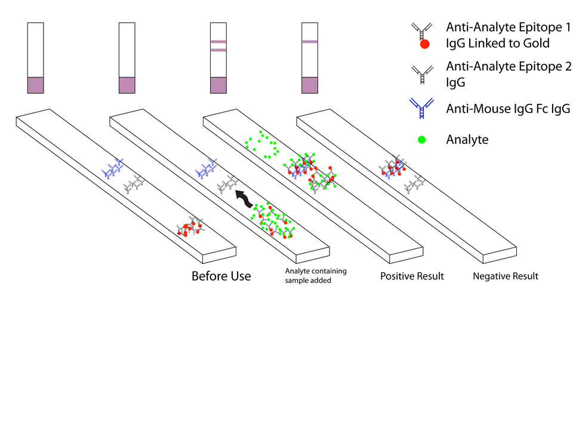
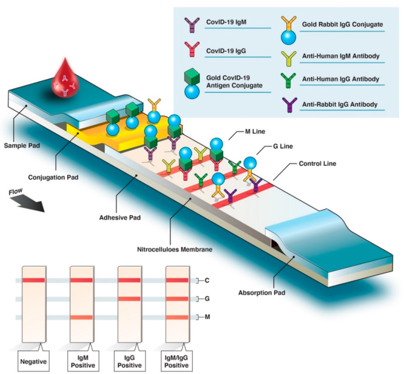

# Immunological Detection Methods
Immuno assays exploit that many proteins bind very specifically to each other (e.g. antibodies to antigens). 

## Lateral Flow Devices

Lateral flow devices work usually as follows [to confirm and cite]:
1. The substrate to test and some activation substance (called activator) are added.
    * If the analyte is present: The analyte binds to some marked substance, called marker here, e.g. marked with gold nanoparticles or fluorescence color. The analyte consists of proteins of SARS-2 in the case of an antigen test or antibodies against SARS-2 in the case of an antibody test.
2. The activator makes the marker flow through the device.
    * If the marker is bound to the analyte, the analyte acts as glue and binds the marker to the test strip. => Test strip gets positive
    * The marker or sometimes some second marker substance get bound to the control strip, which indicates that the substance have flown through the device in other words the activator has correctly induced the flow.

The following graphic by Ian M Campbell (https://commons.wikimedia.org/w/index.php?curid=4842091) illustrates the process:

The device for a SARS-CoV-2 IgM and IgG antibody test has two test strips since two analytes (IgM and IgG) are tested. The graphics by Abdi Ghaffari, Robyn Meurant, and Ali Ardakani [todo: provide link] shows such a device:

