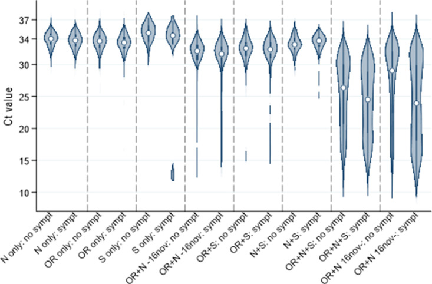
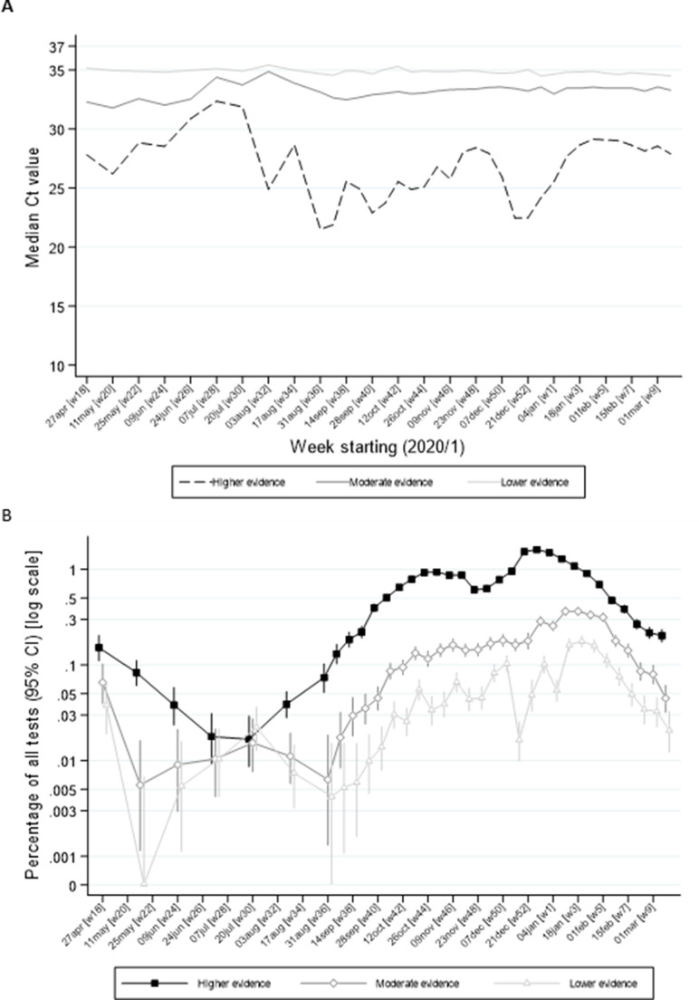

# PCR Diagnosis

* [Summary](#summary)
* [Use cases](#use-cases)
* [PCR Sensitivity and Accuracy](#pcr-sensitivity-and-accuracy)
  * [Determinants of Accuracy](#determinants-of-accuracy)
  * [Relation of Sensitivity and Accuracy](#relation-of-sensitivity-and-accuracy)
  * [RT-PCR Accuracy for SARS-CoV-2](#rt-pcr-accuracy-for-sars-cov-2)
* [From Ct Values to Viral Load](#from-ct-values-to-viral-load)
* [References](#references)
  * [Refs PCR Accuracy and Sensitivity Evaluations](#refs-pcr-accuracy-and-sensitivity-evaluations)
  * [Refs Practical Observations of PCR Accuracy](#refs-practical-observations-of-pcr-accuracy)
  * [Refs Digital Droplet PCR](#refs-digital-droplet-pcr)

> entire page in work

## Summary
> in work
The accuracy of most PCR apparatuses has a standard deviation of roughly 1 to 2 cycles [to check for different apparatuses]. A probe containing a viral load just above the limit of detection (LOD), each probe has a certain probability to go undetected due to the mentioned inaccuracy. 

The LOD for SARS-2 PCR apparatuses varies and ranges from about 10^2 copies/milliliter to 10^5 copies/milliliter for the different apparatuses.

## Use cases
PCR test can be used both to detect microorganisms causing a disease and microorganisms being part of the microbiome in the healthy state. In healthy state the virus numbers are usually very low and often below the limit of detection. Thus the prevalence of viruses is usually much higher than the PCR positives.

## PCR Sensitivity and Accuracy

### Determinants of Accuracy
The PCR sensitivity and accuracy for different settings. E.g.
* Apparatus and Protocol: The efficacy of the apparatus for amplifications, the exact protocol e.g. whether and how the RNA is extracted.
* The DNA/RNA of the microorganisms in questions: PCR works by amplifying specific genome sequences specified by a primer. Especially in the cases of RNA viruses the fast mutation rates can change the efficacy of a primer. Additionally RNA viruses even within a single host often have mutations.

### Relation of Sensitivity and Accuracy
For many considerations, the sensitivity can be viewed as the accuracy at very low DNA/RNA concentration which corresponds to high cycles numbers (usually above 35).

### RT-PCR Accuracy for SARS-CoV-2
Due the significance of SARS-CoV-2, for SARS-CoV-2 there are several comparisons and evaluations of PCR protocols to detect it. The findings are likely similar for other coronaviruses, however the strains of the endemic coronaviruses are more divers [to confirm and cite] and thus construction primers which work for all strains can be more difficult. [to check whether local 2nd structure can affect accuracy]

* [Vogels et al](#vogels) evaluate different primers for PCR amplifications and find:
  * *Ct value < 35:* PCR tests detect coronavirus RNA reliable for concentrations higher than 10^2 copies/microliter = 10^5 copies/milliliter (500 copies/initial reaction) which corresponds to a Ct value of 35. Above this value the standard deviation is about 2 cycles.
  * *Ct value > 35:* Below 10^2 copies/microliter = 10^5 copies/milliliter (500 copies/initial reaction) the sensitivity decreases and is about 25% to 50% for 10^1 copies/microliter (50 copies/initial reaction). For lower concentrations such as 1 copies/microliter the sensitivity is further reduced. Regarding accuracy, all that can be said it's a value below 10^5 copies/mL.

* [Visseaux et al](#visseaux) evaluate the the RealStar SARS-CoV-2 RT- PCR Kit Research Use Only (Altona) and compare is to the WHO references. For the RealStar they observe a reliable detection up to 600 copies/mL (Table 1 in the paper) which corresponds to 13 copies per PCR sample. For the WHO reference assays the detection limits are roughly 10^5 for RdRp gene (Table 2 in the paper) and 10^3 for the E gene which corresponds to 25 copies per PCR sample (Table 1 and 2).

* [Buchta et al](#buchta) assess the accuracy of PCR test from different laboratories in a series of tests since early 2020. A recent test is as follows: two identical samples with a reference Ct of 30.6 were tested by different labs with different PCR testing schemes. 
  * Comparing the two Ct values obtained within in each lab: For about 63% the difference was smaller than 1 Ct value and for 34% the difference was  between 1 and 3 Ct values.
  * Comparing all the Ct values obtained by the different labs yielded a distribution with a mean of 33.2 and a standard deviation of 3.2.
  * Up to a reference Ct value of 36 false negatives are below 10%. Above a ref Ct of 36 the values start to increase and reach about close to 50% at a ref Ct value of 39.

* [Walker et al](#summary-walker) use primers for the three genes encoding the N protein, the S protein, and the ORF1ab. They observe that for frequently just 1 or 2 of 3 PCR genes are detected. For high viral loads (low Ct values) usually all genes are detected: 
  

  The different results are grouped into evidence classes:
  * Higher evidence: two or three genes detected
  * Moderate evidence: single-gene detected and Ct<34 or (2) higher pre-test probability of infection, defined as any symptoms at/around the test or exposed job.
  * Lower evidence: all other positives i.e. single-gene at Ct > 34 in asymptomatic individuals and no exposed job. 

  To check whether the 'lower' and the 'moderate' are false or true positives the average Ct values (A) and the prevalence (B) is plotted and compared to the prevalence of the higher evidence samples (=sure positives):

  

  As visible from B, the prevalences rise and fall in parallel, which indicates that all are *true* positives. 

## From Ct Values to Viral Load
> This is a conceptual description and technical difficulties are skipped (e.g. in a cycle the RNA is not precisely doubled but rather increases e.g. for 90 % doubling efficacy the increase factor is 1.8).

The viral load measurements often work as follows: specific sequences are doubled in cycles until the concentration is high enough that they can be detected by optical methods. When there are already many sequences to start with, one needs fewer doubling cycles (Ct cycles) until detection. Thus few cycles correspond to a high number of sequences in the sample to test (= a high viral load in the sample).

The corresponding calculations go as follows: The viral load is doubled in cycles until detectable: `2^number_of_cycles * viral_load = d_c_h` where `d_c_h = detection_limit_for_helper_method` (the helper method detects when a certain concentration of DNA or RNA is reached, often optical fluorescence is used). Rearranged:
`viral_load = d_c_h / 2^number_of_cycles` 

The minimal viral load detectable:
`viral_load_detection_limit * 2^max_number_of_cycles = helper_method_detection_limit`

Often the viral load is given as logarithm:
`log2(viral_load) = log2(d_c_h) - number_of_cycles`
The viral load as logarithm to base 10:
`log10(viral_load) =log2(viral_load)/log2(10) = (log2(d_c_h) - number_of_cycles)/3.32`

An example formulas for specific protocols:
* [Yilmaz et al](./diagnosis_and_viral_load.md#summary-yilmaz).
* Supplement of [Malik et al](./diagnosis_and_viral_load.md#summary-malik) show the relation between Ct value and viral load.

## References

### Refs PCR Accuracy and Sensitivity Evaluations

#### Buchta
Buchta, C., Camp, J., Jovanovic, J., Radler, U., Puchhammer-Stöckl, E., Benka, B., Huf, W., Müller, M., Griesmacher, A., Aberle, S. & Görzer, I. (2021). A look at the precision, sensitivity and specificity of SARS-CoV-2 RT-PCR assays through a dedicated external quality assessment round. Clinical Chemistry and Laboratory Medicine (CCLM), (), 000010151520211004. <https://doi.org/10.1515/cclm-2021-1004>

#### Vogels
Analytical sensitivity and efficiency comparisons of SARS-CoV-2 RT–qPCR primer–probe sets

#### Liu
Xinjin Liu, Jiangpeng Feng, Qiuhan Zhang, Dong Guo, Lu Zhang, Tao Suo, Wenjia Hu, Ming Guo, Xin Wang, Zhixiang Huang, Yong Xiong, Guozhong Chen, Yu Chen & Ke Lan (2020) Analytical comparisons of SARS-COV-2 detection by qRT-PCR and ddPCR with multiple primer/probe sets, Emerging Microbes & Infections, 9:1, 1175-1179, <https://doi.org/10.1080/22221751.2020.1772679>

#### Visseaux
Benoit Visseaux, Quentin Le Hingrat, Gilles Collin, Valentine Ferré, Alexandre Storto, Houria Ichou, Donia Bouzid, Nora Poey, Etienne de Montmollin, Diane Descamps, Nadhira Houhou-Fidouh,
Evaluation of the RealStar® SARS-CoV-2 RT-PCR kit RUO performances and limit of detection,
Journal of Clinical Virology, Volume 129,2020,
<https://doi.org/10.1016/j.jcv.2020.104520.>

##### Selected Finding
"The detection of 10/10 replicates by the WHO RT-PCR assay was achieved for the dilution containing 1250 copies/mL (i.e. for an input of 25 copies/PCR in our conditions) whereas it was achieved for the dilution containing 625 copies/mL with both E and S genes of the RealStar® SARS-CoV-2 assay (i.e. for an input of 13 copies/PCR)."

### Refs Practical Observations of PCR Accuracy

#### Summary Walker
Walker, A. S., Pritchard, E., House, T., Robotham, J. V., Birrell, P. J., Bell, I., Bell, J. I., Newton, J. N., Farrar, J., Diamond, I., Studley, R., Hay, J., Vihta, K. D., Peto, T. E., Stoesser, N., Matthews, P. C., Eyre, D. W., Pouwels, K. B., & COVID-19 Infection Survey team (2021). Ct threshold values, a proxy for viral load in community SARS-CoV-2 cases, demonstrate wide variation across populations and over time. eLife, 10, e64683. https://doi.org/10.7554/eLife.64683

### Refs Digital Droplet PCR

#### Alteri
Alteri C, Cento V, Antonello M, Colagrossi L, Merli M, Ughi N, et al. (2020) Detection and quantification of SARS-CoV-2 by droplet digital PCR in real-time PCR negative nasopharyngeal swabs from suspected COVID-19 patients. PLoS ONE 15(9): e0236311. 
<https://doi.org/10.1371/journal.pone.0236311>

#### Kim
Kim, K.B., Choi, H., Lee, G.D. et al. Analytical and Clinical Performance of Droplet Digital PCR in the Detection and Quantification of SARS-CoV-2. Mol Diagn Ther 25, 617–628 (2021). <https://doi.org/10.1007/s40291-021-00547-1>