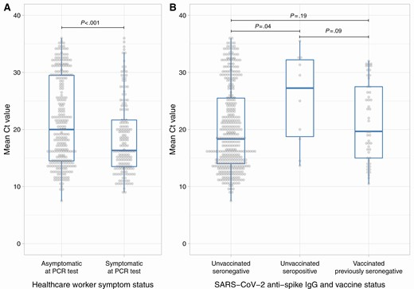
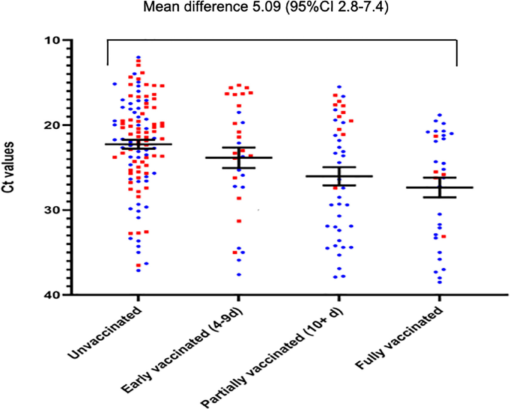

# Individual Susceptibility and Transmission

* [Summary](#summary)
* [Relevance](#relevance)
* [Infector Distribution](#infector-distribution)
  * [Observed Infector Distribution](#observed-infector-distribution)
  * [Possible Causes for uneven Spread](#possible-causes-for-uneven-spread)
* [Viral Load](#viral-load)
  * [Measuring the Viral Load](#measuring-the-viral-load)
  * [Viral Load and Infectivity](#viral-load-and-infectivity)
  * [Viral Load by Symptoms and acquired Immunity](#viral-load-by-symptoms-and-acquired-immunity)
* [Symptom Status](#symptom-status)
  * [Spread by Symptom Status](#spread-by-symptom-status)
  * [Proportion of symptomatic Patients](#proportion-of-symptomatic-patients)
  * [Viral Load by Symptom Status](#viral-load-by-symptom-status)
* [Effects of  Acquired Immunity](#effects-of--acquired-immunity)
* [Transmission by Age](#transmission-by-age)
  * [Transmissions in Schools](#transmissions-in-schools)
  * [Transmissions in Universities and Student Residences](#transmissions-in-universities-and-student-residences)
* [Susceptibility through Dirty Air Exposure](#susceptibility-through-dirty-air-exposure)
  * [Air Pollution](#air-pollution)
  * [Smoking](#smoking)
* [Susceptibility through High BMI](#susceptibility-through-high-bmi)
  * [Geographical Observations of High Overweight Prevalence](#geographical-observations-of-high-overweight-prevalence)
* [Overview of Data Sets](#overview-of-data-sets)
  * [UK Infection Overview](#uk-infection-overview)
  * [Hospital Cohort Studies](#hospital-cohort-studies)
* [References](#references)
  * [References Spread Children and Schools](#references-spread-children-and-schools)
  * [References OUCS](#references-oucs)
  * [References SIREN](#references-siren)
  * [References Household Transmissions](#references-household-transmissions)
  * [References of Household Transmissions with HOSTED](#references-of-household-transmissions-with-hosted)
  * [References ONS-CIS](#references-ons-cis)
  * [References Contact Tracing](#references-contact-tracing)
  * [References Spread from Sequences](#references-spread-from-sequences)
  * [References General Transmissions](#references-general-transmissions)
  * [References Acquired Immunity Status](#references-acquired-immunity-status)
* [References other Viruses](#references-other-viruses)
  * [References Smallpox](#references-smallpox)
  * [References Measles](#references-measles)
  * [References Spread and Air Pollution](#references-spread-and-air-pollution)
  * [Transmission Respiratory Viruses](#transmission-respiratory-viruses)
* [Appendix](#appendix)
  * [Restrictions on Increased Spread](#restrictions-on-increased-spread)

## Summary
* [Transmission Distribution](#transmission-distribution): The spread varies across people: Most studies conclude that 20% are responsible for 80% or more of the infections. 
* Young people are less susceptible and less infectious ([Transmission by Age Groups](#transmission-by-age)). For children Covid is no more or even less dangerous than other respiratory viruses as described in the chapter [Immune System throughout Life](./../4_immunological/ontogenesis_and_locality_of_immunity.md). Accordingly few spread is observed [between children and in schools](#schools-and-children).
* [Transmission by Symptom Status](#spread-by-symptom-status): Symptomatic individuals are several times more infectious.
* [Dirty air exposure](#susceptibility-through-dirty-air-exposure) is associated to high prevalence of severe Covid as geographical analyses show. 
* [High BMI](#high-bmi) increases the susceptibility especially for severe Covid. Geographical analyses indicate that high population average BMI correlates to the number of severe Cases.

## Relevance
Knowing how transmissions are distributed, helps to set and fine-tune control measures. *If measures are necessary*.
* Measures can few for those contributing few to the spread: children are not the carriers of the Covid spread and thus measures should not target them. 
* People with higher R values can be offered better control options: E.g. test access combined with [relaxed but adequate quarantine](../7_social/controlling.md#covid-19-cases-and-quarantine), optimal masks (e.g. custom fit FFP2 including advice) and better education how to handle covid.

> In my opinion, the actions for people with higher R values should always be options to take and *never be any restrictions* on human rights or any other any restrictions with outcast effects. Further discussed in [Restrictions on Increased Spread](#restrictions-on-increased-spread)

## Infector Distribution
### Observed Infector Distribution
The infector distribution is highly skewed:
* Contact tracing in Hong Kong revealed that [Adam et al](#summary-adam):
  * 20% of the cases induced 80% of infections
  * 10% of the cases induced 20% of infections
  * 70% of the cases induced no observed infections (despite most of them being not in quarantine)

* [Illingworth et al](#summary-illingworth) analyse transmission in a hospital settings.  They find that 10% of infectors cause about 50% of the infection and about 20% cause about 80% of the infections. Notably, most infections were caused by patients being treated in non Covid wards.

* A spread analysis (SEIR model based on sequencing and epidemiological data) in Israel in spring 2020 shows that between 2% and 5% of the population contribute for 80% of the spread ([Miller et al](#summary-miller)). Comment: The simulation infers that if the actual cases were several fold higher than the actual cases, 2% of the population are responsible for 80% of the spread. This is likely the case since experience shows that even the best detection schemes miss the majority of cases.

### Possible Causes for uneven Spread
#### Possible Biological Causes
* *Individuality of SARS-CoV-2 Infections*
  SARS-CoV-2 infections are highly individual and situation specific. 
  * One reason is the immune system which in turn is influence by [age and the associated exposure to pathogens](../4_immunological/ontogenesis_and_locality_of_immunity.md). Young people tend to have a strong innate immune system which prevents SARS-CoV-2 to replicate to high numbers. The immune system of adults however, relies more on the acquired immunity from previously encountered pathogens. If a good immune response is not fast enough, in the big surface of the lower respiratory tract SARS-2 can replicate to high numbers. High viral in the lower respiratory tract can cause super spreading and severe Covid.
  * *Situation specific Transmission:* In the lower respiratory tract the immune system can control viruses less well. [Dry particulates enter the lungs well](../5_epidemiological/transmission.md) and accordingly [most spread of severe Covid is in dry air](./spread_analyses.md).
* *Individuality of Respiratory Tract Particle Shedding:*
  Viral shedding is highly individual. Being infected does not imply one sheds infectious virions. The viral shedding depends on where the infection is, the respiratory behavior (e.g. breathing pattern, coughing, sneezing) and the physiology of the respiratory tract. How many small particulates persons produce is highly individual and tends to increase with age, male sex and BMI. Described on in [particle sources](../5_epidemiological/transmission.md#particles-sources). Other factors such as immune system preparedness and behavior are also important.

#### Possible Social Causes
* *Socioeconomic conditions:*
  [Living Conditions](./spread_analyses.md#living-space-and-income) influence transmission chains: People with small living space or small income have higher average R values.
* *Behavior:* How people behave is different.
  * Some might notice symptoms, some not. Symptoms can be wrongly attributed to something else.
  * For some it is easy to adapt the behavior and take precautions, for some it is not.

## Viral Load
How much infected somebody is can be measured by the viral load and it also indicates infectivity.

### Measuring the Viral Load
The viruses can infected multiple location throughout the respiratory tract and thus the viral load depends on the location measured ([Chapter Diagnosis and Viral Load](../3_medical/diagnosis_and_viral_load.md)). 

> The viral load is often given is [cycle thresholds](../3_medical/diagnosis_and_viral_load.md#calculation-of-viral-load) (Ct) values, low Ct values correspond to a high viral load: For SARS-CoV-2, a Ct values of 10 corresponds to a very high viral load and a Ct value of 40 is a very low viral load and usually the detection limit of PCR apparatuses.

### Viral Load and Infectivity
How many virions are at the different locations in the respiratory tract and how much particulates are exhaled from each location determine the amount of virions exhaled. Often the viral load is measured in the nose and the viral load there does not need to correlate with the amount of exhaled infectious aerosol for respiratory tract infections (discussed in the [transmission chapter](transmission.md); specifically shown for influenza by [Yan et al](../5_epidemiological/transmission.md#summary-yan-2018)). Correctly sampled saliva or sputum predict the disease progression, which likely corresponds to the viral load in the lower airways, better than nose samples (chapter [Diagnosis and Viral Load](../3_medical/diagnosis_and_viral_load.md)).

### Viral Load by Symptoms and acquired Immunity
* [Lumley et al](#summary-lumley-march-21) find for health care workers in Oxford the viral loads by nasal and oropharyngeal swabs: symptomatic infections (median [IQR] Ct: 16.3 [IQR 13.5–21.7]) compared to asymptomatic infections (Ct: 20 [IQR 14.5–29.5]). Previously infected persons tend to have a lower viral load (higher Ct values) than seronegative persons or vaccinated persons:
   
* [Pritchard et al](#summary-pritchard) find that previously infected persons rarely have a high viral load. A similar but weaker effect is also observed by vaccination.
* [Regev-Yochay et al](#summary-regev-yochay) find for health care workers a mean Ct value of 21.7 for symptomatic cases and 25.8 for asymptomatic cases. For vaccinated persons the mean is about 22 and for unvaccinated about 27.

## Symptom Status

### Spread by Symptom Status
Note: The strains prevalent during the time of investigation is relevant since strains can induce varying immune responses e.g. coronaviruses can diminish or activate the immune system.
* [Adam et al](#summary-adam) found in January through April in Hong Kong 2020 only 2.2% of the infections (7 out of 309) were caused by pre-symptomatic people.
* The two mass infection events observed in airplanes were both caused by symptomatic infectors [Freedman and Wilder-Smith](./spread_analyses.md#freedman). 
* [Madewell et al](#summary-madewell) find that in household settings symptomatic infectors cause about 3 times as many infections as pre/asymptomatic infectors. 

### Proportion of symptomatic Patients
[in work]
#### Early 2020
The symptomatic proportion of cases varied through back since early 2020:
* [Adam et al](#summary-adam) observe that until 27 March 2020 nearly everybody was symptomatic. Then abruptly from 27 March onwards the proportion of asymptomatic cases increased to about 40 %. // This could be due to the lineages having the D614G mutation.
#### Early 2021
* During the third Covid wave in Israel peaking around mid January 2021 about  [Regev-Yochay et al](#summary-regev-yochay) about 60 % of unvaccinated and about 50 % of vaccinated persons are asymptomatic.

### Viral Load by Symptom Status
Discussed in the section [viral load](#viral-load-by-symptoms-and-acquired-immunity).

## Effects of  Acquired Immunity

## Transmission by Age
* [Hall et al](#summary-ja-hall) reveal by analyzing "Household Transmission Evaluation Data" in England:
  * people between 5 and 29 years have lower household transmission rates than the other groups. 
  * The household transmission is high between people over 40 years of approximately the same age.
  * Very young children (0 to 4 years) transmit Covid frequently to their parents or grandparents. 
    > Their immune system in the lungs is early in the training phase and additionally they may not have had contact with any coronaviruses and so they lack the cross immunity most older have acquired from the human endemic CoVs.

  The observed transmissions by the age of the index cases (x-axis) and the contacts (y-axis) in households visualized (Figure 3 in [Hall et al](#summary-ja-hall)):

  
  

  > Similar observations are also made in the Netherlands by [van der Hoek et al](#van-der-hoek). The transmission pattern shown in "Figuur" in their paper is very similar to the results shown above. The article is in dutch and for this reason is not considered any further.

* [Dattner et al](#summary-dattner) observe that children are relative to adults
  * less susceptible 45% [40%, 55%]) 
  * somewhat less infectious 85% [65%, 110%])
* The meta-analysis by [Madewell et al](#summary-madewell) concludes that children are only about half as likely to get infected in households compared to adults (spouses which are most likely to get infected and the adult infections are subject to relationship habits).

### Transmissions in Schools
Children are less likely to be tested positive and less likely to be infectors. Children also do not super spread since in school settings no super spreading can be traced back to children - the super-spreading events observed, were likely caused by teachers.

A recommended review is [COVID-19 Transmission and Children: The Child Is Not to Blame](#leeraszka) by B. Lee and W. Raszka.

* [Vlachos, Hertegard and Svaleryd](#summary-vlachossvaleryd) found that parents children in the 9th school year (open schools)had about the same incidence rate for Covid-19 as parents children in the 10th school year (closed school). If adjusted for factors such as age and occupation the risk was about 15% higher for being diagnosed with Covid-19 when the child went to open schools. // Comment: this indicate that other factors are more important than whether the children go to school. 
* Large high school outbreak in Israel shortly after reopening of the schools. The outbreak was probably due to aerosol super-spreading from teacher(s) which was enable by densely populated rooms and the permanent use of air-conditioning [Summary Stein-Zamir](#summary-stein-zamir). 
* [Ehrhardt et al](#summary-ehrhardtbrockmann) observed in Baden-Wuertenberg between 19 May to 28 July:
  * 6 of 137 infected pupils infected a total of 11 other pupils (an R value contribution of below .1)
  * 3% of infections of children (0-19 year) could be traced back to schools. Where as 41% to families and 8% to festivals/events.
* [Perez-Lopez et al](#summary-perez-lopez) published statistics about viruses detected in nasopharyngeal swabs from visits in Sidra Medicine, the main pediatric center in Qatar. They observed a significant 30 fold reduction for influenza A. A 30% reduction was observed for influenza B and Common HCoVs. //Comment: Their observations indicate that in school settings only the influenza A transmission is efficient and other viruses are transmitted mainly in setting other than schools. This in turn indicates that most respiratory viruses are transmitted primarily by adults.

### Transmissions in Universities and Student Residences
[in work]
 

## Susceptibility through Dirty Air Exposure
*In short:* Dirty Air Exposure is associated to a high Prevalence of Severe Covid.

### Air Pollution
_Through Air Pollution_: High rates of air pollution occur frequently in industrialized densely populated regions which have inversion weather situations (usually in the winter). Examples (order: most polluted air first, source: estimates from watching the maps at ventusky.com): northern India, central and northern China (including Wuhan), northern Italy, Tehran

Specifically for Italy a correlation between Covid and air pollution is shown by [Kotsiou et al](#kotsiou).

### Smoking
_Through Smoking_: Smokers and Ex-Smokers. Ex-smokers have a higher risk for severe risk than never smokers.

> The overall health benefits of a smoke stop outweigh by fare a possible increased Covid incidence: Current smokers seem to have no higher Covid risk than never smokers, but a lower risk than former smokers. This could be caused by (possibly toxic) environment changes in the lung when smoking. [Local environment changes in the lungs](../6_prevention_and_treatment/temperature_modulation.md) can also be achieved with sauna or steam inhalation which don't have the possibility of health hazards which smoke has. 

> 12.6.21: It's not about smoke-free - Everyone should judge the risks to take in life on his own. Add restrictions for addictives, I consider as adequate however.

## Susceptibility through High BMI
### Geographical Observations of High Overweight Prevalence
*High Overweight Prevalence is associated to High Covid Prevalence and Death Rates*

* *Observations:*
    Countries with high rates of obesity tend to have much more severe cases than countries with lower rates but otherwise similar characteristics. 

    Selected countries with high rates of obesity (in decreasing order, source: obesity.procon.org):
    US, Jordan, Turkey, Mexico, UK, Hungary, Israel, Czechia

    Few obesity: Vietnam, Bangladesh, India, Nepal, Japan

* *Possible Explanation:*
    * One reason is for the many severe cases, is that obesity itself increases the risk for severe Covid. But the case counts seem to increase overall i.e. also in people which are not obese [to check and cite/provide evidence]. 
    * A possible biological explanation is that the mucus clearance is inversely proportional to the BMI which increases susceptibility for infection and the risk for a high viral load. High BMI also influences the exhaled aerosol (chapter [Particles in the Respiratory Tract](transmission.md#particle-dynamics-in-the-respiratory-tract).

## Overview of Data Sets
### UK Infection Overview
#### ONS-CIS
The Office for National Statistics (ONS) in the UK carries out a COVID-19 Infection Survey (CIS). 
* [Prichard et al](#summary-pritchard) infer the risk of reinfection and the vaccine effectiveness from ONS-CIS data. 
* [House et al](#summary-house) analyse the household transmission with or without vaccination.

#### HOSTED
Household Transmission Evaluation Dataset (HOSTED) links laboratory-confirmed COVID-19 cases in England to individuals living with the same address. Detail description of the [HOSTED data set](#references-of-household-transmissions-with-hosted).
* [JA Hall et al](#summary-ja-hall) analyse the household transmission by the age of the individuals, the regions of living and the season of the year.
* [Harris et al](#summary-harris) infer the household transmission with or without vaccination.

### Hospital Cohort Studies
#### OUCS
Oxford University Hospitals offer symptomatic and asymptomatic SARS-CoV-2 testing to all staff: [References OUCS](#references-oucs).
* [Lumley December 20](#summary-lumley-december-20): Reinfection rates
* [Lumley March 21](#summary-lumley-march-21): Reinfection rates and vaccine breakthroughs.
* [Lumley July 21](#summary-lumley-july-2021): Infection paths and spreader distribution.

#### SIREN
Goal: "The SARS-CoV-2 Immunity and Reinfection Evaluation (SIREN) Study is a large, multicentre prospective cohort study of health-care workers and support staff in publicly- funded National Health Service (NHS) hospitals in the UK."

Testing Scheme: "SIREN participants had asymptomatic PCR testing (anterior nasal swabs or combined nose and oropharyn- geal swabs) every 14 days and monthly antibody testing at their site of enrolment, with a variety of assays used across sites. As per government guidelines, hospitals introduced twice weekly asymptomatic testing using a lateral flow device, Innova SARS-CoV-2 Antigen Rapid Qualitative Test (Innova),12 to all front-line health-care workers for twice weekly asymptomatic testing in November, 2020."

* [VJ Hall April 21](#summary-vj-hall-april-21): Reinfection and vaccine efficacy.

####  Sheba Medical Center
[Regev-Yochay et al](#summary-regev-yochay) Ramat-Gan, Israel the effectiveness of BNT162b2 is evaluated.

#### Health Insurance Studies

#### Spread from Contact Tracing

## References

### References Spread Children and Schools

#### Alonso
Alonso, S., Alvarez-Lacalle, E., Català, M., López, D., Jordan, I., García-García, J. J., Soriano-Arandes, A., Lazcano, U., Sallés, P., Masats, M., Urrutia, J., Gatell, A., Capdevila, R., Soler-Palacin, P., Bassat, Q., & Prats, C. (2021). Age-dependency of the Propagation Rate of Coronavirus Disease 2019 Inside School Bubble Groups in Catalonia, Spain. The Pediatric infectious disease journal, 10.1097/INF.0000000000003279. Advance online publication. https://doi.org/10.1097/INF.0000000000003279

#### Lee,Raszka
Lee B and Raszka WV. 
**COVID-19 Transmission and Children: The Child Is Not to Blame.**
Pediatrics. 2020;146(2):e2020004879 <https://doi.org/10.1542/peds.2020-004879>

#### Summary Ehrhardt,Brockmann
**Transmission of SARS-CoV-2 in children aged 0 to 19 years in childcare facilities and schools after their reopening in May 2020**
Ehrhardt J , Ekinci A , Krehl H , Meincke M , Finci I , Klein J , Geisel B , Wagner-Wiening C , Eichner M , Brockmann SO . , Baden-Württemberg, Germany. Euro Surveill. 2020;25(36):pii=2001587. 
<https://doi.org/10.2807/1560-7917.ES.2020.25.36.2001587>

##### Methods
"We investigated data from severe acute respiratory syndrome coronavirus 2 (SARS-CoV-2) infected 0–19year olds, who attended schools/childcare facilities, to assess their role in SARS-CoV-2 transmission after these establishments’ reopening in May 2020 in Baden-Württemberg, Germany."

##### School Setting
50% Group Size: Yes, Cleaning of Surface: Yes, Regular Ventilation: Yes, Hygiene: Yes, Face Mask in Break: Some, Face Mask in Classroom: No, Physical Distancing: Some, No Singing: Most, Physical Education: No

##### Results
* Infection by pupils
  1. Total of 557 Covid-19 cases in the age group 0-19 year out of a total of 3104 cases in Badenwuertenberg in the study period (19.5-25.7)
  2. For 453 School attendance information was available
  3. 137 (30% of 453) were at least 1 day at school while infectious 
  4. 11 other pupils were infected by 6 of those 137
  5. no secondary infection from those 11 were detected despite extensive contact tracing
* only 15 (3%) of 453 infected children (with school attendance known) were infected in schools (the 11 above from other pupils and 4 by teachers). Most infections occurred in families or festivals/events (Table 2).

#### Summary Vlachos,Svaleryd
**School closures and SARS-CoV-2. Evidence from Sweden’s partial school closure**
Jonas Vlachos, Edvin Hertegard, Helena Svaleryd

##### Methods
Remark: Working Paper
* "Swedish upper secondary schools moved to online instruction while lower secondary school remained open. This allows for a comparison of parents and teachers differently exposed to open and closed schools, but otherwise facing similar conditions."
* the incidence rates were adjusted using logistic regression for wage, sex, occupation, educational attainment, income, regions of residence and of origin. OLS was used too. 

##### Results
* Comparison of Covid-19 incidences between parents with children in schools and homeschooling:
  * unadjusted the Covid incidence were near the same 5.67 versus 5.66 (Table 2)
  * adjusted the risk for parents with children in school was about 15% [OR 1.15; CI95 1.03–1.27] higher if adjusted with logistic regression(Table 1)
* "Among lower secondary teachers the infection rate doubled relative to upper secondary teachers [OR 2.01; CI95 1.52–2.67]. This spilled over to the partners of lower secondary teachers who had a higher infection rate than their upper secondary counterparts [OR 1.30; CI95 1.00–1.68]."

> ##### Comment
> It is not clear that the observed slightly increased Covid incidence of parents/teachers of lower secondary school children results from transmission from the children, it could also be attributed to parents visiting the schools and a transmission between adults. 

#### Summary Stein-Zamir
**A large COVID-19 outbreak in a high school 10 days after schools’ reopening, Israel, May 2020.**
Stein-Zamir Chen , Abramson Nitza , Shoob Hanna , Libal Erez , Bitan Menachem , Cardash Tanya , Cayam Refael , Miskin Ian .  Euro Surveill. 2020;25(29):pii=2001352. <https://doi.org/10.2807/1560-7917.ES.2020.25.29.2001352>

##### Methods
Analyzing a large high school out break in Israel shortly after schools have been reopened. 

##### School Setting
* From 13 March to 17 May Schools in Israel were closed (limited opening for small children on 3 May)
* A heat wave with temperatures up to 40 degree from 19–21 May: 
  * "air-conditioning functioned continuously in all classes."
  * no face-masks
* "crowded classes: 35–38 students per class, class area 39–49 m2, allowing 1.1–1.3 m2 per student"

##### Results
* "Testing of the complete school community revealed 153 students (attack rate: 13.2%) and 25 staff members (attack rate: 16.6%) who were COVID-19 positive."
* "COVID-19 rates were higher in junior grades (7–9) than in high grades (10–12) (Figure 1). The peak rates were observed in the 9th grade (20 cases in one class and 13 cases in two other classes) and the 7th grade (14 cases in one class). Of the cases in teachers, four taught all these four classes, two taught three of the four classes and one taught two of these four classes."
* "Most student cases presented with mild symptoms or were asymptomatic."

#### Summary Dattner
Dattner I, Goldberg Y, Katriel G, Yaari R, Gal N, Miron Y, et al. (2021) **The role of children in the spread of COVID-19: Using household data from Bnei Brak, Israel, to estimate the relative susceptibility and infectivity of children.** 
PLoS Comput Biol 17(2): e1008559. <https://doi.org/ 10.1371/journal.pcbi.1008559>
##### Methods
* "Data were collected from households in the city of Bnei Brak (City close to Tel Aviv), Israel, in which all household members were tested for COVID-19 using PCR."
* The authors developed a model (discrete, stochastic and dynamic) for the propagation of Covid within a households. With this model infectivity and susceptibility of children and adults can be estimated and compared.
 
##### Findings
* "Inspection of the PCR data shows that children are less likely to be tested positive compared to adults (25% of children positive over all households, 44% of adults positive over all households, excluding index cases), and the chance of being positive increases with age."
* "We estimate that the susceptibility of children (under 20 years old) is 43% (95% CI: [31%, 55%]) of the susceptibility of adults. The infectivity of children was estimated to be 63% (95% CI: [37%, 88%]) relative to that of adults."

### References OUCS
#### Testing Scheme OUCS
OUCS = Oxford University Cohort Studies

Oxford University Hospitals offer symptomatic and asymptomatic SARS-CoV-2 testing to all staff at 4 hospitals and associated facilities in Oxfordshire, United Kingdom:
* Test Methods: 
	* Acute Infection: nasal and oropharyngeal swab PCR testing
	* Past Infection: Antibody status by anti-trimeric spike IgG ELISA 
* Testing Frequency for acute Infection:
  * Asymptomatic HCWs: voluntary PCR testing every 2 weeks and serological testing every 2 months
  * Symptomatic: SARS-CoV-2 PCR testing for symptomatic (new persistent cough, fever ≥37.8°C, anosmia/ageusia)

#### Summary Lumley December 20
*Antibody Status and Incidence of SARS-CoV-2 Infection in Health Care Workers*
##### Methods and Setting
"A total of 12,541 health care workers participated and had anti-spike IgG measured; 11,364 were followed up after negative antibody results and 1265 after positive results, including 88 in whom seroconversion occurred during follow-up."
##### Results
* 223 anti-spike–seronegative health care workers had a positive PCR test (1.09 per 10,000 days at risk), 100 during screening while they were asymptomatic and 123 while symptomatic.
* 2 anti-spike–seropositive health care workers had a positive PCR test (0.13 per 10,000 days at risk), and both  asymptomatic.
* "After adjustment for age, gender, and month of testing (Table S1) or calendar time as a continuous variable (Fig. S2), the incidence rate ratio in seropositive workers was 0.11 (95% CI, 0.03 to 0.44; P = 0.002)."

#### Summary Lumley March 21
*An Observational Cohort Study on the Incidence of
Severe Acute Respiratory Syndrome Coronavirus 2
(SARS-CoV-2) Infection and B.1.1.7 Variant Infection in
Healthcare Workers by Antibody and Vaccination Status*
##### Methods 
* Data Observation Duration: March 2020 to 28.2.2021
* Analyse the effect of seroconversion due to natural infection and vaccination on infection rates as part of the [OUCS testing](#testing-scheme-oucs).
* "Although an unexpected rise in incidence was seen in the first 2 weeks postvaccination, this time period was excluded from effectiveness calculations."

##### Settings
* "As previously reported [2], asymptomatic testing was less frequent in unvaccinated seropositive HCWs (127/10 000 person-days) than unvaccinated seronegative HCWs (185/10 000 person-days). Rates in previously seronegative and seropositive vaccinated staff were similar (163–169/10 000 person-days). Symptomatic testing followed a similar pattern (Supplementary Table 1)."
* "Most HCWs were vaccinated between December 2020 and January 2021 (Figure 1A); 8285 staff received Pfizer-BioNTech vaccine (1407 two doses) and 2738 Oxford-AstraZeneca vaccine (49 two doses)."

##### Results
###### Incidences Rates

Group |  case count | adjusted incidence ratio | 95% confidence interval
--|--|--|--
seronegative HCWs | 635 | ref | -
unvaccinated seropositive HCWs |12 | 0.15 | .08–.26 
seronegative, 1 dose vaccine vaccination | 64|0.36 | .26–.50
second vaccination | 2 | ~ 0.10 | .02–.38

Comments:
* Very low person count for double vaccinated, thus the result has a large confidence interval.
* An increased infection risk in the first 2 weeks after vaccination especially for AstraZeneca
  > This can be due to behavior changes but in theory also biological mechanisms are thinkable e.g. vaccines can (temporarily) diminish the immune system by killing immune cells or the immune system is distracted: it builds up a strong immune protection against the vaccine and thereby temporarily ignores the SARS-CoV-2 infection.
* From two weeks on after the first vaccine dose the rate of PCR positivity was reduce by about 65% (as described in incidence rates). The reduction was similar for BT162 and AstraZeneca. (Figure 3 )

[todo add figure 3]

###### Viral Load
* *By Symptom Status:* The median viral loads were higher, that is, lower Ct values lower in symptomatic infections (median [IQR] Ct: 16.3 [IQR 13.5–21.7]) compared to asymptomatic infections (Ct: 20 [IQR 14.5–29.5]) (Figure 4A, Kruskal-Wallis P < .001)." // since many asymptomatic individuals had low viral loads but high viral loads were observed in both groups.
* *By Immune Status:* "Unvaccinated seronegative HCWs had the highest viral loads (Ct: 18.3 [IQR 14.0–25.5]), followed by vaccinated previously seronegative HCWs (Ct: 19.7 [IQR 15.0–27.5]); unvaccinated seropositive HCWs had the lowest viral loads (Ct: 27.2 [IQR 18.8–32.2]) (Figure 4B, overall P = .06)." // only few cases of unvaccinated seropositive

#### Summary Lumley July 2021
**Epidemiological data and genome sequencing reveals that nosocomial transmission of SARS-CoV-2 is underestimated and mostly mediated by a small number of highly infectious individuals**

##### Methods
* *Algorithm:* The Covid spread is analyzed using contact pattern and genome sequencing.
* *Setting:* "The Oxford University Hospitals NHS Foundation Trust comprises four hospitals with ∼1100 beds (mostly in 4-bed bays within wards of 20–30 beds) and ∼13,500 staff."

##### Results
* Most introduction didn't induce further transmissions: "Within 764 samples sequenced 607 genomic clusters were identified (>1 SNP distinct). Only 43/607(7%) clusters contained evidence of onward transmission (subsequent cases within ≤ 1 SNP)" // SNP = Single Nucleotide Polymorphism
* "Most (80%) nosocomial acquisition occurred in rapid super-spreading events in settings with a mix of COVID-19 and non-COVID- 19 patients." // The spread networks are shown in Figure 2 B. The hospital introductions and the onward spread in Figure 3.

### References SIREN
#### Summary VJ Hall April 21
*COVID-19 vaccine coverage in health-care workers in England and effectiveness of BNT162b2 mRNA vaccine against infection (SIREN): a prospective, multicentre, cohort study*
##### Methods
"Baseline risk factors were collected at enrolment, symptom status was collected every 2 weeks, and vaccination status was collected through linkage to the National Immunisations Management System and questionnaires. Participants had fortnightly asymptomatic SARS-CoV-2 PCR testing and monthly antibody testing, and all tests (including symptomatic testing) outside SIREN were captured."
##### Setting
"At least one dose of vaccine was given to 20641 (89%) participants by Feb 5, 2021; 19384 (94%) received the BNT162b2 vaccine and 1252 (6%) received the ChAdOx1 vaccine." //both first and second doses (for those who got them) peaked in early January 21 (Figure 1) -> unvaccinated follow was mostly December to early January, while vaccinated follow was early January to 5. February
##### Results

Immune Status| # PCR positives | Incidence per 10 K person days | Reduction to sero -
--|--|--|--
sero - | 902 | 20 | ref
sero + |  75 |  3 |  85 % (*)
1 dose |  66 | 11 |  45 % (*)
2 dose |   8 |  5 |  75 % (*)

(*) Comments: The reductions given above are unadjusted (not in the paper). Adjustments are tricky e.g. since [Illingworth et al](#summary-illingworth) observed the majority of transmissions in *non* Covid wards. Adjustment for month would be important since in December and January there were many more cases than in February (e.g. observed in [Lumley](#summary-lumley-march-21)) and double vaccinated persons were mainly followed from mid January onwards.

### References Household Transmissions

#### Notes on Household Transmissions
* Even if the Covid prevalence is low, infected household members may community acquire the infection at the same event since the transmission is super-spreading-event driven and the disease onset can be hard to determine due to asymptomatic/low symptomatic cases and varying incubation times. Methods such as sensitivity analyses with varying the cut-off dates between symptom onsets can sometimes increase the confidence in the model used.
* If the community transmissions are high, the secondary attack rates needs correction for community acquired infections. Also commented at [Summary Madewell](#summary-madewell)].

#### Summary Madewell
**Household transmission of SARS-CoV-2: a systematic review and meta-analysis of secondary attack rate**
Zachary J. Madewell, Yang Yang, Ira M. Longini Jr, M. Elizabeth Halloran, Natalie E. Dean medRxiv preprint 
<https://doi.org/10.1101/2020.07.29.20164590>, posted August 1, 2020.

##### Methods
Meta-Analysis of studies regarding the transmission dynamics of Covid-19 in household settings. Many different kind of studies are included: 
* Covid diagnosis based on live tests (RT-PCR) or past infections with antibody tests, some studies included symptoms, a few studies do whole-genome sequencing, some studies are in settings (area and times) of high prevalence.
* The influence of the different factors (contact type, symptom status, adult/child contacts, sex, relationship to index case, number of contacts in household, ...) is analyzed.

##### Comment
> Studies from countries with high and very high Covid prevalence are included too, in these countries independent infections pathways for different household members are very likely and thus inferring the secondary attack rate from the prevalence in household members overestimates the secondary attack rate. 

##### Findings
Secondary Attack Rates with different groups as **infectors**. The error rate is in brackets. 
* household: 0.19 (0.4); family including non household contacts: 0.18 (0.5)
* symptomatic: 0.2 (0.6); pre- or asymptomatic: 0.07 (0.04)

Secondary Attack Rates with different groups as **infectees**. The error rate is in brackets. 
* children: 0.16 (0.6); adults: 0.31 (1.2) // adults includes spouses
* spouse: 0.43 (1.6); other: 1.8 (0.8)

Proportion of households where a secondary transmission was observed:
* 0.32 (.025)

Comparison with SARS-1 or MERS:
* SARS-1: 0.06 (0.04)
* MERS: 0.035 (0.035)

### References of Household Transmissions with HOSTED

#### HOSTED Dataset
* "In brief, laboratory confirmed cases of COVID-19 in England which are reported to national laboratory surveillance systems(2) are linked to individuals who share the same address, using National Health Service (NHS) number and the Unique Property Reference Number (UPRN)." ([Supplement to Harris](#summary-harris))
* Institutional settings (using UPRN information) such as care homes, prisons, and households with more than 10 residents are excluded.
* "HOSTED includes individual-level socio-demographic data for cases and household contacts, including age, sex, and Index of Multiple Deprivation (IMD); information on property type, confirmed cases using PCR-based SARS-CoV-2 through national reporting systems, and linked information on hospitalisation and mortality. The vaccination data include date and type (ChAdOx1 nCoV-19 or BNT162b2) of first and second doses for all vaccinated individuals in the HOSTED dataset." (Supplement to [Harris](#summary-harris)).

#### Summary JA Hall
JA Hall, RJ Harris, A Zaidi, SC Woodhall, G Dabrera, JK Dunbar, 
**HOSTED—England’s Household Transmission Evaluation Dataset: preliminary findings from a novel passive surveillance system of COVID-19**, 
International Journal of Epidemiology, Volume 50, Issue 3, June 2021, Pages 743–752, 
<https://doi.org/10.1093/ije/dyab057>

##### Methods
* The [Household Transmission Evaluation Dataset (HOSTED)](#hosted) links confirmed COVID-19 cases to individuals in the same household in England.
* "We explored the risk of household transmission according to: age of case and contact, sex, region, deprivation, month and household composition between April and September 2020, building a multivariate model."

##### Results
The heat map (Figure 3 in the paper and displayed in the section [transmission by age](#transmission-by-age)) shows the secondary cases by age of the index case and age of the contact. The figure shows:

* _Few Spread:_ People younger than 30 year but older than 4 have few secondary cases (left third of the image except left most column).
* _Much Spread:_ 
  * For index cases above 40 years the transmissions are high. The transmission rates peak at an age of about 65 years.
  * Very young children 0 to 4 of age transmit Covid well and mainly to their parents and their grand parents (left most column).
  * Parents between 40 and 59 transmit to older children (15-24) but the children not to them (hotspot at middle right, missing hotspot on the mirrored)

The graphs below show the secondary attack rate in the different administration division in the UK. 

The Southern regions have lower secondary attack rates likely due to the more comfortable climate in the summer months.

##### Methods Details
"As the incubation period for SAR-CoV-2 is thought to be 2–14 days [16],  we chose a threshold of 2 days between the specimen dates of the index and secondary cases as a pragmatic decision to offset the risks of misclassifying cases as either co-primary or as secondary. A sensitivity analysis using a cut-off of 4 days found to have little effect on any of the results or on the multivariable model. We have also made the implicit assumption that two (or more) cases occurring in a household within 2–14 days represents household transmission when it also plausible that they are two independent community-acquired infections. However, given the timing of this study, when the number of cases was at its lowest, this risk is probably small." 

> // Considering the asymptomatic/low symptomatic cases, simultaneous community acquired infection (e.g. at a super spreading event) cannot be ruled out even with the sensitivity analysis by varying the incubation cut-offs.

#### Summary Harris

##### Methods
* "The analysis cohort included households with an index case occurring between 4th January 2021 to 28th February 2021, with 14 days observable follow up for all contacts."
* "We defined Index Cases as the earliest case of laboratory-confirmed COVID-19, by diagnosis date, for a household. Household Contacts were defined as all individuals with the same address as the index cases of COVID-19; and Secondary Cases as a known household contact of an index case with a positive SARS-CoV-2 test that has a specimen date between two and 14 days after the specimen date of the index case."
* "The analysis cohort included households with an index case occurring between 4th January 2021 to 28th February 2021, with 14 days observable follow up for all contacts."
* "In all households, the majority of index cases and contacts were age <60, with a high proportion of individuals aged <40 in unvaccinated households."
##### Results
1. *Non vaccinated:* about 10% household transmission. "In households where the index case was not vaccinated before testing positive, there were 96,898 secondary cases out of 960,765 household contacts (10.1%)."
2. *Index vaccinated:* Just "There were 196 secondary cases in 3,424 contacts (5.72%) where the index case received the ChAdOx1 nCoV-19 vaccine 21 days or more before testing positive, and 371 secondary cases in 5,939 contacts (6.25%) where the index case received the BNT162b2 vaccine 21 days or more before testing positive." // not much difference between BNT162b2 and ChAdOx1 this despite BNT162b2 produces higher level of antibodies.
3. *Index and (some) contact vaccinated:* The secondary attack rate when both the index case and the contacts are vaccinated seems to be not much different as when both are unvaccinated: Secondary attack rate when both index and contact are vaccinated: 8152 out of 67622 contacts (Table S1) -> SAR ~= 12%. The 12% SAR is about the attack rates observed between older people in winter (Table S2 and [Summary Hall](#summary-ja-hall) which is also based on HOSTED data). Since vaccinated contact are less likely to get infected, this observation indicates increased transmission from vaccinated persons to other vaccinated persons once positive tested.

##### Comments
> *Adjustments:* To calculate the odd ratios the authors do also some adjustments, however since adjusting is tricky: e.g. for older couples which belong to vaccine-prioritized groups, the secondary attack is higher, however in the weeks before a vaccination appointment the infection rate decreases as observed in [Pritchard](#summary-pritchard), and the latter is more likely in older couples. For the difficulties regarding correct adjustment, the unadjusted data are cited here.

> *Biases:* Vaccinated persons may be miss-classified as contacts since they are less likely symptomatic in the first month after vaccinations due to vaccine effectiveness at preventing symptomatic disease, placebo effects and the protection from severe disease. Which could yield to a bias in households with many infectees the index case is likely wrongly attributed to an unvaccinated person. Considering only households where both index and contact are vaccinated is less biased in this respect. As noted, the latter data (2.) indicate higher transmission from vaccinated persons.

### References ONS-CIS
Households are visited and instructed how to self take nose and throat swabs. The swabs are then taken weekly for the first month and then monthly for the first year. The swabs are sent or colleted and analyzed in labs for PCR testing. The goal overview of the community prevalence.

#### Summary House
House T, Pellis L, Pritchard E, McLean AR, Walker AS. *Total Effect Analysis of Vaccination on Household Transmission in the Office for National Statistics COVID-19 Infection Survey.* arXiv; 2021.

##### Goal
"Here we seek to calculate a total effect of having at least one completed vaccination in a household before introduction of infection, with no attempt to determine causation, mediation, confounding etc. We quantify uncertainty in the results using bootstrapping."

##### Method Details
* "For visits to be included in the current dataset, participants had to be aged 16 years or over and have either a positive or negative swab result from 1st December 2020 to 31 May 2021."
* "We did not differentiate between vaccines since our aim is to obtain a total effect of the programme as implemented."

##### Results
* Households without vaccination: SAR = 23.5 [22.6,24.4]%
* Households with a least one vaccination 21 days before: SAR = 12.5 [4.0,23.3]% //the vaccination can either be the index, any contact, or all/both

#### Summary Pritchard
*Impact of vaccination on new SARS-CoV-2 infections in the United Kingdom*
##### Methods
1,945,071 Covid PCR tests from nose and throat swabs taken from 383,812 [ONS-CIS](#ons-cis) participants between 1 December 2020 and 8 May 2021 are analyzed to assess the effects of vaccination and previous infections.

##### Results

### References Contact Tracing

#### Summary Adam
*Clustering and superspreading potential of SARS-CoV-2 infections in Hong Kong*
Adam D, Wu P, Wong J, et al. Research Square; 2020. 
<https://doi.org/10.21203/rs.3.rs-29548/v1>

##### Methods
"Using contact tracing data from 1,038 SARS-CoV-2 cases confirmed between 23 January and 28 April 2020 in Hong Kong, we identified and characterized all local clusters of infection."

##### Results
* Distribution of Infectivity:
  * 20% of the cases induced 80% of infections
  * 10% of the cases induced 20% of infections
  * 70% of the cases induced no observed infections (despite most of them being not in quarantine, Fig.2)
* "Gatherings in social settings such as bars, restaurants, weddings and religious sites appear to be at increased risk of superspreading events."
* "Transmission in social settings was significantly associated with an increased number of secondary cases compared to transmission observed in family households."
* Quarantine
  * Home quarantine yielded sporadic infections (2 observed) in family settings (Fig.2 d) and none outside families
  * Government quarantine yielded no further infections (Fig.2)
* "Of all cases confirmed in Hong Kong, 195 (18.8%, 195/1,038) were asymptomatic at confirmation (Supplementary Table 2) and, of these, most (83.1%, 162/195) were PCR-confirmed from 27 March onward". So ahead of 27 March asymptomatic cases were sporadic and less than 5%. From 27 March onwards asymptomatic cases jumped to around 40 % (Extended Data Fig.2).
* Infections caused by pre-symptomatic infectors were rarely observed: "Seven instances of likely pre-symptomatic transmission were observed where onset of the infectee preceded that of the infector or occurred on the same day."

##### Limitations
"These findings take advantage of the quality of case ascertainment and contact tracing data in Hong Kong, although some incompleteness in links between cases could potentially bias our estimates of transmission heterogeneity."

#### Almadhi
Almadhi, M. A., Abdulrahman, A., Sharaf, S. A., AlSaad, D., Stevenson, N. J., Atkin, S. L., & AlQahtani, M. M. (2021). The high prevalence of asymptomatic SARS-CoV-2 infection reveals the silent spread of COVID-19. International journal of infectious diseases : IJID : official publication of the International Society for Infectious Diseases, 105, 656–661. 
<https://doi.org/10.1016/j.ijid.2021.02.100>

### References Spread from Sequences

#### Summary Miller
**Full genome viral sequences inform patterns of SARS-CoV-2 spread into and within Israel**

##### Methods
212 SARS-CoV-2 sequences in combination with "high-resolution epidemiological data" are used to deduce the spread into and within Israel.

##### Results
* "We find that travelers returning from the United States of America significantly contributed to viral spread in Israel, more than their proportion in incoming infected travelers."
* "We further report high levels of transmission heterogeneity in SARS-CoV-2 spread, with between 2-10% of infected individuals resulting in 80% of secondary infections."
  * "Specifically, if we assume almost complete case reporting, our phylodynamic analysis indicates that between 5% and 10% of infections are responsible for 80% of secondary infections. With lower assumed levels of case reporting, less than 5% of infections would be responsible for 80% of secondary infections." // considering that SARS-CoV-2 tests have a detection rate of about 50% and many cases are missed by contact tracing, an upper bound of 1/3 for the case reporting seem reasonable in the Spring 2020 in Israel => the model predicts that about 2% are responsible for 80% of the infections (p_h = 0.02 in Fig 6)

##### Conclusions
* "Our results indicate that superspreading events drive the transmission dynamics of SARS-CoV-2, suggesting that focused measures to reduce contacts of select individuals/social events could mitigate viral spread."
* The global connectivity allows for massive introductions which suggests the importance of border controls. //The authors als conclude shelter-in-place restriction for halting viral spread but as of July 2021 it is known that shelter-in-place likely increases and not decreases the spread due to indoor aerosol transmissions.
##### Method Details
* "We obtained RNA extracted from nasopharyngeal samples. Sequencing was performed based on the V3 Artic protocol (https://artic.network/ncov-2019)."
* "Instead of assuming a given level of transmission heterogeneity for Israel, we instead performed phylodynamic inference for the SEIR model across a range of transmission heterogeneities. Specifically, the SEIR-type model implemented two classes of infectious individuals, corresponding to a highly infectious subset of individuals (Ih) and a less
infectious subset of individuals (Il)." // Detail description in Methods>Phylodynamic analysis> Equation (1) - (5).

#### Summary Illingworth
**Superspreaders drive the largest outbreaks of hospital onset COVID-19 infections**
##### Methods
Using an algorithm based both on contacts patterns between people and sequencing of SARS-CoV-2 genomes Illingworth et al infer patterns of viral transmission between patients and health care workers (HCWs).
##### Results
* "Of the 38 transmission events in the maximum likelihood networks, 20 were patient-to-patient, 8 were from patient to HCW, 8 were HCW-to-HCW, and just 2 were from HCW to patient (Figure 2—figure supplement 1)"
* Most patient transmission occurred in non Covid wards (Figure 2 for non Covid wards versus Figure 3 for Covid wards). //this indicates that protection measures in Covid wards work(ed)
* About 10% of the people for responsible for 50% of infections and about 20% for 80% of the infections (Figure 4 C). 

<!-- todo include pic -->

### References General Transmissions

#### van der Hoek
*De rol van kinderen in de transmissie van SARS-CoV-2*

### References Acquired Immunity Status

#### Summary Regev-Yochay
Regev-Yochay, G., Amit, S., Bergwerk, M., Lipsitch, M., Leshem, E., Kahn, R., Lustig, Y., Cohen, C., Doolman, R., Ziv, A., Novikov, I., Rubin, C., Gimpelevich, I., Huppert, A., Rahav, G., Afek, A., & Kreiss, Y. (2021). *Decreased infectivity following BNT162b2 vaccination: A prospective cohort study in Israel.* 
The Lancet regional health. Europe, 7, 100150. 
https://doi.org/10.1016/j.lanepe.2021.100150

##### Methods
Analyse the effect of BNT162b2 regarding SARS-Cov-2 infections in health care workers with a prospective cohort study.

##### Methods Details
* From 19. December 2020 to 14. March 2021.
* "On each day, we considered individuals to have a status of being either Unvaccinated, in the Early Vaccine stage (defined as 4 to 10 days post the first dose), those Partially Vaccinated (11 days post first dose to 10 days post second dose), or Fully Vaccinated (11 days or more post second dose)."
* " Staff could transition from one group to another following seroconversion or vaccination after 60 or 14 days, respectively, disregarding any PCR-positive result during this crossover period, including the 14 days following a second vaccination for previously seronega- tive HCWs vaccinated twice."

##### Results
"Among those exposed, 295 individuals (8.2%) had a positive result. N-gene Ct value was available for 224 (75.9%) cases."

###### Vaccine Effects upon Exposure
* Table 2a in the paper
* Testing uniform after exposure regardless of vaccination status

Status | # Exposures | # PCR Ct <40 | Prev <40 | Prev PCR <30 | Prev never Symptoms | Prev Symptom & <30 | RR PCR<40 | vacc eff Ct<40 | vacc eff Ct<30
--|--|--|--|--|--|--|--|--|--
unvacc     | 1441 | 75 | 5.2 % | 3.1 % | 3.3 % | 1.8 % | ref | ref  | ref
early vacc | 490  | 18 | 3.7 % | 1.7 % | 2.4 % | 1.0 % | .71 | 29 % | 45 %
part. vacc | 1442 | 34 | 2.4 % | 1.2 % | 1.5 % | 0.6 % | .45 | 55 % | 59 %
fully vacc | 1300 | 23 | 1.8 % | 0.9 % | 0.9 % | 0.3 % | .34 | 66 % | 70 %

> In the table above, it is assumed that (as usually) PCR positive is equivalent to Ct < 40

###### Vaccine Effects by Incidence Rates

* Table 2b in the paper
* All tests: Those after exposure as above but also all other tests (which likely are less for vaccinated)

Status | # cases Ct<40 | Rate per Person days | vacc eff Ct<40 | 
--|--|--|--
unvacc     | 163 | 8.2 | Ref 
early vacc |  42 | 7.8 | 13 %
partly vacc|  50 | 3.0 | 75 %
fully vacc |  31 | 0.9 | 89 %

###### Viral Load by Symptoms
Ct Values by Symptoms (vaccinated and unvaccinated)
* asymptomatic: mean Ct 21.7, median 20.9
* symptomatic: mean Ct 25.8, median 24.6
* mean Ct value difference 4.1, 95%CI 2.5-5.7, p<0.001

###### Viral Load by Vaccination
Ct Values by Vaccination (regardless of symptoms)
* unvaccinated: Mean Ct= 22.2+-1.0, median 23.3
* vaccinated: Mean Ct = 27.3+-2.2, median 25.8 
* mean difference 5.09, 95%CI 2.8-7.4, p<0.001

##### Comments Exposure vs Incidence
The differences between vaccine effectiveness determined by exposure and by incidence show exemplary crucial points on effectiveness analyses. The results obtained by exposure based testing are consistent with the observed viral load shift by the different vaccination stages. On the other hand the results from the incidence rates have sudden jumps and don't agree with a continuos viral load shift. Possible reasons are:

* Israel introduced a "Covid Pass" called "Green Pass" which requires vaccination, recent overcome infection or testing to enter certain places. Thus, those not vaccinated likely do much more community tests than those vaccinated. This increases the detection rate for unvaccinated (especially mild cases) and so vaccine effectiveness based on incidence is overestimated.

* The study took place from mid December to mid March. During this period there was a Covid wave peaking at mid January and a vaccination campaign where the majority of workers get vaccinated by the first dose in late December and with the second dose in mid January (Fig 1 in the paper). Thus most days for the incidence observation for fully vaccinated cases (10 days post second dose) are after the wave peak when the Covid prevalence was much lower (the decline was mostly not due to vaccination since the vaccine effects across the majority of the population were not there yet in mid January). 

In conclusion only the results obtained by testing upon exposure provide an unbiased estimation of vaccine effectiveness.

#### Summary Gazit
**Comparing SARS-CoV-2 natural immunity to vaccine-induced immunity: reinfections versus breakthrough infections**

##### Methods
* *Type:* Retrospective cohort study based on case matching using the data from MHS health fund. 
* *Population:* The study population included MHS members aged 16 or older." //the different cohorts are described under models in the result section below
* *Diagnosis:* RT-PCR test and symptoms in the next 5 days (chiefly fever, cough, breathing difficulties, diarrhea, loss of taste or smell, myalgia, weakness, headache and sore throat.)
* *Dependent Variables:* "Outcomes, or second events: documented RT-PCR confirmed SARS-CoV-2 infection, COVID-19, COVID-19-related hospitalization and death. Outcomes were evaluated during the follow-up period of June 1 to August 14, 2021, the date of analysis, corresponding to the time in which the Delta variant became dominant in Israel."

##### Results
Three different comparison denoted as Model 1 (infected in early 2020 compared to vaccinated in early 2020), Model 2 (anytime infected compared to vaccinated in early 2020) and Model 3 (infected compared to infected and additionally vaccinated) are made. 

The odds ratios below are adjusted for comorbidities and market with (*).

###### Model 1
Comparison of vaccinated persons (second dose between 1.1. and 28.2.21) to persons infected (SARS-CoV-2 positive PCR test between 1.1. and 28.2.21). A total of 16215 persons were in both groups.

Outcome  |  outcome in vaccinated | outcome in recovered  | odds ratio (*) | 95% confidence (*)
--|--|--|--|--
Positive PCR  | 238 | 19 | 13.06 | [8.08, 21.11]
Symptomatic Inf.  | 191 | 8 | 27.02 | [12.7, 57.5]
Hospitalization  | 8 | 1 | ~ 8 | too few cases

###### Model 2
Comparison of vaccinated persons to infected any time before. Each of the two groups contained 46035 persons. 
Notes
* The difference to model 1 is that the natural infection was allowed to occur *any time* before 28.2.21. Most infections happened in September 2020, thus the natural infections occurred on average before the vaccination. The study population is more than 3 times as large.
* To check whether the Covid pass from natural infection was valid throughout the entire study period. //else the results could be "Covid certificate" biased, which could for example induce an overestimation of the vaccine efficacy compared to natural infection.

Outcome  |  outcome in vaccinated | outcome in recovered  | odds ratio (*) | 95% confidence (*)
--|--|--|--|--
Positive PCR  | 640 | 108 |  5.96 | [4.85, 7.33]
Symptomatic Inf.  | 484 | 68 | 7.13 | [5.51, 9.21]
Hospitalization  | 21 | 4 | 6.7 | [1.99, 22.56]

###### Model 3
Comparison of immunity by natural infection alone and infection followed by vaccination (between March and 25.5.21). // the vaccination occurred right before the study period, thus this model 3 describes primarily whether an additional vaccine has an effect on reinfection in the first few months.

Outcome  |  outcome in recovered and vaccinated | outcome in recovered  | odds ratio (*) | 95% confidence (*)
--|--|--|--|--
Positive PCR  | 20 | 37 |  0.53 | [0.3, 0.92]
Symptomatic Inf.  | 16 | 23 | ~0.7 | -
Hospitalization  | - | - | -| -

<!--
The probability if the vaccination was only allowed to occur *after* the natural infection was:
Outcome  |  outcome in recovered and vaccinated | outcome in recovered  | odds ratio (*) | 95% confidence (*)
--|--|--|--|--
Positive PCR  | 19 | 28 |  0.68 | .38 to 1.21
-->

## References other Viruses

### References Smallpox

#### Mukherjee
**Pattern of intrafamilial transmission of smallpox in Calcuta,India**

##### Methods and Setting
* The household transmission of 43 smallpox cases which occurred in Calcutta in  1971 and 1972 is analysed.
* "The areas affected by smallpox were generally slum areas where the houses consisted of compounds or open spaces surrounded by 5-7 rooms, each living room being occupied by a " family" (multiple family compound). Very rarely, a family had more than 1 room or a separate compound (single family compound). The members of all the families in each compound mixed freely amongst themselves."

##### Findings

* Vaccinated persons are less likely to get infected (Table B), if infected less likely to be severely ill (Table A shows that the majority of index cases wasn't pox vaccinated and in agreement Table B and C show that vaccinated persons have a much lower risk to get infected. Table A indicates that the share of severe cases is much higher among unvaccinated persons). 
* Vaccinated persons transmit smallpox less since less likely to get ill and if ill they transmit less since fewer severe cases (Table A) which transmit more (Table B) and even with the same symptom level vaccinated persons transmit less (Table C)
* The secondary attack rates (SAR) in household settings is up to 90 % between unvaccinated individuals and decreases to about 5 % between vaccinated individuals (Table C). 
* The effect of vaccination is primarily by reducing susceptibility, by about a factor 10 i.e. 90% reduction; some reduction of transmissibility of vaccinated index cases seems to occur but it is comparatively low, about a factor 1.5 to 2 i.e. 30% to 50% reduction  (Table C).

###### Table A Index Cases

Severity | # Vaccinated | # Unvacc | # All
--|--|--|--
Severe   | 2 | 15 | 17
Discrete | 13| 13 | 26
Total    | 15| 28 | 43

###### Table B SAR by Severity

Severity of index case| # Index Cases | # Vacc. Contacts | # Vacc. Cases | Vacc Rate | # Unvacc. Contacts | # Unvac Cases | Unvacc Rate | # All Contacts | # all cases | Rate | % contacts vaccinated
--|--|--|--|--|--|--|--|--|--|--|--
Severe   | 17 |256 | 20 | 7.8 %|34| 28 | 82 % | 290 | 48 | 16.5 % | 88.3 %
Discrete | 26 |405 | 27 | 6.6 %|46| 33 | 71 % | 451 | 60 | 13.3 % | 89.8 %
Total    | 43 |661 | 47 | 7.1 %|80| 61 | 76 % | 741 |108 | 14.6 % | 89.2 %

(Data from Table 4., data consistency checked with Table 1. and Table 2., severe cases = haemorrhagic and confluent)

###### Table C SAR by Vaccination 
*SAR by Vaccination Status of Index (discrete cases only) and Contacts*

Vaccinationstatus of index case| # Cases | # Vacc. Contacts | # Vacc. Cases | Vacc Rate | # Unvacc. Contacts | # Unvac Cases | Unvacc Rate
--|--|--|--|--|--|--|--
Vaccinated   | 13 |281 | 15 | 5.3%|36| 24 | 66 %
Unvaccinated | 13 |124 | 12 | 9.7%|10|  9 | 90 %
Total        | 26 |405 | 27 | 6.6%|46| 33 | 71 %

(Summary of Table 7. [with corrections](#corrections-table-7))

###### Corrections Table 7
> Some of the data in Table 7. in the paper are not consistent with Table 4. and Table 1. and additionally the data in Table 7. are partly unlikely/wrong. Therefore some of the data in Table 7. and accordingly in the table P-B above, have  corrections by "educated guessing" to make the data consistent. No inconsistencies for other data has been observed, but not all tables have been crosschecked. The paper is pretty old, I may try to reach the authors nevertheless.

###### Table D SAR by Contact
*SAR by Contact Pattern and Vaccination Status of Contact*

Setting | Vacc Contact | # cases | Rate |  Unvacc Contacts | # cases | Rate 
--|--|--|--|--|--|--
same room |79 |8 |10.1 % |21 |15 |71.4 |100 |23 |23.0
other room |489| 30| 6.1 %| 41 |33 |80.5 |530| 63| 11.9

### References Measles

#### Summary Franklin
**Factors Influencing the Secondary Attack Rate Among Susceptibles at Risk**

##### Methods
Analyses of a measles outbreak in Detroit in 1935. Families with measles cases and susceptible contacts were randomly contacted and the household transmission rates analysed.

##### Findings
* The household attack rate of measles among susceptible contacts (not having had measles before) is about 85 % (Table 1).
* Index cases aged between 5 and 9 are most infectious with about 88 % compared to index cases between 1 and 4 which infect 73 % and index cases between 10 and 14 which infect about 70 % of susceptible contact (Table 1 or Table 2).
* Children between 1 and 4 are most susceptible and get infected with above 90 % compared to about 50 % for children below 1 and about 80 % for children between 5 and 9 (Table 3 or Table 2).
* The household attack rates and the case numbers are highest in the winter months. Nearly no cases were observed in the summer months. (Table 4)

#### Summary Cisse
*Role of Schools in the Transmission of Measles in Rural Senegal*

##### Methods
"Patterns of measles transmission at school and at home were studied in 1995 in a rural area of Senegal with a high level of vaccination coverage."

##### Setting Measles Senegal

Age Group (years) | Vaccination | Children with history of measles | Total Immune Primed
--|--|--|--
1-4 years | 80 % | 3 % | 83 %
5-9 years | 68 % | 10 % | 78 %
10 - 14 years | 36 % | 39 % | 75 %

#### Findings
* Attack rates for about 50% for unvaccinated children in households/huts and about 20% in compounds regardless of age group (Table 2.) // surprising since in the older age groups previous measles infection are more prevalent ([Setting](#setting-measles-senegal)) and a previous infection provides near complete immunity.
* Attack rates for vaccinated children were about 10 % across all settings and age groups. (Table 2) // thus the vaccine seem to reduce susceptibility by 80 %
* Unvaccinated index cases yield about 1.5 to 2 times more secondary cases (Table 3).
* A measles infection was not associated to a change in school grades.

### References Spread and Air Pollution

#### Kotsiou
Kotsiou,O.S.;Kotsios,V.S.; Lampropoulos, I.; Zidros, T.; Zarogiannis, S.G.; Gourgoulianis, K.I. 
**PM2.5 Pollution Strongly Predicted COVID-19 Incidence in Four High-Polluted Urbanized Italian Cities during the Pre-Lockdown and Lockdown Periods.** 
Int. J. Environ. Res. Public Health 2021, 18, 5088. 
<https://doi.org/10.3390/ijerph18105088>

### Transmission Respiratory Viruses

#### Summary Perez-Lopez
**Dramatic decrease of laboratory‐ confirmed influenza A after school closure in response to COVID‐19**
Perez‐Lopez A, Hasan M, Iqbal M, Janahi M, Roscoe D, Tang P.; Pediatric Pulmonology. 2020;1–2. 
<https://doi.org/10.1002/ppul.24933>

##### Methods
The effect of school closures on the prevalence of different respiratory viruses in children which search medical advice in children hospital in Qatar is investigated.

##### Method Details
* "A proactive school closure was the first social distancing measure implemented by the State of Qatar on 10 March."
* "Table 1 shows a comparison of the molecular detection of respiratory viruses other than SARS‐CoV‐2 on nasopharyngeal swabs from our PED per 1000 emergency visits before school closure, between 13 February and 14 March, assuming a maximum incubation period for influenza of 4 days, and after school closure, between 15 March and 11 April."

##### Results

Virus tested| open schools|closed schools| RR (95% CI)
------------|-------------|-------------|-------------------
Total tests | 75.1 (69.1‐81.6) | 64.1 (60.3‐77.6) | 0.9 (0.7‐1)
Influenza A | 8.7 (6.7‐11.1) | 0.3 (0.07‐1.5) | 0.03 (0.004‐0.2)
Influenza B | 3.3 (2.2‐4.9) | 2.3 (1.1‐4.7) | 0.7 (0.3‐1.5)
RSV |0.9 (0.4‐1.9) | 1 (0.3‐2.8)| 1.1 (0.3‐3.7
Rhino/entero | 12.1 (9.7‐14.8) | 12.3 (9.7‐17.4)| 1 (0.7‐1.4)
hMPV | 3.6 (2.4‐5.2) | 3.3 (1.9‐6.1)| 0.9 (0.5‐1.8)
Common HCoVs | 3.1 (2‐4.6) |  2.3 (1.1‐4.7) | 0.7 (0.3‐1.6) 
Adenovirus | 2.3 (1.3‐3.7) | 7.2 (5.1‐11.1) |3.2 (1.7‐5.8)
Parainfluenza | 3.1 (2‐4.6)| 3.6 (2.1‐6.4) | 1.2 (0.6‐2.3)

## Appendix

### Restrictions on Increased Spread
> I am aware of the fact that many (governments, doctors, parliaments, citizens) around the world assume that currently available 'mRNA' and 'Adeno-virus-with-spike' vaccines are risk free and provide a useful protection against transmission. The supposedly reduced transmission and susceptibility is taken as a reason to restrict elementary rights and the freedom in varying degrees for those not vaccinated.

> It is scientific task to determine the properties/features that predicts whether someone is more or less likely to be infectious. One such feature is being vaccinated.
> Another scientific question is, whether and which vaccines are safe. 

> Relevant moral questions are (some go fare beyond the above considerations):
> * Whether there should be restrictions for those being more likely infectious.
> * The relations between opening the windows  / keeping distance / wearing a mask / living healthily or unhealthily / getting vaccinated / removable chip implant / being young or old.
> * Who can say or has the right to say  something is safe, good or useful for somebody.
> * How and by who, how fast and which risks are estimated and weighted.
> * On different beliefs and world views.

> This is about *the present situation and the near future* and neither about the past nor the fare future. Sometimes historical comparisons are made. I think such comparisons fall short and are not helpful for an unbiased and rational discussion. E.g. in the middle ages the knowledge of natural sciences limited: Most diseases were not linked to pathogens and accordingly the transmission paths were often completely unknown. With todays knowledged many measures taking back then were not adequate or even harmful. Situations around the fascist regimes in Europe in the 30s and 40s were also fundamentally different.