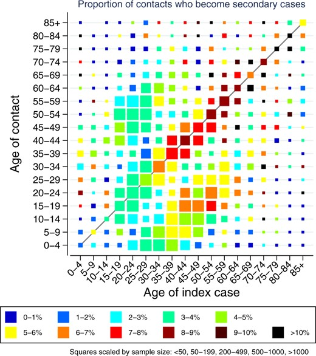
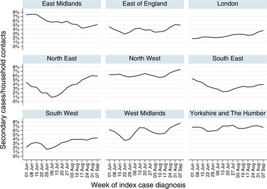

# Spread Analyses
Spread Analyses across the World and across different Settings
* [Short Summary](#short-summary)
* [Summary](#summary)
  * [Summary Findings regarding Transmission Paths](#summary-findings-regarding-transmission-paths)
  * [Summary Findings Population Susceptibility](#summary-findings-population-susceptibility)
  * [Summary Geographical Observations and Analyses](#summary-geographical-observations-and-analyses)
  * [Summary Situation Analyses and Contact Tracing](#summary-situation-analyses-and-contact-tracing)
  * [Summary Observations Population Susceptibility](#summary-observations-population-susceptibility)
* [Findings from Geographical Observations and Analyses](#findings-from-geographical-observations-and-analyses)
  * [Exchanged Air is associated to Covid Spread](#exchanged-air-is-associated-to-covid-spread)
  * [Dry Indoor Air is associated to the Spread of severe Covid](#dry-indoor-air-is-associated-to-the-spread-of-severe-covid)
  * [Life Circumstances: Can increase Susceptibility and Exposure](#life-circumstances-can-increase-susceptibility-and-exposure)
* [Geographical Observations and Analyses](#geographical-observations-and-analyses)
  * [Methods](#methods)
  * [Transmissions in Europe](#transmissions-in-europe)
  * [Transmissions in the USA](#transmissions-in-the-usa)
  * [Transmissions in Africa](#transmissions-in-africa)
  * [Transmissions in India](#transmissions-in-india)
  * [Transmissions in Nepal](#transmissions-in-nepal)
  * [Transmissions in South America](#transmissions-in-south-america)
* [Local Geographical Influences](#local-geographical-influences)
  * [Cities versus Rural](#cities-versus-rural)
  * [Living Conditions](#living-conditions)
  * [Income](#income)
* [Settings of where Zoonotic Jumps of Betacoronaviruses were observed](#settings-of-where-zoonotic-jumps-of-betacoronaviruses-were-observed)
* [Analyses of specific Settings](#analyses-of-specific-settings)
  * [Medical and Care Facilities](#medical-and-care-facilities)
  * [Indoor Social Settings](#indoor-social-settings)
  * [Cruise Ships](#cruise-ships)
  * [Airplanes](#airplanes)
  * [Factories](#factories)
  * [Large Scale Sporting Events](#large-scale-sporting-events)
* [Other Viruses](#other-viruses)
  * [Betacoronaviruses](#betacoronaviruses)
  * [Respiratory Viruses](#respiratory-viruses)
* [Individuality of Transmission](#individuality-of-transmission)
  * [Infector and Transmission Distribution](#infector-and-transmission-distribution)
  * [Observed Transmission Rates](#observed-transmission-rates)
  * [Infectors and Symptom Status](#infectors-and-symptom-status)
  * [Schools and Children](#schools-and-children)
* [Summarized References](#summarized-references)
  * [References Household Transmissions](#references-household-transmissions)
  * [References General Spread Patterns](#references-general-spread-patterns)
  * [References Covid Spread Children and Schools](#references-covid-spread-children-and-schools)
  * [References Living Conditions](#references-living-conditions)
  * [References SARS-2 in India](#references-sars-2-in-india)
  * [References SARS-2 in Eastern Africa](#references-sars-2-in-eastern-africa)
  * [References SARS-2 in Tropical Africa](#references-sars-2-in-tropical-africa)
  * [References SARS-2 in Southern Africa](#references-sars-2-in-southern-africa)
  * [References SARS-2 in South America](#references-sars-2-in-south-america)
  * [References SARS-2 in Europe](#references-sars-2-in-europe)
  * [References Spread Inferred from Sequences](#references-spread-inferred-from-sequences)
  * [References Sars-2 in South East Asia](#references-sars-2-in-south-east-asia)
* [References](#references)
  * [References Specific Settings](#references-specific-settings)
* [Appendix](#appendix)
  * [Terminology](#terminology)
  * [Sport Events](#sport-events)

## Short Summary
Methods: The spread behavior of Covid is analysed in geographical and social settings.

Observations: 
* High transmission rates of severe Covid are nearly only observed in situations where much air is exchanged between people. Much air is exchanged when spending much time in shared indoor rooms without good ventilation, in crowded confined settings. Deep breathing (High altitude or activities such as sports, singing) increases the air inhaled and thereby greatly increases the amount of particles deposited to the lungs. 
* Most severe cases and high fatality rates are observed in dry air. The indoor air is dry when heating, air-conditioning or when the outdoor air is dry.
* High fatality rates are associated to unhealthy lifestyles (e.g. obesity and polluted air).

Findings:
* Covid transmits mainly through breathed air but not trough droplets or fomites. Severe Covid transmits mainly through dry air.
* The individual differences regarding susceptibility and infectiousness are large and the risk factors for severe Covid (except high age) also tend to increase transmissions. Children can catch mild infections but are much less infectious compared to adults.

## Summary

### Summary Findings regarding Transmission Paths
* *Exchanged Air is associated to the Spread of Covid:* Covid-19 transmissions correlate to the amount of air people breadth from each other. The amount of exchanged air is high:
   * Confined air: Indoors with bad ventilation (often either heated or air-conditioned) 
   * Increased inhaling 
     * being at low air pressure (either high altitude or airplane) 
     * vocal activities such as singing or shouting
     * strains e.g. sports. Already going up a staircase can be enough when: the oxygen uptake is low (e.g. arteriosclerosis) or unathletic or going up fast.
* *Dry Indoor Air is associated to the Spread of severe Covid:* Nearly all waves of severe Covid occur in settings with dry air: heated, ACs or dry outdoor air. Likely since the lung deposition rate is increased when the exhaled virions dry out. Also the virions have a higher viability in dry air and the immune system clearance of the respiratory tract is reduced in dry air.
* *Droplet Transmission is Not important for the Spread of severe Covid:* In settings where droplet transmission but no aerosol transmission is likely, namely in crowded outdoor settings such as demonstrations or swimming pools, transmissions of symptomatic Covid-19 is not noticed.
* *Contact Transmission is possibly associated to the Spread of mild Covid but not of severe Covid* [arguments in work]
* *Fomite Transmission is Not important for the Spread of Covid:* In settings where contact and fomite transmission is likely (e.g. no water to wash , eating with hands), there is no evidence for transmission of Covid neither at the population level (regions where water to wash hands is scarce) nor through contact-tracing (e.g. on camping grounds, take away food).
  
The observations strongly indicate a generalized aerosol transmission model for symptomatic Covid: either droplet or dry form aerosol ([Summary Airborne Transmission](../5_epidemiological/transmission.md#overview-airborne-transmission)). Since severe cases are mainly observed in settings with dry indoor air, indicates dry form transmission need a special focus. Droplet or contact transmission may yield asymptomatic infections but don't cause symptomatic or severe Covid.

Regarding prevention measures relevant is, that the transmission of symptomatic Covid correlates to the amount of air exchanged. The exact transmission mechanism provides additional insights and helps fine-tuning but mostly it can be abstracted away. One of the most important prevention measure is Ventilation, especially in warm environments.

### Summary Findings Population Susceptibility
Founded by [observations of transmission within populations](#summary-observations-population-susceptibility):
* Population groups with an adequate and in form immune system in the lungs mostly get mild diseases and seem to be less infectious. These includes young people and especially children for whom Covid is no more or even less dangerous than common cold viruses or influenza. 
* On the other hand populations with long-time exposure to air pollution or have high prevalence of risk factors such as few movement and/or severe obesity tend to have more Covid cases and higher fatality rates.
  

### Summary Geographical Observations and Analyses

#### Geographical Settings with Increased Spread of Severe Covid
Covid-19 waves across the world are predated certain climates:
* _Cold Outdoors:_ Cold temperatures below 15 degrees during the day and below 10 degrees at night => indoor heating => dry indoor and often badly ventilated air
* _Hot and Humid:_ Hot outdoor air temperatures above 30 degrees or above 25 degrees combined with intense sun. But only in countries where air-conditioners are widespread (mostly wealthier, industrialized countries). => indoor air is recirculated and additionally ACs reduce the humidity.
* _Very Dry Air:_ Very dry outdoor air at moderate temperatures or high temperatures: Middle East (where also MERS spreads in the dry indoor air), northern India (e.g. Delhi, Uttarakhand, Chandigarh) and Nepal at the foothills of the Himalaya.

#### Geographical Settings with Mainly Mild Covid
High absolute humidity of outdoor air but no air-conditioners and dense living conditions. Examples: Coastal india (except tourism regions in the South like Goa and Puducherry where ACs are likely widespread), tropical Africa (spread data from Lagos in Mali, Nigeria, Gambia, South Sudan, Zambia), Indonesia.

#### Geographical Settings with Few Spread 
Situations which favour ventilation and being outdoors. E.g. rural regions around the world as long as the temperatures are not much below the comfort zone (heating when cold is common around the world).

### Summary Situation Analyses and Contact Tracing

#### Situations with an Increased Spread
Spread events are observed indoors or sometimes in semi-confined settings such as crowded stadiums in the evening:
  * [Large Scale Sporting Events](#large-scale-sporting-events) In sports clubs where spectators are/were allowed to the stadiums, the players have a much higher risks to get infected with Covid-19 than in regions without spectators. Moreover Covid-19 incidence rates seem to be higher in areas with large scale sport events (especially indoor). 
  * [Airplanes](#airplanes): High spread rates observed without adequate prevention measures (mask, ventilation). 
  * [Large Scale Production Factories](#large-scale-production-factories): Multiple large outbreaks observed mainly in food production factories around the world.
  * [Large Buildings](#living-conditions): In cold seasons small living spaces are associated with an increased spread.

#### Situations with NO increased Spread 
For crowded events during the day in unconfined settings (e.g. demonstrations or crowded swimming pools) no increased spread is observed (neither by contact tracing nor monitoring of the overall cases).
* In regions/settings with limited access to water for washing hands, which is mostly relevant before eating. E.g. for outdoor take away food no increased transmission has been observed even though hand washing is often waved.
* Crowded settings during the day in unconfined settings: Neither superspreading nor steep increases in the populations for repeated events (e.g. demonstrations, crowded parks, beaches and swimming pools).

### Summary Observations Population Susceptibility
* [Schools and Children](#schools-and-children): Children are less susceptible to infection and they spread Covid less than adults. In schools if there were many infected this is mostly due to super spreading teachers and not children infecting each other. [argumentation in work]
* [Population](#population-specific-transmission): Analyzing the spread across people: 20% are responsible for 80% of the infections.
* [Air Pollution](#dirty-air-exposure): Regions which had high air pollution over the last decades seem to have many more cases and have higher death rates.
* [Overweight](#overweight): Regions where overweight tend to have more cases and higher fatality rates.

  

---

## Findings from Geographical Observations and Analyses

### Exchanged Air is associated to Covid Spread
Covid-19 waves across the world usually are predated by situations which favour time spent indoors and bad ventilation which are heating in harsh climates and air-conditioners in hot and humid climates.

#### Low temperature => Indoor Heated
When the temperatures are below the comfort zone, at least during the night, the time spend indoor increases and the windows tend to be closed.

Situations with many severe Covid cases:
* In the respective winter times of the northern and southern hemispheres.
* At high altitude the winter starts earlier (high altitude also increases the amount of air breathed).

#### Hot & Rich => Air-Conditioned
ACs are prevalent in Regions with high temperatures over prolonged periods (mostly latitudes between 30 degrees South and North) if the degree of mechanization is high (often associated with a median gdp/person above 10'000 $) or tourism.

Situations with many severe Covid cases:
* Southern US in summer: E.g. Los Angeles, Florida, Texas and Arizona
* South Americas: Brazil
* Coastal regions of Mexico (in Mexico City high altitude and dry air are probably the important factors)
* Some parts of Southern Europe: regions of Spain, Portugal, Greece
* Most Countries in the Middle East
* Southern and coastal India e.g. the tourism region Goa

#### High Altitude => Low Pressure
Spread is increased at high altitude since the volume of air breathed is increased.

Situations with many severe Covid cases:
* In Central and South America a couple of large cities are above 2000 meters: Mexico City, La Paz in Bolivia, Quito in Ecuador, Bogota in Colombia
* Winter sport locations in the Alps and Rocky Mountains.

#### Settings which favour staying indoors => Indoors Air Breathed Increased
* In large cities people tend to spend more time indoors than on the country side.
* Measures that motivate to stay at home and avoid outdoor activities, not always are beneficial since they increase the time spend indoors. Additionally they can yield respectively enhance unhealthy lifestyles and thereby increase susceptibility for severe Covid. For people living in houses with  gardens (and regions where many people life in houses) staying home can work or at least not increase the spread. On the other hand in settings with [small living spaces](#living-conditions), where already an increased transmission is observed, measures which increase the time spend indoor or encourage meeting indoors can yield additional transmissions.

#### Many People in the Same Building => Indoor Air Exchanged in the Stairwells
* Large residential blocks if no good ventilation in the stairwells and/or flats. Nearly all places with many Covid cases have a high share of residential blocks: cities in the Wuhan, Tehran, Milan, Spain, UK, US, Czech, Paris, ...
* Densely populated indoor places where people from many places meet. E.g. crowded pubs & bars, public transport, cruise ships, ...

Remark: Protection measures help to reduce shared air, which is reduced by ventilation or filtered to some extent by masks. E.g. in public transport with good ventilation and good fitting masks the infection risk is likely low.

### Dry Indoor Air is associated to the Spread of severe Covid

#### Heated, ACs, Dry Outdoors => Dry Indoor Air
Nearly all steep increases in severe cases and deaths have been observed in settings where the indoor air is dry. 
* Indoor Heated: Heating reduces the relative humidity. Observed in regions with cold Winters across the world.
* Air Conditioned: ACs remove humidity. Many covid deaths when the outdoor air is humid are only observed in regions where air-conditioners are frequently used (e.g. Large cities in northern Brazil nearly year round, South Brazil in Summer, Cities in Southern US summer 2020, Tourism Regions in Southern India Gao).
* Dry Outdoor Air: Examples: Peru Spring 2020, northern Central India Spring 2021

#### No ACs & No Heating and Humid Outdoor => Humid Indoor Air
* The indoor air is humid if the outdoor air is humid and neither heated nor air-conditioned (or otherwise dehumidified). Heating is less optional than air-conditioning.
* In humid air settings combined with dense living conditions (e.g. Indonesia, Lagos in Nigeria, large cities of coastal India e.g. suburbs of Mumbai): High seroprevalence for Covid-19 has been detected but mainly asymptomatic or mild cases with very low fatality rates. But in humid air (above 50% relative humidity) Covid-19 deaths seem rare.

#### Explanation of the Air Humidity Effects
* The viability of coronavirus virions is highest in dry air (below efflorescence humidity) (-> [Page Virion Viability](../2_biological/virion_viability.md))
* In humid environments, organic particles act as condensation nuclei and therefore loose their dry form. So viruses "find" themselves within growing droplets, which fall to the ground. On the other hand in dry air particles stay in the air long (-> [Fate of Particles in the Air](../5_epidemiological/transmission.md#the-fate-of-particles-in-the-air)).
* Particles get deposited earlier in the respiratory tract (-> [Particle Dynamics in the Respiratory Tract](../5_epidemiological/transmission.md#deposition-factors)) where the immune system is better prepared to control viruses and therefore only mild diseases are caused (-> [Infection Locations and Disease Patterns](../3_medical/coronavirus_disease_patterns.md)).
* The immune system clearance in the respiratory tract works better (-> [Humidify Inhaled Air](../6_prevention_and_treatment/increasing_the_mucus_flow.md))
  

### Life Circumstances: Can increase Susceptibility and Exposure

#### Dirty Air Exposure
* ##### Air Pollution
  _Through Air Pollution_: High rates of air pollution occur frequently in industrialized densely populated regions which have inversion weather situations (usually in the winter). Examples (in decreasing order, source: estimates from watching the maps at ventusky.com): northern India, central and northern China (including Wuhan), northern Italy, Tehran

* ##### Smoking
  _Through Smoking_: Smokers and Ex-Smokers. Ex-smokers have a higher risk for severe risk than never smokers.

  > However the overall health benefits of a smoke stop outweigh by fare a possible increased Covid incidence: Current smokers seem to have no higher Covid risk than never smokers, but a lower risk than former smokers. This could be caused by (possibly toxic) environment changes in the lung when smoking.[Local environment changes in the lungs](../6_prevention_and_treatment/temperature_modulation.md) can also be achieved with sauna or steam inhalation which don't have the possibility of health hazards which smoke has. 
  
  > 12.6.21: It's not about smoke-free - Everyone should judge the risks to take in life on his own. But since smoking is addictive, I consider restrictions on advertisement as adequate.

#### Overweight
* *Observations:*
    Countries with high rates of obesity tend to have much more severe cases than countries with lower rates but otherwise similar characteristics. 

    Selected countries with high rates of obesity (in decreasing order, source: obesity.procon.org):
    US, Jordan, Turkey, Mexico, UK, Hungary, Israel, Czechia

    Few obesity: Vietnam, Bangladesh, India, Nepal, Japan

* *Possible Explanation:*
    * One reason is that obesity increases the risk for severe Covid. But the case counts seem to increase overall i.e. also in people which are not obese [to check and cite/provide evidence]. 
    * It is observed that the number of exhaled particles is correlated to the BMI, so obesity may increase transmission.

## Geographical Observations and Analyses
> entire section in work and incomplete, May/June 2021

### Methods
For regions across the world the following is analysed:
* *Observations* = Covid-19 cases and deaths to find Covid-waves i.e. time spans with increased spread.  While Covid-19 decrease or stay low despite having a relevant number of possible Covid spreaders (Not Considered as of May 2021: the spread in regions with very low case numbers with extensive contact tracing, behaves differently.)
* *Measures* = Measures taken to flatten/prevent Covid waves.
* *Possible Causes* = Geographical, climate and social situations including measures taken which seem to explain the spread.
 

### Transmissions in Europe

#### General Patterns
##### Spring 2020
* Measures: Strict measures in countries but often focussed on contact/fomite transmission
* Observations: High number of cases: in the Lombardy (starting point and discovered late, many residential blocks, history of air pollution), central Spain (quite high altitude, dense living conditions), Belgium, UK (obesity rate quite high, residential blocks)

##### Summer and Autumn 2020
* Measures: Focus on droplet prevention, Masks usage becomes common.
* Observations: 
  * A wave with the linage 20A.EU1 starts on the iberian peninsula (Spain and Portugal). [Hodcroft et al](#summary-hodcroft) show that the lineage 20A.EU1 was first primarily sequenced in Spain and later in many parts of Europe. Before Spain was hit by this wave, there was an excess in deaths in Portugal, which could be due to Covid [to clarify and link statistics]. So the wave probably started in ACs rooms in Portugal moved to Spain and in late summer to France and UK. Next the wave hit Switzerland, Belgium and Netherlands.
  * [in work] In late summer and early autumn cases increased at low level in central Europe and Great Britain but overall stayed low until climate got cooler. In october when temperatures felt and the heating season started, cases sharply increased.

#### Transmissions in the UK
##### Summer 2020
Overall quite low case numbers, though the numbers are higher in the Northern regions than in the warmer Southern regions (citation in work, noted in [Hall et al](#summary-hall)]). In parallel the secondary attack rate in households is higher in the Northern parts as observed by ([Hall et al](#summary-hall)). The higher secondary attack rate indicates a higher (transmission rate which would explain the higher case rates .
##### Autumn 2020
##### December 2020 - January 2021
##### February - May 2021

### Transmissions in the USA
#### Spring 2020
* Measures: Strict measures in many areas
* Observations: High number of severe cases in densely populated areas, mainly large urban centers in the North (e.g. New York).

#### Summer 2020
* Observations: Moderate to high number of severe cases in the urban centres of the Sun Belt.

#### Autumn and Winter 2020
* Observations: 
  * High number of severe cases starting where the winter comes first: Central North and at high altitude (Colorado).
  * Early to Mid Winter 2020/2021: High case numbers in many states (less severe cases where the winter is warmer)
  * Mid to Late Winter 2021: Cases start decreasing. 
* Possible Causes: The decline starting early January 2021 is likely due a combination of factors such as 1) some built up immunity 2) awareness and caution of the population and the government after peaks around thanksgiving but no overly strict measures such as general curfews and 3) shifting the [protection focus to aerosol transmission](../7_social/controlling.md) (outdoor gastronomy and shopping was often allowed e.g. in New York) => people are and meet outdoors. Additionally the measures were adapted to the local situations.
  

#### Spring 2020
* Measures:
  * Non pharmaceutical interventions lessened in many states. 
  * A large vaccination program.
* Possible Causes: A key reason for low cases are likely the warming temperatures, especially in the Southern states. The vaccination program is excepted to reduce the number of severe cases [to check if fatality rate lowered]. 

### Transmissions in Africa
#### Summarized Observations in Tropical Africa
* *High Prevalence* In urban settings where living conditions are dense, very high spread rates were/are observed: 
  * up to 70% of the population seropositive
  * over 7% PCR positive at the same time. Accounting that nasal swabs usually have detection rate of less than 70%, an estimated 10% of the population are infected simultaneously.
* *Mainly Asymptomatic* The wast majority of cases are unnoticed and mild: often those with positive seroprevalence experienced didn't experience more disease symptoms than those with negative seroprevalence (which is different from Europe/Americas or South Africa).
* *Very low fatality rates* The death rate per million inhabitants is very low. The high infection rates combined with the few number of deaths yield very low infection fatality rates, mostly below 0.01%.

> Interpreting Seroprevalences: The seroprevalence test kits have sensitivity/specificity tradeoffs and when designed and calibrated in one region, they may not work as well in an other region/setting. The cut off values can be adjusted to correct the specificity but influencing the sensitivity: So those with negative seroprevalence may still have been infected or those with positive seroprevalence may cross-react with antibodies targeted at non-SARS-2 antigens.

#### Literature on the Epidemiology of SARS-2 in tropical Africa
* [Sagara et al](#summary-sagara) observed measured the seroprevalence in July and December in rural and urban regions of Mali:
  * In urban regions the seroprevalence increased from 20% to 70%.
  * In rural regions from roughly 5% to 35 - 55%.
  * Seroconversion was not associated to experienced symptoms, however seroconversion was slightly associated with searching medical advice.
* In Zambia during the first Covid wave [Mulenga et al](#summary-mulenga) observed a PCR positive rate of about 10% in urban settings and 3% in rural settings yielding an average of 7% positive. The seroprevalence at the early phase of the wave was about 2%. 
* [Quashie et al](#summary-quashie) observe seroprevalences of ranging from 10-15% (shopping malls, formal employees, higher education) to 25% (markets, informal employees) in August 2020. In February the pattern changes: The seroprevalences is now higher in the formal sector with about 25% compared to about 20% in the informal sector. //=> possibly indicates droplet transmission in the early spread since with aerosol spread on would except shopping malls to be hit first. But with dense crowds and (semi-)confined aerosol spread is also possible.
* [Wiens et al](#summary-wiens) found that in South Sudan at least 22% had been infected by SARS-2 in the first wave (May to August; Seroprevalence was done in September). After adjustment for age, waning antibodies and sex about 40% seem to have been infected by September 2020. 
* By September 2020, in Ibadan (Nigeria) around 45% of the hospital staff had detectable antibodies ([Olayanju](#summary-olayanju)) and over 30% in Kinshasa (Kongo) ([Ndaye](#summary-ndaye)).

#### Transmissions in Southern Africa
##### South Africa
The spread patterns are in-between the observations from Europe/North America and  tropical africa:
* There are summer and winter peaks.
* The seroprevalence after the first Covid wave which was in Winter (June-Aug) 2020 was high and ranged from 15% to 50% depending  on the socioeconomic background ([Shaw et al](#summary-shaw), [Hsiao et al](#summary-hsiao)). Informal housing and lower earning were significantly associated with seropositivity. All testees worked at the same shopping complex but the prevalence varies greatly among the different types of employees which indicates that transmissions occurred at home and not at the workplace ([Shaw et al](#summary-shaw)).
* About 20% of the cases have typical symptoms of a respiratory disease and also a share of severe cases is observed ([Shaw et al](#summary-shaw)).
* The performance of seroprevalence test-kits tends to be similar as in European and North American continents ([Hsiao et al](#summary-hsiao))).

#### Northern Africa
[in work]

#### Eastern Africa
[in work]

### Transmissions in India

#### Northern States
##### Spring 2021
* Observations: High number of severe cases in urban centres close to the foothills of the Himalaya such as Delhi and Chandigarh. 
* Possible Causes: These cities have very dry air in the spring season due to katabatic winds from the Himalaya which is still snow covered in Spring (especially in the March, April).

#### Coastal and Southern States

##### Summer 2020
##### Spring 2021
* Observations: High number of severe cases in the tourism regions in the South such as Goa or Puducherry.  
* Possible Causes: These regions have warm and humid climate in the Spring often due to South winds. Due to tourism air-conditioning is likely widespread (tourism brings culture, technology and money).

  > Tourism and travelling play an important role in culture and technological exchange across the world. Historic examples are numerous:
  > * Marco Polo brought back many things from his journey along the silk road.
  > * The first trams in Switzerland were not in the urban centres but up in mountainous and rural Engadin brought by British tourists [to confirm].

### Transmissions in Nepal
##### Spring 2021
* Covid cases: Nepal is confronted for the first time with many severe Covid cases.
* Possible causes: Similar to northern India, at the foothills of the Himalaya there's dry air in the spring. The wave swept over from northern India.

### Transmissions in South America

<!--
#### Observations Spring 2020
Most countries in South Americas recorded many cases, a notable exception is Uruguay with very few cases and only a couple of deaths. The geographic and social situation are hugely different across the Continent. 
All countries provided programs for financial support and additionally:
- Nationwide Quarantines: Argentina, Bolivia, Columbia, Ecuador, Peru, Chile[to Check]
- Stay at home recommendation: Uruguay
- No/few nationwide rules: Brazil

#### Argentina

#### Brazil
* High death rate in the district of the capital Brasilia.
* Manaus in where the climate is year round tropical with hot and humid air, had
-->

#### Transmissions in Peru
##### Summer 2020
* Measures: General Curfew implemented quite early in Spring 2020.
* Covid Cases: Very high number of severe cases and many deaths.
* Possible Causes: 
  * Many cities in central Peru have dry air due to katabatic winds from the Andes.
  * Dense living conditions including large residential blocks in the capital Lima.

## Local Geographical Influences

### Cities versus Rural
A main distinguishing feature between rural and cities is that in rural areas people are segregated by geographical distance (corresponding a lower population density over entire regions) and thus the time to travel while in cities people tend to be segregated by social factors such as interest/jobs/hobbies/age/world views. The distance separation induces well defined clusters (villages). Social factors yield clusters to but the borders are softer and the clusters are different for each social factor. 
Infectious disease wave through the clusters until there's no more ground to nourish. 

##### Rural
* Segregated by mobility
* Life is often outdoors or distributed indoor rooms during the day but in the evening the society is tightly connected. 

##### Urban
* not segregated by mobility (but by social factors) which yields a different segmentation for each factor
* life is often indoors but distributed. 
* People belong to different clusters trough a day
* High population densities which are often associated with dense [living conditions](#living-conditions) are common.

#### Observations
* In less densely populated provinces (more rural and smaller cities) the Covid-waves are more steep and shorter i.e. the incidence curve is more peaked compared to the incidence curves in large cities (Observation and simulations by [Rader,Scarpino et al](#summary-rader,scarpino)).

> I also except that in rural settings: 
> * at the peak incidence a large share of the population is infected at the same time and the wave passes through the entire community in one go (e.g. observed by [Dalziel et al](#summary-dalziel) for influenza).
> * lower death rates (probably 2/3) due to immune systems better adapted to viruses. 

### Living Conditions

#### Observations from Literature
People in neighborhoods in cities with small living areas and a low incomes are more frequently infected and contribute above average to the spread of Covid. Small living space is correlated to low income which in turn is correlated to jobs where home office is less possible (e.g. service)  
* [Brueningk et al](#summary-brueningk) deduce the Covid-19 spread from SARS-CoV- 2 genome sequencing: Small living space and low incomes are associated with increased spread (effective R values are higher for the tertiles with the lowest living space/lowest income).
* [Lundkvist et al](#lundkvist) observe that in Stockholm people living in suburbs with large buildings built in the 60s have a seroprevalence of 30%, compared to a seroprevalence of 4% for people living in modern building (likely some form of ventilation is built in).

#### Share of Residential Blocks
Across the world regions and communities with a large share of people living in residential blocks tend to have higher Covid infections rates:
* Large cities in the UK and the US which have high shares of residential blocks, had high severe Covid case rate. [to confirm and cite/source]
* In Eastern Europa, where the share of residential blocks built in the 60s through 80s is high, Covid case rates where high during the winter 20/21.
* The Lombardy in northern Italy was a Covid hot-spot in winter 2020 and had high cases in Winter 2021. The share of people living in residential blocks is higher than in the neighboring regions: Ticino (Switzerland) and regions in northern Italy such as the South Tirol. Severe Covid rate were very high in late Winter 2020 and still quite high in Winter 2021.

### Income

#### Income Effects within Cities
In some cities in Western Europe (e.g. in Basel, Stockholm -> [References Living Space](#living-space)), a negative correlation between income and Covid cases is observed within 'commuting areas' i.e. analyzing only areas within commuting distances. Within commuting/catchment areas  the income usually is correlated to the [living space](#living-space), which is possibly a founding cause. Also jobs which require physical presence in large buildings (e.g. fabrics) tend to have low wages.

#### Income Effects between Cities
When comparing income in larger areas than commuting distances, there the negative correlation between income and Covid cases does not hold: 
* rural areas with low incomes show no increased Covid case count compared to rich cities [to provide data/cite]

#### Income Effects on the Country Level
On the country level Covid cases and deaths are positively correlated to income.

---

## Settings of where Zoonotic Jumps of Betacoronaviruses were observed
* The initial cases that led to the discovery of Sars-CoV-2 occurred  during cold outdoor air temperature and therefore dry indoor air in the Wuhan Sea Food market. Pictures of the market suggest that the market is partly indoor and therefore likely heated. The zoonoses of Sars-Cov-1 also are linked to a live animal market or civets kept inside restaurants.
* The primary spreading indoors can be a reason  this new betacoronavirus diseases occurred recently, even though overall hygiene increased. There are other possible explanations however: One is that the diagnostic tooling improved enabling the discovery of these diseases (MERS, discovered in 2012, has been infecting humans at least for several decades, which is known from analyzing backup samples [to cite]).

---

## Analyses of specific Settings

Spread situations and patterns of Covid-19 both observed and described in literature are discussed. 

### Medical and Care Facilities

##### Hospitals
> in rework May 21

In settings without prior SARS experience the infection rate in health care workers is very high:
* 2003 in South East Asia  (Introduction [Mizumoto](#mizumoto))
* 2019/2020 in Europe - Italy especially ([Lancet Editorial](#lancet-editorial))
	
Possible Explanation: The medical staff is used to protect against fomites and droplet transmission and to some extent versus aerosol transmission and know to handle them. However, they are not yet used to the new spreading pattern. Consequently in all rooms of the building wearing a mask likely is key in reducing the infection rates (many cities in China reported few infections in hospitals [citations to be added]).

##### Long Term Care Facilities
Long-Term Care Facility in Seattle [Honein et al](#honein).

### Indoor Social Settings
* [Contact Tracing in Hong Kong](#summary-adam) revealed that transmission in social settings (bars, weddings, temples) was associated with more secondary cases than households.

### Cruise Ships

#### Diamond Princess

##### Observations
Diamond Princess Cruise Ship anchored in Japan. The elucidative analysis by [Mizumoto and Chowell](#mizumoto) shows:
* Covid-19 spread started between passengers and not equally between passengers and personal.
* Very high peak values of the reproduction number are observed (over 10).

##### Interpretation
The observations indicate long range but same room transmission which favours aerosol over droplet transmission:
* In the droplet model, one would except the personal to be crucial for the junction of the different guest groups, since they have the most short range contacts, which enable droplet transmission.
* Smoke diffuses entire rooms and stays quite long => spending much time in the same confined rooms is more relevant than interactions or being close but only for a short period. Therefor an initial spread in passengers is expected (if the initial spread starts in the passengers) since they spend the time in the same areas.
* The reproduction number peak values are well above the number of close contacts a person usually has and so droplet transmission is unlikely.

The observed spread patter even favour small or dry particulates over larger aerosol particulates, since for larger particles are more local spread would be excepted:
* For 'large' aerosol transmission about an equal spread would be expected.

### Airplanes
[Freedman and Wilder-Smith](#freedman) is a concise review about the knowledge on airplane transmission as of September 2020. Table 1 in their paper summarizes the studies reviewed. Key points from their summary:
* "In-flight transmission of SARS-CoV had previously been demonstrated during the symptomatic but not asymptomatic phase of illness. In 2003, up to 22 transmissions occurred on a single f light from a single index case;1 conversely, several other carefully stud- ied flights resulted in no transmission."
* For SARS-CoV-2 two super-spreading events (more than 10 transmissions) have been observed. Both in March when no adequate aerosol protection measures were in place. Both index cases were symptomatic. 
* Since strong protection measures are in place only few transmissions have been described. 
* Protection measures in airplanes:
  * Screens for symptoms at boarding time (asymptomatic patients have been frequently overlooked but they rarely caused transmissions.
  * Masks (mostly permanent but often meals are served)
  * Ventilation is not mentioned in the paper from [Freedman and Wilder-Smith](#freedman), see [Ventilation in Airplanes](#ventilation-in-airplanes)

#### Ventilation in Airplanes
Ventilation:  Airlines seem to have optimized ventilation to have a high air exchange (20 times per hour) and the air flow is from top to bottom (and not anymore from front to back) [citations in work].

### Factories
Around the world in many large scale production factories especially in those preparing food (e.g. meat, bread), large Covid-19 outbreaks among the personal have been observed [citations/sources in work].

#### Analysis Factories
> Noteworthy that often food production factories are concerned. This could be due to low temperatures and no sunlight, in these settings the [virion survive long](../2_biological/_site/virion_viability.md).[To check whether they reuse filtered air and what temperature/humidity settings]

### Large Scale Sporting Events
Large scale sporting events provided likely ground for ultra-spreading events. The evidence for this is currently based on:
* Players and staff were very frequently infected yielding to many cancellations of matches. Infections are very rare in countries with fan bans. Sport events settings (number of spectator and protections measures) and infected players and populations in the appendix: [Sport Events](#sport-events).
* The increase of Covid-19 cases seems to be steeper in regions where spectators of large scale sporting events live (steep increases in Switzerland regions where ice-hockey spectators are, increase in Nether) [to check and verify]
* Sport events settings (number of spectator and protections measures) and infected players and populations in the appendix: [Sport Events](#sport-events).

> October/November 2020: There's no proof yet as fare as I know. But evidence strong enough to **not allow spectators** anymore in Covid risk regions. Clarify the picture: Prevalence of Covid-19 in the spectators either through antigen/PCR (PCR: ideally whole genome sequencing to backtrace the transmission pathways) or by studying seroprevalence rates. 

> In epidemiology too: *Exploring and trying combined with measurements, consideration and analyses help* to understand SARS-CoV-2 including its transmission. 

## Other Viruses
### Betacoronaviruses
#### SARS-CoV-1
* _Hotels_: Hotel in Hong Kong, especially during cooler outdoor air temperatures [Lin](#lin), [Chan](#chan). The virus spread to guests in rooms on the same floor. Spread to personal was rarely observed.

#### Mers-Cov
Most superspreading events were observed in winter and often in hospitals ([Dudas et al 2017](../2_biological/hosts_of_nidovirales.md#summary-dudas-2017)).

<!--
### Alphacoronaviruses [in work]
-->

### Respiratory Viruses
* Perez-Lopez et al analysed the effect of school closures on respiratory viruses. [Summary of Perez-Lopez et al](#summary-perez-lopez) and commented in the [Schools and children section](#schools-and-children).

---

## Individuality of Transmission
> Knowing how transmissions and infectors are distributed, can help to adjust control measures. 

### Infector and Transmission Distribution
The infector distribution is highly skewed:
* Contact tracing in Hong Kong revealed that [Adam et al](#summary-adam):
  * 20% of the cases induced 80% of infections
  * 10% of the cases induced 20% of infections
  * 70% of the cases induced no observed infections (despite most of them being not in quarantine)
* A spread analysis (SEIR model based on sequencing and epidemiological data) in Israel in spring 2020 shows that between 2% and 5% of the population contribute for 80% of the spread ([Miller et al](#summary-miller)). Comment: The simulation show that if the actual cases were several fold higher than the actual cases, 2% of the population are responsible for 80% of the spread. This is likely the case since experience shows that even the best detection schemes miss the majority of cases.

### Observed Transmission Rates
* [Hall et al](#summary-hall) reveal by analyzing "Household Transmission Evaluation Data" in England:
  * people between 5 and 29 years have much lower household transmission rates than the other groups. 
  * The household transmission is high between people over 40 years of approximately the same age.
  * Very young children (0 to 4 years) transmit Covid frequently to their parents or grandparents. 
    > Their immune system in the lungs is early in the training phase and additionally they may not have had contact with any coronaviruses and so they lack the cross immunity most older have acquired from the human endemic CoVs.
* [Brueningk et al](#summary-brueningk): As noted in the section [living conditions](#living-conditions), people with small living space or small income have higher average R values.
* Children are less susceptible and transmit Covid less than adults as discussed in the section [schools and children](#schools-and-children). Children also do not super spread since in school settings no super spreading can be traced back to children.

#### Possibly Causes for different Transmission Rates
Possible reasons for the skewed distribution are:
* *Socioeconomic conditions:*
  [Living Conditions](#living-conditions) influence transmission chains.
* *Individuality of Virus Shedding.*
  Viral shedding is highly individual. Being infected does not imply one sheds infectious virions. The viral shedding depends on where the infection is, the respiratory behavior (e.g. breathing pattern, coughing, sneezing) and the physiology of the respiratory tract. How many small particulates persons produce is highly individual and tends to increase with age, male sex and BMI. Described on in [particle sources](../5_epidemiological/transmission.md#particle-sources). Other factors such as immune system preparedness and behavior are also important.

### Infectors and Symptom Status
 Note: The strains prevalent during the time of investigation is relevant since coronaviruses can diminish or activate the immune system.
 * In early 2020 over 80% developed symptoms.

* [Adam et al](#summary-adam) found in January through April in Hong Kong 2020 only 2.2% (7 in 309) of the infections were caused by pre-symptomatic people.
* The two mass infection events observed in airplanes were both caused by symptomatic infectors [Freedman and Wilder-Smith](#freedman). 
* [Madewell et al](#summary-madewell) find that in household settings symptomatic infectors cause about 3 times as many infections as pre/asymptomatic infectors. 

### Schools and Children
Children are less likely to be infectees and less likely to be infectors.

A recommended review is [COVID-19 Transmission and Children: The Child Is Not to Blame](#leeraszka) by B. Lee and W. Raszka. Notable findings from the studies are below and summaries of most studies are in [Summarized References](#summarized-references).

* [Dattner et al](#summary-dattner) observed that children are relative to adults
  * less susceptible 45% [40%, 55%]) 
  * somewhat less infectious 85% [65%, 110%])
* [Madewell et al](#summary-madewell) find that children are only about half as likely to get infected in households compared to adults (spouses which are most likely to get infected and the adult infections are biased by relationship habits).
* [Vlachos, Hertegard and Svaleryd](#summary-vlachossvaleryd) found that parents children in the 9th school year (open schools)had about the same incidence rate for Covid-19 as parents children in the 10th school year (closed school). If adjusted for factors such as age and occupation the risk was about 15% higher for being diagnosed with Covid-19 when the child went to open schools. // Comment: this indicate that other factors are more important than whether the children go to school. 
* Large high school outbreak in Israel shortly after reopening of the schools. The outbreak was probably due to aerosol super-spreading from teacher(s) which was enable by densely populated rooms and the permanent use of air-conditioning [Summary Stein-Zamir](#summary-stein-zamir). 
* [Ehrhardt et al](#summary-ehrhardtbrockmann) observed in Baden-Wuertenberg between 19 May to 28 July:
  * 6 of 137 infected pupils infected a total of 11 other pupils (an R value contribution of below .1)
  * 3% of infections of children (0-19 year) could be traced back to schools. Where as 41% to families and 8% to festivals/events.
* [Perez-Lopez et al](#summary-perez-lopez) published statistics about viruses detected in nasopharyngeal swabs from visits in Sidra Medicine, the main pediatric center in Qatar. They observed a significant 30 fold reduction for influenza A. A 30% reduction was observed for influenza B and Common HCoVs. //Comment: Their observations indicate that in school settings only the influenza A transmission is efficient and other viruses are transmitted mainly in setting other than schools. This in turn indicates that for most viruses adults play the major role in the transmission.
 

---

## Summarized References
[in work]
References without a summary are in the section [References](#references). Copy & Paste citations are in "___". 

### References Household Transmissions

> #### Comments on Household Transmissions
> * Even if the Covid prevalence is low, infected household members may community acquire the infection at the same event since the transmission is super-spreading-event driven and the disease onset can be hard to determine due to asymptomatic/low symptomatic cases and varying incubation times. Sensitivity analyses with varying the cut-off dates between symptom onsets help for symptomatic cases.
>  * If the community transmissions are high, the secondary attack rates needs correction for community acquired infections. Also commented at [Summary Madewell](#summary-madewell)].

#### Summary Hall
JA Hall, RJ Harris, A Zaidi, SC Woodhall, G Dabrera, JK Dunbar, 
**HOSTED—England’s Household Transmission Evaluation Dataset: preliminary findings from a novel passive surveillance system of COVID-19**, 
International Journal of Epidemiology, Volume 50, Issue 3, June 2021, Pages 743–752, 
<https://doi.org/10.1093/ije/dyab057>

##### Methods
"The Household Transmission Evaluation Dataset (HOSTED) is a passive surveillance system linking laboratory-confirmed COVID-19 cases to individuals living in the same household in England. We explored the risk of household transmission according to: age of case and contact, sex, region, deprivation, month and household composition between April and September 2020, building a multivariate model."
##### Results
The heat map below (Figure 3 in the paper) shows the secondary cases by age of the index case and age of the contact:
* _Few Spread:_ People younger than 30 year but older than 4 have few secondary cases (left third of the image).
* _Much Spread:_ 
  * For index cases above 40 years the transmissions are high. The transmission rates peak at an age of about 65 years.
  * Very young children 0 to 4 of age transmit Covid well and mainly to their parents and their grand parents (left most column).
  * Parents between 40 and 59 transmit to older children (15-24) but the children not to them (hotspot at middle right, missing hotspot on the mirrored)

The graphs below show the secondary attack rate in the different administration division in the UK. 

> // The Southern regions have lower secondary attack rates likely due to the more comfortable climate in the summer months.

##### Methods Details
"As the incubation period for SAR-CoV-2 is thought to be 2–14 days [16],  we chose a threshold of 2 days between the specimen dates of the index and secondary cases as a pragmatic decision to offset the risks of misclassifying cases as either co-primary or as secondary. A sensitivity analysis using a cut-off of 4 days found to have little effect on any of the results or on the multivariable model. We have also made the implicit assumption that two (or more) cases oc- curring in a household within 2–14 days represents house- hold transmission when it also plausible that they are two independent community-acquired infections. However, given the timing of this study, when the number of cases was at its lowest, this risk is probably small." 

> // Considering the asymptomatic/low symptomatic cases, simultaneous community acquired infection (e.g. at a super spreading event) cannot be ruled out even with the sensitivity analysis by varying the incubation cut-offs.

#### Summary Madewell
**Household transmission of SARS-CoV-2: a systematic review and meta-analysis of secondary attack rate**
Zachary J. Madewell, Yang Yang, Ira M. Longini Jr, M. Elizabeth Halloran, Natalie E. Dean
medRxiv preprint 
<https://doi.org/10.1101/2020.07.29.20164590>, posted August 1, 2020.

##### Methods
Meta-Analysis of studies regarding the transmission dynamics of Covid-19 in household settings. Many different kind of studies are included: 
* Covid diagnosis based on live tests (RT-PCR) or past infections with antibody tests, some studies included symptoms, a few studies do whole-genome sequencing, some studies are in settings (area and times) of high prevalence.
* The influence of the different factors (contact type, symptom status, adult/child contacts, sex, relationship to index case, number of contacts in household, ...) is analyzed.

##### Findings
Secondary Attach Rates with different groups as **infectors**. The error rate is in brackets. 
* household: 0.19 (0.4); family including non household contacts: 0.18 (0.5)
* symptomatic: 0.2 (0.6); pre- or asymptomatic: 0.07 (0.04)

Secondary Attach Rates with different groups as **infectees**. The error rate is in brackets. 
* children: 0.16 (0.6); adults: 0.31 (1.2) // adults includes spouses
* spouse: 0.43 (1.6); other: 1.8 (0.8)

Proportion of households where a secondary transmission was observed:
* 0.32 (.025)

Comparison with SARS-1 or MERS:
* SARS-1: 0.06 (0.04)
* MERS: 0.035 (0.035)

> ##### Comment
> Studies from countries with high and very high Covid prevalence are included too, in these countries independent infections pathways for different household members are very likely and thus inferring the secondary attack rate from the prevalence in household members overestimates the secondary attack rate. 

### References General Spread Patterns

#### Summary Adam
**Clustering and superspreading potential of SARS-CoV-2 infections in Hong Kong**
Adam D, Wu P, Wong J, et al. Research Square; 2020. 
<https://doi.org/10.21203/rs.3.rs-29548/v1>

##### Methods
"Using contact tracing data from 1,038 SARS-CoV-2 cases confirmed between 23 January and 28 April 2020 in Hong Kong, we identified and characterized all local clusters of infection."

##### Results
* Distribution of Infectivity:
  * 20% of the cases induced 80% of infections
  * 10% of the cases induced 20% of infections
  * 70% of the cases induced no observed infections (despite most of them being not in quarantine, Fig.2)
* "Gatherings in social settings such as bars, restaurants, weddings and religious sites appear to be at increased risk of superspreading events."
* "Transmission in social settings was significantly associated with an increased number of secondary cases compared to transmission observed in family households."
* Quarantine
  * Home quarantine yielded sporadic infections (2 observed) in family settings (Fig.2 d) and none outside families
  * Government quarantine yielded no further infections (Fig.2)
* "Of all cases confirmed in Hong Kong, 195 (18.8%, 195/1,038) were asymptomatic at confirmation (Supplementary Table 2) and, of these, most (83.1%, 162/195) were PCR-confirmed from 27 March onward" (Extended Data Fig.2)
* Infections caused by pre-symptomatic infectors were rarely observed: "Seven instances of likely pre-symptomatic transmission were observed where onset of the infectee preceded that of the infector or occurred on the same day."

##### Limitations
"These findings take advantage of the quality of case ascertainment and contact tracing data in Hong Kong, although some incompleteness in links between cases could potentially bias our estimates of transmission heterogeneity."

### References Covid Spread Children and Schools

#### Summary Ehrhardt,Brockmann
**Transmission of SARS-CoV-2 in children aged 0 to 19 years in childcare facilities and schools after their reopening in May 2020**
Ehrhardt J , Ekinci A , Krehl H , Meincke M , Finci I , Klein J , Geisel B , Wagner-Wiening C , Eichner M , Brockmann SO . , Baden-Württemberg, Germany. Euro Surveill. 2020;25(36):pii=2001587. 
<https://doi.org/10.2807/1560-7917.ES.2020.25.36.2001587>

##### Methods
"We investigated data from severe acute respiratory syndrome coronavirus 2 (SARS-CoV-2) infected 0–19year olds, who attended schools/childcare facilities, to assess their role in SARS-CoV-2 transmission after these establishments’ reopening in May 2020 in Baden-Württemberg, Germany."

##### School Setting
50% Group Size: Yes, Cleaning of Surface: Yes, Regular Ventilation: Yes, Hygiene: Yes, Face Mask in Break: Some, Face Mask in Classroom: No, Physical Distancing: Some, No Singing: Most, Physical Education: No

##### Results
* Infection by pupils
  1. Total of 557 Covid-19 cases in the age group 0-19 year out of a total of 3104 cases in Badenwuertenberg in the study period (19.5-25.7)
  2. For 453 School attendance information was available
  3. 137 (30% of 453) were at least 1 day at school while infectious 
  4. 11 other pupils were infected by 6 of those 137
  5. no secondary infection from those 11 were detected despite extensive contact tracing
* only 15 (3%) of 453 infected children (with school attendance known) were infected in schools (the 11 above from other pupils and 4 by teachers). Most infections occurred in families or festivals/events (Table 2).

#### Summary Vlachos,Svaleryd
**School closures and SARS-CoV-2. Evidence from Sweden’s partial school closure**
Jonas Vlachos, Edvin Hertegard, Helena Svaleryd

##### Methods
Remark: Working Paper
* "Swedish upper secondary schools moved to online instruction while lower secondary school remained open. This allows for a comparison of parents and teachers differently exposed to open and closed schools, but otherwise facing similar conditions."
* the incidence rates were adjusted using logistic regression for wage, sex, occupation, educational attainment, income, regions of residence and of origin. OLS was used too. 

##### Results
* Comparison of Covid-19 incidences between parents with children in schools and homeschooling:
  * unadjusted the Covid incidence were near the same 5.67 versus 5.66 (Table 2)
  * adjusted the risk for parents with children in school was about 15% [OR 1.15; CI95 1.03–1.27] higher if adjusted with logistic regression(Table 1)
* "Among lower secondary teachers the infection rate doubled relative to upper secondary teachers [OR 2.01; CI95 1.52–2.67]. This spilled over to the partners of lower secondary teachers who had a higher infection rate than their upper secondary counterparts [OR 1.30; CI95 1.00–1.68]."

> ##### Comment
> It is not clear that the observed slightly increased Covid incidence of parents/teachers of lower secondary school children results from transmission from the children, it could also be attributed to parents visiting the schools and a transmission between adults. 

#### Summary Stein-Zamir
**A large COVID-19 outbreak in a high school 10 days after schools’ reopening, Israel, May 2020.**
Stein-Zamir Chen , Abramson Nitza , Shoob Hanna , Libal Erez , Bitan Menachem , Cardash Tanya , Cayam Refael , Miskin Ian .  Euro Surveill. 2020;25(29):pii=2001352. <https://doi.org/10.2807/1560-7917.ES.2020.25.29.2001352>

##### Methods
Analyzing a large high school out break in Israel shortly after schools have been reopened. 

##### School Setting
* From 13 March to 17 May Schools in Israel were closed (limited opening for small children on 3 May)
* A heat wave with temperatures up to 40 degree from 19–21 May: 
  * "air-conditioning functioned continuously in all classes."
  * no face-masks
* "crowded classes: 35–38 students per class, class area 39–49 m2, allowing 1.1–1.3 m2 per student"

##### Results
* "Testing of the complete school community revealed 153 students (attack rate: 13.2%) and 25 staff members (attack rate: 16.6%) who were COVID-19 positive."
* "COVID-19 rates were higher in junior grades (7–9) than in high grades (10–12) (Figure 1). The peak rates were observed in the 9th grade (20 cases in one class and 13 cases in two other classes) and the 7th grade (14 cases in one class). Of the cases in teachers, four taught all these four classes, two taught three of the four classes and one taught two of these four classes."
* "Most student cases presented with mild symptoms or were asymptomatic."

#### Summary Dattner
Dattner I, Goldberg Y, Katriel G, Yaari R, Gal N, Miron Y, et al. (2021) **The role of children in the spread of COVID-19: Using household data from Bnei Brak, Israel, to estimate the relative susceptibility and infectivity of children.** 
PLoS Comput Biol 17(2): e1008559. <https://doi.org/ 10.1371/journal.pcbi.1008559>
##### Methods
* "Data were collected from households in the city of Bnei Brak (City close to Tel Aviv), Israel, in which all household members were tested for COVID-19 using PCR."
* The authors developed a model (discrete, stochastic and dynamic) for the propagation of Covid within a households. With this model infectivity and susceptibility of children and adults can be estimated and compared.
 
##### Findings
* "Inspection of the PCR data shows that children are less likely to be tested positive compared to adults (25% of children positive over all households, 44% of adults positive over all households, excluding index cases), and the chance of being positive increases with age."
* "We estimate that the susceptibility of children (under 20 years old) is 43% (95% CI: [31%, 55%]) of the susceptibility of adults. The infectivity of children was estimated to be 63% (95% CI: [37%, 88%]) relative to that of adults."

#### Summary Perez-Lopez
**Dramatic decrease of laboratory‐ confirmed influenza A after school closure in response to COVID‐19**
Perez‐Lopez A, Hasan M, Iqbal M, Janahi M, Roscoe D, Tang P.; Pediatric Pulmonology. 2020;1–2. 
<https://doi.org/10.1002/ppul.24933>

##### Methods
* "A proactive school closure was the first social distancing measure implemented by the State of Qatar on 10 March."
* "Table 1 shows a comparison of the molecular detection of respiratory viruses other than SARS‐CoV‐2 on nasopharyngeal swabs from our PED per 1000 emergency visits before school closure, between 13 February and 14 March, assuming a maximum incubation period for influenza of 4 days, and after school closure, between 15 March and 11 April."

##### Results

Virus tested| open schools|closed schools| RR (95% CI)
------------|-------------|-------------|-------------------
Total tests | 75.1 (69.1‐81.6) | 64.1 (60.3‐77.6) | 0.9 (0.7‐1)
Influenza A | 8.7 (6.7‐11.1) | 0.3 (0.07‐1.5) | 0.03 (0.004‐0.2)
Influenza B | 3.3 (2.2‐4.9) | 2.3 (1.1‐4.7) | 0.7 (0.3‐1.5)
RSV |0.9 (0.4‐1.9) | 1 (0.3‐2.8)| 1.1 (0.3‐3.7
Rhino/entero | 12.1 (9.7‐14.8) | 12.3 (9.7‐17.4)| 1 (0.7‐1.4)
hMPV | 3.6 (2.4‐5.2) | 3.3 (1.9‐6.1)| 0.9 (0.5‐1.8)
Common HCoVs | 3.1 (2‐4.6) |  2.3 (1.1‐4.7) | 0.7 (0.3‐1.6) 
Adenovirus | 2.3 (1.3‐3.7) | 7.2 (5.1‐11.1) |3.2 (1.7‐5.8)
Parainfluenza | 3.1 (2‐4.6)| 3.6 (2.1‐6.4) | 1.2 (0.6‐2.3)

---
   
### References Living Conditions

#### Summary Rader,Scarpino
**Crowding and the shape of COVID-19 epidemics**
Rader, B., Scarpino, S.V., Nande, A. et al.
Nat Med (2020). 
<https://doi.org/10.1038/s41591-020-1104-0>

##### Goal
Figure out the effect of population densities (crowding), mobility, humidity on the overall and the temporal distribution of Covid-19 incidences. 

##### Methods
The incidence rates of Covid was analysed in China and Italy.
Their work consists of two parts: 
1. A spread analysis, using various statistical methods.
     * Regions which published independent Covid cases were considered as units. In China these were provinces [to confirm]. 
     * For each unit the population density is determined.
     * To measure how peaky the incidence curves are, Shannon entropy is calculated. 
2. The spread is simulated. The simulation is done for different population models [to check].

##### 1. Analysis Results
* lower density = sparse (rural areas): 
  * more peaked incidence rates, most of the infections are within 20 days (Figure 1a)
  * lower cumulative incidence (final attack rate)
* high density = crowded (large cities): 
  * less peaked incidence rates, most of the cases are within 40 days (Figure 1a)
  * higher cumulative incidence rates
##### 2. Simulation Results
* lower density = sparse: 
  * intervention measures cause the incidence curve to flatten out and moderately reduce total case count (Figure 3 c and d)
* high density = crowded: 
  * intervention measures are crucial since without interventions prolonged spread with high numbers of infected is predicted (Figure 3 c and d)

#### Lundkvist
Åke Lundkvist, Stefan Hanson & Björn Olsen (2020) 
**Pronounced difference in Covid-19 antibody prevalence indicates cluster transmission in Stockholm, Sweden**, 
Infection Ecology & Epidemiology, 10:1, 
DOI: 10.1080/20008686.2020.1806505

##### Methods
"The prevalence of COVID-19 antibodies on June 17–18, 2020 was investigated in two residential areas of Stockholm, Sweden."
##### Results
In Norra Djurgårdsstaden, modern residential blocks in the upper price class, 4.1% of study participants had SARS-CoV-2-specific antibodies. In Tensta a suburb with low cost apartments in large residential blocks (built in the 60s and 70s), 30% of the participants tested antibody positive.

#### Summary Brueningk
**Determinants of SARS-CoV-2 transmission to guide vaccination strategy in a city**
Sarah C. Brüningk, Juliane Klatt, Madlen Stange, et al; medRxiv 
<https://doi.org/10.1101/2020.12.15.20248130>

> An updated version is online (June 2021), however the summary below is not yet updated and is based on the version online in January 2021

##### Methods
The influence of 4 socioeconomic factors (Living space per person, Median Income, 1-person households, Seniority) on the spread of SARS-CoV-2 is analysed with a spread simulation model constructed  from cases, sequenced cases and serology. In a second step the overall spread of Covid and the ICU occupancy is simulated when high spreading subgroups are given a reduced transmissibility respectively vulnerable subgroups have an increased resistance to severe Covid.

>  The term vaccinated is used in the paper but since it is unknown (as of 27.1.2021) whether the available vaccines produce a useful immunity regarding transmission and there are other methods (e.g. testing, masks, natural immunity) to reduce transmissibility the term reduced transmissibility is used here.

##### Results
People belonging to the thirds with the smallest living space per person have the largest pre-lockdown effective reproductive number (shown in Figure 3). Similarly people in the lowest income (which is likely well correlated to the living space) have a high reproductive number. Reducing the transmissibility of the people belonging to the lowest living space third or the lowest income third reduces and delays the maximal icu occupancy (Figure 7).

##### Methods Details
* Sequence Information: "In total 247 cases within the time period from the 25th of February until the 22nd of April were included in this analysis. For all data a seven day moving window average was taken to account for reporting bias on weekends, and cumulative numbers of infected cases (compartment I) were calculated."
* Simulation: "SEIR-model. Similar to previous work [20, 52, 53] the spread of the epidemic within the city of Basel was described using a compartmental two-arm SEIR model including both sequenced, and un-sequenced/unreported cases."
* Serology: "We determined SARS-CoV-2 antibody responses in a total of 2,019 serum samples collected from individuals between 25th of February and 22nd of May, 2020, to account for sero-conversion. The cohorts included healthy blood donors and patients from the University Hospital Basel with residency in Basel-City, and Viollier AG Zurich, a lab medicine provider contracted for the SARS-CoV-2 PCR testing."
##### Results Details
* Mobility:
  * "We observe that low and median income populations are more mobile than their wealthier counterparts. Moreover, there is little mobility within areas with a low share of 1-person households, a result of the predominantly peripheral location of the relevant statistical blocks (see Figure S5). For living space per person or percentage of senior citizens, mobility was comparable between tertiles with a trend towards higher mobility within the younger population groups."
  * "For living space per person or percentage of senior citizens, mobility was comparable
146 between tertiles with a trend towards higher mobility within the younger population groups."
* "We found that blocks with a higher median income (2% achieved significance), or higher living space per person (1% achieved significance), or lower share of 1-person households (2% achieved significance) had a significantly lower Ref f (< 1.7) relative to the maximum Ref f observed in the relevant partition."
* "Serology information was used to estimate the fraction of unreported cases as follows: An estimated 1.88% (38/2,019) of the Basel-City population was infected with SARS-CoV-2. Of these 60% would be attributed to the B.1-C15324T strain, leading to a percentage of 88% of unreported/unsequenced cases to consider."

#### Summary Dalziel
**Urbanization and humidity shape the intensity of influenza epidemics in U.S. cities**
Benjamin D. Dalziel, Stephen Kissler, Julia R. Gog, Cecile Viboud, Ottar N. Bjørnstad, C. Jessica E. Metcalf and Bryan T. Grenfell
Science 362 (6410), 75-79. 
<https://doi.org/10.1126/science.aat6030>

##### Methods
* "However, the role of city size and structure in shaping transmission patterns of seasonal influenza is not well understood. We address this here using 6 years (2002 to 2008) of data on weekly incidence of influenza- like illness (ILI) in 603 three-digit postal (ZIP) codes across the United States, assembled from medical claims data (34)."
##### Results
* "We find that differences in v-j among cities persist across years—some cities have consistently more intense epidemics than others, year after year. " //v-j is defined as the normalized inverse of the Shannon entropy of incidence distribution in  a given city and year // higher v-j means 'peakier' influenza waves
* "Cities with higher mean intensity tend to be located in the east, have smaller population sizes, and have higher-amplitude seasonal fluctuations in specific humidity." (Fig 1 D-F)
* "Increasing base transmission potential can decrease epidemic intensity in a seasonally forced compartmental epidemic model." (Fig 2)
* Population size and crowding increase the base transmission potential. (Fig 3 F,G)

### References SARS-2 in India

#### Summary Inbaraj
Inbaraj LR, George CE, Chandrasingh S (2021) 
**Seroprevalence of COVID-19 infection in a rural district of South India: A population-based seroepidemiological study.** 
PLoS ONE 16(3): e0249247. <https://doi.org/10.1371/journal.pone.0249247>
##### Methods
Study Population:
* 509 individuals over 18 years.
* "Hypertension (20.2%) and diabetes (16.9%) were reported as the most common comorbidities."
Seroprevalence Testing:
* "The serum was separated and used to test for antibodies using the Elecsys Anti SARS CoV2 assay, an electro chemiluminescent immunoassay using a recombinant protein representing the nucleocapsid (N) antigen for the determination of high-affinity antibodies (including IgG) against SARS CoV2 [15]"
* ". The assay sensitivity and specificity were reported to be 97.2% (95.4–98.4) and 99.8% (99.3–100) respectively, in samples taken 30 days or more post symptom onset [16]." //assay used according to standard specifications 
##### Results
* "The overall seroprevalence of COVID-19 was 12.4% (95% CI 9.6–15.6) (Table 2) The age- and gender-adjusted seroprevalence was 8.5% (95% CI 6.9%- 10.8%) (S1 Table)."
* "We estimated an IFR of 12.8 per 10000 infections or 0.13% ..."

Unadjusted seroprevalence (shown Table 2):
* overall 12.4%
* hypertension 16.3%
* diabetes 10.7%
* more than 8 years education 15.6%
* age >40 12.1%

//the increased seroprevalence with over 8 educations suggest a correlation to income which may be correlated to AC usage.

#### Summary George
George CE, Inbaraj LR, Chandrasingh S, de Witte LP (2021). 
**High seroprevalence of COVID-19 infection in a large slum in South India; what does it tell us about managing a pandemic and beyond?** Epidemiology and Infection 149, e39, 1–6. 
<https://doi.org/10.1017/S0950268821000273>

##### Objective
* "The objective of the current study was to estimate the seroprevalence of COVID-19 infection in a dense slum of South India. We hypothesised a high prevalence of infection, considering the density of the population and the impossibility of preventive measures in this setting."
* "Devarajeevanahalli (DJ Halli), also known as the ‘Dharavi of Bangalore’ is one of the largest governments notified slums in Bangalore, extending over 1.15 km2 with an estimated popula- tion of 100 000 people [3–5] (Fig. 1)."
* "Further, screening and testing efforts were hindered by communal violence which claimed three lives in this area [12]."

##### Methods
* "The serum was separated and used to test for antibodies using the Elecsys Anti SARS CoV2 assay, an electrochemiluminescent immunoassay using a recombinant protein representing the nucleocapsid (N) antigen for the determination of high-affinity antibodies including IgG against SARS CoV2 [15]."
* "The assay sensitivity and specificity were reported to be 97.2% (95.4–98.4) and 99.8% (99.3–100), respectively, in samples taken 30 days or more post-symptom onset [16]."

##### Results
* Seroprevalence by IgG:
  * overall, unadjusted: 57.9% (95% CI 53.4–62.3)
  * with hypertension: 66.6%
  * with diabetes: 62.3%
* IFR: 2.94 per 10'000 = 0.03%
* "The majority (95.2%) of the seropositive individuals, did not report any symptom related to COVID-19 infection at the time of the study nor in the past."

##### Discussion
* "A recent survey done in all 30 districts of Karnataka state, conducted from 16 September 2020 among all adults aged 18 years and above, reported adjusted IgG seroprevalence of 16.4% [23]. Though low (pregnant women attending the antenatal clinic), moderate (persons moving in the community) and high risk (elderly and persons with comorbid conditions) population group were covered, the survey did not include population from slums, a possible explanation for low prevalence."
* Limitations:
  1. Pragmatic sampling due to violence 2 weeks before.
  2. No adjustment of seroprevalence to age but seroprevalence similar across age groups anyways.
  3. Less men than women, since men were not home  during day time. //Possibly field work which would could explain the lower seroprevalence of men.

#### Summary Malani
Malani, A., Shah, D., Kang, G., Lobo, G. N., Shastri, J., Mohanan, M., Jain, R., Agrawal, S., Juneja, S., Imad, S., & Kolthur-Seetharam, U. (2021). 
**Seroprevalence of SARS-CoV-2 in slums versus non-slums in Mumbai, India.** 
The Lancet. Global health, 9(2), e110–e111. https://doi.org/10.1016/S2214-109X(20)30467-8

##### Objective
Seroprevalence in six slum and non-slum communities across three wards (one each from the three zones) of Mumbai, India.
##### Methods
* Date: June 29-July 19, 2020
* Location: Slums and non-slums in Mumbai, India
* Antibody-testing: "At the Kasturba Hospital laboratory, plasma was separated and used to test for IgG antibodies via chemiluminescence (CLIA) using Abbott Diagnostics ArchitectTM N-protein based SARS-CoV-2 tests. According to the manufacturer, sensitivity was 96.77% (95% CI: 90.86 to 99.33) and specificity was 99.63% (95% CI: 99.05 to 99.90). Manufacturer validation results are consistent with 3, finding a sensitivity of 96.9% (89.5% to 99.5%) and specificity of 99.90% at ≥14 days after symptom onset. However, according to 4, sensitivity was 92.7% (95% CI: 90.2, 94.7) and specificity of 99.9% (95% CI: 99.4, 100) at ≥14 days after symptom onset."(from supplemented appendix, therein are also references 3 and 4)

##### Results 
* "Our estimates of adjusted seroprevalence are higher in slums (means ranging from 55·1% to 61·4%) than in non- slums (mean ranging from 12·0% to 18·9%) across wards (appendix p 8)."
* "Combined with reported COVID-19 cases and numbers of death in sampled wards, our findings suggest a high asymptomatic spread of the infection and an infection fatality rate of 0·076% in slums and 0·263% in non-slums."
* In slums at age>60 the seroprevalence was highest with about 60%. While in non-slums it was lowest for those over 60, with about 12% (Table e5) 

  > In slums likely is not possible for the older to avoid infection and they may also spend more time indoor.

### References SARS-2 in Eastern Africa

#### Summary Abdella
S. Abdella et al., **Prevalence of SARS-CoV-2 in urban and rural Ethiopia: Randomized household serosurveys reveal level of spread during the first wave of the pandemic** EClinicalMedicine (2021), <https://doi.org/10.1016/j.eclinm.2021.100880>
##### Methods
* *Type*: Seroprevalence
* *Testing Dates:* 22. July - 2. September 2020
* "We undertook a population-based household seroprevalence serosurvey based on 1856 participants in Ethiopia, in the capital city Addis Ababa, and in Jimma, a middle-sized town in the Oromia region, and its rural surroundings (districts of Seka and Mana), between 22 July and 02 September 2020."
* 1856 Participants
* "We tested one random participant per household for anti-SARS-CoV-2 antibodies using a high specificity rapid diagnos- tic tests (RDTs) and evaluated population seroprevalence using a Bayesian logistic regression model taking into account test performance as well as age and sex of the participants."
##### Results
"IgG prevalence was estimated at 1.9% (95% CI 0.43.7%), and combined IgM/IgG prevalence at 3.5% (95% CI 1.75.4%) for Addis Ababa in early August 2020, with higher prevalence in central sub-cities. Prevalence in Jimma town was lower at 0.5% (95% CI 01.8%) for IgG and 1.6% (95%CI 04.1%) for IgM/IgG, while in rural Jimma IgG prevalence was 0.2% and IgM/IgG 0.4% in early September."

### References SARS-2 in Tropical Africa

#### Halatoko
Halatoko WA, Konu YR, Gbeasor- Komlanvi FA, Sadio AJ, Tchankoni MK, Komlanvi KS, et al. (2020) 
**Prevalence of SARS-CoV-2 among high-risk populations in Lome ́ (Togo) in 2020.** 
PLoS ONE 15(11): e0242124. <https://doi.org/10.1371/journal.pone.0242124>

#### Summary Elimian
Elimian KO et al (2020). **Descriptive epidemiology of coronavirus disease 2019 in Nigeria, 27 February–6 June 2020.** 
Epidemiology and Infection 148, e208, 1–16.  <https://doi.org/10.1017/S095026882000206X>
##### Methods
* *Investigation Period*: 27.2.20 - 6.6.20
* *Type*: PCR tests, Symptoms
##### Results
* Cumulative incidence (CI): 5.6 per 100 000 population
* Case fatality (CF): 2.8%

###### Symptoms
Overall the disease symptoms were not associated to seropositivity: symptomatic non-cases 9307 (32.5%) of 28637 non-cases, symptomatic confirmed cases 4139 (30.8%) of total confirmed cases 13 446.

The following table shows selected symptom of Non Cases and Confirmed Cases (summarized from Table 2 in the paper). Percentages in the table refer to individuals with the symptom among symptomatic individuals (total is 9307 for non cases and 4139 for cases).

Symptoms| - | + 
--|--|--
Cough|52|56
Chest pain|3|4
Difficult Breathing | 20|19
Rapid Breathing|1.2|1.5
Fatigue |3|5
Fever| 42|56
Headache|9|14
Runny Nose|26|24
Sore Throat|28|20
Loss of Smell|0.5|4
Loss of Taste|.5| 3.1
Diarrhea(Table 3)|-|8

// The symptoms tend to indicate infections in the middle respiratory tract (e.g. bronchi since cough fever) but less in the lower lungs(not much fatigue and very few ARDS). The low rate of loss of smell/taste and sore throat don't indicate primarily upper respiratory tract infections.

#### Summary Sagara
Sagara, I., Woodford, J., Kone, M., Assadou, M. H., Katile, A., Attaher, O., Zeguime, A., Doucoure, M., Higbee, E., Lane, J., Doritchamou, J., Zaidi, I., Esposito, D., Kwan, J., Sadtler, K., Dicko, A., & Duffy, P. (2021). 
**Rapidly increasing SARS-CoV-2 seroprevalence and limited clinical disease in three Malian communities: a prospective cohort study.** 
medRxiv : the preprint server for health sciences, 2021.04.26.21256016. https://doi.org/10.1101/2021.04.26.2125601

##### Methods
The seroprevalence in a couple urban and rural communities was investigated both in July and in December. The rainy season is between July and December, so the sampling visits are at the beginning and at the end of the rainy season. The rainy season is also mosquito season and thus malaria season. 
* *Investigated:* Seroprevalence, demographic, social, medical and self-reported symptoms
* *Testing Dates:*
  * Visit 1: 27 July and following weeks
  * Visit 2: 14 December and following weeks
* *Study Population:* "Overall, 94.8% (2533/2672) of participants completed both study visits. A total of 50.3% (1343/2672) of participants were male, and 31.3% (837/2672) were aged <10 years, 27.6% (737/2672) were aged 10-17 years, and 41.1% (1098/2572) were aged over 18 years."
##### Results
The seroprevalences for visit 1 and visit 2 are summarized in Figure 2:
* Urban Sotuba has the highest prevalence both times: 20% at the first visit and about 70% at the second visit.
* Rural Bancoumana has the second highest prevalence with with about 7% for visit 1 and 53% for visit 2. 
* Rural Doneguebougou has the lowest prevalence with about 5% at visit 1 and 37% at visit 2.

The overall findings are:
* "The cumulative SARS-CoV-2 exposure rate was 58.5% (95% CI: 47.5 to 69.4). This varied between sites and was 73.4% (95% CI: 59.2 to 87.5) in the urban community of Sotuba, 53.2% (95% CI: 42.8 to 63.6) in the rural town of Bancoumana, and 37.1% (95% CI: 29.6 to 44.5) in the rural village of Donéguébougou."
* Regardless whether seropositive or seronegative about half experienced some disease symptoms. The seropositive were a little likelier to search medical advice (63% to 46%).
##### Methods Details
* *Seroprevalence:* "Sera separated from blood samples collected at each visit were tested for the presence of IgG antibodies to SARS-CoV-2 spike protein and receptor binding domain (RBD) at the MRTC/DEAP Immunology Laboratory using a reference ELISA adapted for optimized performance in the local population [6, 14]. Seropositivity was defined as spike protein and RBD assay absorbance values (optical density, OD) above antigen cutoffs. The estimated sensitivity and specificity of these cutoffs was 73.9% (51.6 to 89.8) and 99.4% (97.7 to 99.9) respectively [6]."
* *Symptoms:* "Symptom history included systemic symptoms: fever, chills, fatigue, myalgia, and headache; respiratory symptoms: sore throat, cough, rhinorrhea, shortness of breath, wheeze, anosmia/loss of taste, and respiratory symptoms not otherwise specified; and gastrointestinal symptoms: nausea/vomiting, abdominal pain, and diarrhea. Symptom severity was estimated based on self-reported school or work absenteeism, presentation for medical attention, and hospitalization."
##### Results Details
* Symptoms: "Among seropositive participants, 48.6% (352/724) reported a history of any symptoms, compared to 49.3% (803/1629) in seronegative participants. As a result of increased background illness rates, it is difficult to establish which symptoms are associated with COVID-19 in the study population. Chills (3.7% (27/724) vs 2.1% (34/1619), p=0.0250) and fatigue (4.3% (31/724) vs 2.5% (41/1619), p=0.0275) were more frequently reported by seropositive participants compared to seronegative participants." ... "In participants reporting symptoms at visit 2, seropositive individuals were more likely to have sought medical attention for symptoms compared to seronegative individuals (63.4% (223/352) vs 45.9% (366/797), p<0.0001, Supplementary Table 4)."

#### Summary Mulenga
Lloyd B Mulenga, Jonas Z Hines, Sombo Fwoloshi,et al
**Prevalence of SARS-CoV-2 in six districts in Zambia in July, 2020: a cross-sectional cluster sample survey,**
The Lancet Global Health, Volume 9, Issue 6, 2021,Pages e773-e781,ISSN 2214-109X, <https://doi.org/10.1016/S2214-109X(21)00053-X.>
##### Methods
* *Testing Dates*: 4. July - 27. July 2020
* *Type*: Seroprevalence, PCR testing, Symptoms
* *Study Population:* "Overall, 4258 people from 1866 households participated in the study. The median age of participants was 18·2 years (IQR 7·7–31·4) and 50·6% of participants were female."
##### Results
* Prevalence: 
  * The rtPCR-positive prevalence was 7.6%  and the seroprevalence was 2.1%. The national testing data indicate that the first wave in Zambia started in July, which is consistent with a low seroprevalence but high PCR values.
  * The prevalence in rural regions was about 3% compared to 10% in cities.
  * Prevalence tends to be higher for people with a higher educations level.

##### Discussion
* "Only a small proportion of people with SARS-CoV-2 infection were aware of their infection."

#### Summary Ndaye
Nkuba Ndaye, A., Hoxha, A., Madinga, J., Mariën, J., Peeters, M., Leendertz, F. H., Ahuka Mundeke, S., Ariën, K. K., Muyembe Tanfumu, J. J., Mbala Kingebeni, P., & Vanlerberghe, V. (2021). 
**Challenges in interpreting SARS-CoV-2 serological results in African countries.**
The Lancet. Global health, 9(5), e588–e589. <https://doi.org/10.1016/S2214-109X(21)00060-7>
##### Methods
* *Testing Dates:* 17 July to 13 August
* *Type:* Seroprevalence
* *Study Population:* 
  * The median age of participants was 42 years; 242 (43%) of 562 participants were male and 320 (57%) were female.
  * Healthcare staff
* *Location:* Kinshasa (capital of the Democratic Republic of Congo)
##### Results 
1. "202 samples (36%) were seropositive using the EUROIMMUN IgG, 171 (30%) using the Quickzen IgM and 72 (13%) using the Quickzen IgG. Only 46 (8%) of 562 samples were positive by all three tests."
2. "Two of eight participants who had previously tested positive by SARS-CoV-2 PCR were seronegative by all three commercial serology tests."
3. "89 (16%) samples were positive for malaria by microscopy."

> The seroprevalence (1.) is likely over 40% since low seroprevalence of those with a positive PCR test (2.) suggest a low sensitivity of the immune assays.
  
##### Method Details
* *Seroprevalence:* "These three commercial assays were the EUROIMMUN IgG ELISA (EUROIMMUN, Lübeck, Germany)—a widely used assay in Europe, with sensitivity of 94·6% and specificity of 99·8%—and Quickzen IgG and IgM (Zentech, Belgium), a lateral flow test that detects IgG and IgM antibodies on a single device with a specificity of 100% and sensitivity of 68·8% for IgM and 49·2% for IgG.1"

#### Summary Olayanju
Olayanju, O., Bamidele, O., Edem, F., Eseile, B., Amoo, A., Nwaokenye, J., Udeh, C., Oluwole, G., Odok, G., & Awah, N. (2021). 
**SARS-CoV-2 Seropositivity in Asymptomatic Frontline Health Workers in Ibadan, Nigeria.** 
The American journal of tropical medicine and hygiene, 104(1), 91–94. <https://doi.org/10.4269/ajtmh.20-1235>
##### Methods
* *Study Population:* 
  * "This is a hospital-based cross-sectional study; healthcare workers who had not taken the COVID-19 test and had no COVID-19–related symptoms were randomly selected from different departments of the hospital." 
  * 133 participants
* *Location:* Ibadan, Nigeria
* *Test Dates:* May, June 2020 ? [to check]
##### Results
* "Sixty participants were positive for SARS-CoV-2 IgG, indicating a seroprevalence of 45.1% in the study population (Table 1)."
* "Grouping of study participants by department where they work showed that 90% of O&G staff, 60% of emergency staff, 59% of medicine staff, 33% of micro- biology staff, 32% of chemical pathology staff, 23% of surgery staff, and 21% of private suite staff recruited for this study were seropositive for SARS-CoV-2, whereas none of the study participants recruited from hematology was seropositive."

#### Summary Wiens
**Seroprevalence of anti-SARS-CoV-2 IgG antibodies in Juba, South Sudan: a population-based study**
Kirsten E. Wiens, Pinyi Nyimol Mawien, John Rumunu, et al 
medRxiv 2021.03.08.21253009; <https://doi.org/10.1101/2021.03.08.21253009>
##### Methods
During August 10–September 11, 2020, we recruited 2,214 participants for a representative household-based cross-sectional serosurvey in Juba, South Sudan.*
* *Study Population:* 2214, from 1840 interview data available
##### Results
* "We found 22.3% of participants had severe acute respiratory syndrome coronavirus 2 (SARS- CoV-2) receptor binding domain IgG titers above prepandemic levels. After accounting for waning antibody levels, age, and sex, we estimated that 38.3% (95% credible interval 31.8%–46.5%) of the population had been infected with SARS-CoV-2."
* Those having experienced a respiratory illness, which 6% had, had seroprevalence of 19.5%; those who had no respiratory illness had a seroprevalence of 22.5%. //=> Covid is not associated with respiratory symptoms for most.

#### Summary Quashie
**Trends of SARS-CoV-2 antibody prevalence in selected regions across Ghana**
Peter Kojo Quashie, Joe Kimanthi Mutungi, Francis Dzabeng, Daniel Oduro-Mensah, ..., Patrick Ansah, William K. Ampofo, Francisca Mutapi, Gordon A. Awandare
medRxiv 2021.04.25.21256067; <https://doi.org/10.1101/2021.04.25.21256067>

##### Methods
* "To estimate the level of community exposure to SARS-CoV-2 in Ghana, we conducted
37 phased seroprevalence studies of 2729 participants in selected locations across Ghana." 
* *Test Dates:* Phase 1 in August, Phase 2 in October, Phase 3 in December and Phase 4 in February.
* *Study Population:* 1305 in Phase 1, 395 Phase 2, 393 Phase 3, 636 Phase 4 (Table 2)

##### Results
* The socio-demographic characteristics of participants are shown in Table 1. The corresponding serostata are tabled in Table 2. Key findings:
  * Phase 1: "In Phase I, 252/1305 (19%) tested positive for IgM or IgG or both. Exposure rate was significantly higher among individuals tested at markets/lorry stations (26.9%) compared to those at Shopping Malls (9.4%)."
  * Phase 2 and 3: "Phases II and III screening activities in October and December 2020,
  49 respectively, showed no evidence of increased seroprevalence, indicating either a reduced
  50 transmission rate or loss of antibody expression in a subset of the participants."
  * Phase 4: The seroprevalence in shopping mall staff now increased to 25% from 9.4% in phase 1. The seroprevalence in heath care related settings increase to 22.2% from 13.4% in phase 1.sy
* "Additionally, the high exposure levels seen in the communities suggest that COVID-19 in Ghana still predominantly presents with none-to-mild symptoms. "

### References SARS-2 in Southern Africa
#### Summary Hsiao
Hsiao M et al,
**SARS-COV-2 SEROPREVALENCE IN THE CAPE TOWN METROPOLITAN SUB-DISTRICTS AFTER THE PEAK OF INFECTIONS**
COVID-19 Special Public Health Surveillance Bulletin, 18 (S5)

##### Methods
* *Testing Dates:* "15 July and 7 August 2020" //right after the peak of the first Covid wave in South Africa. The cases were still quite high and winter was ongoing.
* *Study Population:* Public sector patients in Cape Town Metropolitan: "The source of the residual samples was pregnant women who required blood grouping as part of standard antenatal care, and persons living with HIV (PLWHIV) who underwent routine annual viral load monitoring at public sector clinics."
* *Seroprevalence Testing:* "SARS-CoV-2 total antibody (IgG and IgM) testing was performed on the Roche Cobas e601 platform using the ElecsysTM anti-SARS-CoV-2 assay (Roche, Geneva, Switzerland) according to manufacturer’s instructions."
##### Results
* *Seroprevalence:* "The seroprevalence varied between subdistricts (range 31%-46%), males and females (33% and 42%, respectively), and source populations (42% in PLWHIV and 38% in antenatal women)."
* *Seroprevalence Accuracy:* "From a local assay validation prior to the study using local RT-PCR positive symptomatic individuals and stored negative sera taken prior to December 2019, we established a sensitivity of 91.2% and specificity of 99,7% (Dr M Naidoo, personal communication). This performance is similar to findings in independent evaluations in Germany12, Iceland7 and an evaluation by Public Health England that found a sensitivity of 86.1% (95% confidence interval (CI) 74.8-90.7%) and specificity of 100% (95% CI 99.1-100%) using the same assay."

#### Summary Shaw
Shaw JA, Meiring M, Cummins T, Chegou NN, Claassen C, Du Plessis N, et al. (2021) 
**Higher SARS-CoV-2 seroprevalence in workers with lower socioeconomic status in Cape Town, South Africa.** 
PLoS ONE 16(2): e0247852. https://doi.org/ 10.1371/journal.pone.0247852
##### Methods
* *Study Population:* "We tested 405 volunteers representing all socioeconomic strata from the workforce of a popular shopping and tourist complex in central Cape Town with the Abbott SARS-CoV-2 IgG assay."
* *Type:* " We assessed the association between antibody positivity and COVID-19 symptom status, medical history, and sociodemographic variables."
* *Investigation Dates:* 17.8.20 to 4.9.20 //after first wave
* *Seroprevalence Testing:* "Samples were analysed after a single freeze-thaw cycle with the Abbott SARS- CoV-2 IgG assay (Abbott Laboratories, South Africa, Pty Ltd) on the Architect i System (Abbott Laboratories, Illinois, USA), a chemiluminescent microparticle immunoassay (CMIA), for the qualitative detection of IgG antibodies to the SARS-CoV-2 nucleocapsid protein. An index of 1.4 was considered positive according to the manufacturer’s specifications."
##### Results
* "Of the 405 volunteers tested one month after the first peak of the epidemic in Cape Town, 96(23.7%) were SARS-CoV-2 IgG positive." The positivity varied across the jobs and living conditions/locations and ranged from 10% to 50% (-> [sociodemographic part](#sociodemographic-data)).
* "The specificity of the assay was 98.54% (95%CI 94.82%-99.82%) in the pre-COVID controls."
* Assuming the absence of SARS-CoV-2 from the local population at the time of sample collection (before November 2019), this implies a specificity of 98.54% (95% CI 94.82%-99.82%, p<0.05) for the Abbott SARS-CoV-2 IgG Assay in this population when using the manufacturer’s recommended cut-off of 1.4. Compared to the

###### Sociodemographic Data
Seropositivity is associated with living in a low income district, informal housing and house keeping jobs (in the mall). These factors are themselves associated with each other (Fig 2.). Considering [observations for dense living conditions otherwhere](#living-space) and the in the investigated setting all are employees from the same shopping complex there is strong evidence that the relevant factor are the living circumstances. So the transmissions happen at home and not at work.
  
###### Demographic Data

Medical Data|positive|negative
--|--|--
BP>140/90mmHg| 37.5%|22%
Diabetes|10%|4%
Asthma|3%|8%
Ever Smoker| 26%|41%

###### Symptoms 
(full list in Table 1 in the paper)

Symptoms| positive|negative
--|--|--
New Cough|26%|20%
Fever or chills|29%|13%
Muscle Aches|22%|12%
Sore Throat|17%|19%
Loss of Smell|24%|2%
Loss of Taste|22%|4%
Diarrhea|7%|9%
Nausea/vomit|1%|3%

=>
Symptoms are similar to those observed in Europe/US/China but are less frequently observed.
* associated:
  * Significantly associated to seropositivity are loss of smell & taste and fever/chills.
  * There was some increase in muscle aches and new cough in the seropositive.
* not associated: nausea/vomit, diarrhea, sore throat

#### Summary Sykes
Sykes, Wendy et al. **Prevalence of anti-SARS-CoV-2 antibodies among blood donors in Northern Cape, KwaZulu-Natal, Eastern Cape, and Free State provinces of South Africa in January 2021.** Research square rs.3.rs-233375. 12 Feb. 2021, <https://doi.org/10.21203/rs.3.rs-233375/v1.> Preprint.

### References SARS-2 in South America

#### Filho
Amorim Filho, Luiz et al. “Seroprevalence of anti-SARS-CoV-2 among blood donors in Rio de Janeiro, Brazil.” 
Revista de saude publica vol. 54 (2020): 69. <https://doi.org/10.11606/s1518-8787.2020054002643>

### References SARS-2 in Europe

**HOSTED—England’s Household Transmission Evaluation Dataset: preliminary findings from a novel passive surveillance system of COVID-19**

#### Summary Streeck
Streeck, H., Schulte, B., Kümmerer, B.M. et al. 
**Infection fatality rate of SARS-CoV2 in a super-spreading event in Germany.** 
Nat Commun 11, 5829 (2020).  <https://doi.org/10.1038/s41467-020-19509-y>

##### Methods
* "A SARS-CoV2 super-spreading event occurred during carnival in a small town in Germany. Due to the rapidly imposed lockdown and its relatively closed community, this town was seen as an ideal model to investigate the infection fatality rate (IFR)."
* "Anti-SARS-CoV-2 IgA and Anti-SARS-CoV-2 IgG were determined with enzyme-linked immunosorbent assays (ELISA) on the EUROIMMUN Analyzer I platform (most recent CE version for IgG ELISA as of April 2020, specificity 99.1%, sensitivity 90.9%,..."
##### Results
"We found that of the 919 individuals with evaluable infection status, 15.5% (95% CI:[12.3%; 19.0%]) were infected. This is a fivefold higher rate than the reported cases for this community (3.1%). 22.2% of all infected individuals were asymptomatic. The estimated IFR was 0.36% (95% CI:[0.29%; 0.45%]) for the community and 0.35% [0.28%; 0.45%] when age-standardized to the population of the community. Participation in carnival increased both infection rate (21.3% versus 9.5%, p < 0.001) and number of symptoms (estimated relative mean increase 1.6, p = 0.007)."

### References Spread Inferred from Sequences

#### Summary Miller
**Full genome viral sequences inform patterns of SARS-CoV-2 spread into and within Israel**
##### Methods
212 SARS-CoV-2 sequences in combination with "high-resolution epidemiological data" are used to deduce the spread into and within Israel.
##### Results
* "We find that travelers returning from the United States of America significantly contributed to viral spread in Israel, more than their proportion in incoming infected travelers."
* "We further report high levels of transmission heterogeneity in SARS-CoV-2 spread, with between 2-10% of infected individuals resulting in 80% of secondary infections."
  * "Specifically, if we assume almost complete case reporting, our phylodynamic analysis indicates that between 5% and 10% of infections are responsible for 80% of secondary infections. With lower assumed levels of case reporting, less than 5% of infections would be responsible for 80% of secondary infections." // considering that SARS-CoV-2 tests have a detection rate of about 50% and many cases are missed by contact tracing, an upper bound of 1/3 for the case reporting seem reasonable in the Spring 2020 in Israel => the model predicts that about 2% are responsible for 80% of the infections (p_h = 0.02 in Fig 6)
##### Conclusions
* "Our results indicate that superspreading events drive the transmission dynamics of SARS-CoV-2, suggesting that focused measures to reduce contacts of select individuals/social events could mitigate viral spread."
* The global connectivity allows for massive introductions which suggests the importance of border controls. //The authors als conclude shelter-in-place restriction for halting viral spread but as of July 2021 it is known that shelter-in-place likely increases and not decreases the spread due to indoor aerosol transmissions.
##### Method Details
* "We obtained RNA extracted from nasopharyngeal samples. Sequencing was performed based on the V3 Artic protocol (https://artic.network/ncov-2019)."
* "Instead of assuming a given level of transmission heterogeneity for Israel, we instead performed phylodynamic inference for the SEIR model across a range of transmission heterogeneities. Specifically, the SEIR-type model implemented two classes of infectious individuals, corresponding to a highly infectious subset of individuals (Ih) and a less
infectious subset of individuals (Il)." // Detail description in Methods>Phylodynamic analysis> Equation (1) - (5).

#### Summary Hodcroft
**Emergence and spread of a SARS-CoV-2 variant through Europe in the summer of 2020**
Emma B. Hodcroft, Moira Zuber, Sarah Nadeau, In ̃aki Comas, Fernando Gonzalez Candelas, SeqCOVID-SPAIN consortium, Tanja Stadler  and Richard A. Neher
medRxiv preprint doi: <https://doi.org/10.1101/2020.10.25.20219063>

##### Methods
The spread of the cluster 20A.EU1 in Europe is analyzed by comparing genome sequences. The cluster 20A.EU1 is defined as "The cluster was initially identified as a monophyletic group of sequences stemming from the larger 20A clade with amino acid substitutions at positions S:A222V, ORF10:V30L, and N:A220V or ORF14:L67F (overlapping reading frame with N), corresponding to nucleotide mutations C22227T, C28932T, and G29645T. In addition, sequences in 20A.EU1 differ from their ancestors by the synonymous mutations T445C, C6286T, and C26801G. There are currently 19,695 sequences in the cluster by this definition."

##### Findings
* "The prevalence of early samples in Spain, diversity of the Spanish samples, and prominence of the cluster in Spanish sequences suggest Spain as the likely origin for the cluster, or at least the place where it first expanded and became common."
* "Lentiviral particles with the A222V mutant spike had slightly higher titers than those without (mean 1.3-fold higher), although the difference was not statistically significant (Fig. S2). Therefore, A222V does not lead to the same large increases in the titers of spike-pseudotyped lentiviral that has been observed for the D614G mutation (Korber et al., 2020; Yurkovetskiy et al., 2020), which is a mutation that is now generally considered to have increased the fitness of SARS-CoV-2 (Plante et al., 2020; Volz et al., 2020)."

### References Sars-2 in South East Asia

## References
References with a summary are in the section [Summarized References](#summarized-references)

#### Lee,Raszka
Lee B and Raszka WV. 
**COVID-19 Transmission and Children: The Child Is Not to Blame.**
Pediatrics. 2020;146(2):e2020004879 <https://doi.org/10.1542/peds.2020-004879>

#### Choi
Choi, E. M., Chu, D., Cheng, P., Tsang, D., Peiris, M., Bausch, D. G....Watson-Jones, D. (2020). 
**In-Flight Transmission of SARS-CoV-2. Emerging Infectious Diseases**, 
26(11), 2713-2716. <https://dx.doi.org/10.3201/eid2611.203254.>

#### Freedman
Freedman, D. O., & Wilder-Smith, A. (2020). **In-flight Transmission of SARS-CoV-2: a review of the attack rates and available data on the efficacy of face masks. Journal of travel medicine, taaa178. Advance online publication.** 
<https://doi.org/10.1093/jtm/taaa178>

### References Specific Settings
    
##### Lancet Editorial
The Lancet Editorial
**COVID-19: protecting health-care workers**
www.thelancet.com Vol 395 March 21, 2020 <https://doi.org/10.1016/S0140-6736(20)30644-9>

##### mizumoto 
Kenji Mizumoto, Gerardo Chowell
**Transmission potential of the novel coronavirus(COVID-19) on board the diamond Princess Cruises Ship, 2020**
<https://doi.org/10.1016/j.idm.2020.02.003>
  
##### honein
Temet M. McMichael et al.
**Epidemiology of Covid-19 in a Long-Term Care Facility in King County, Washington**
This article was published on March 27, 2020, at NEJM.org. <https://doi.org/10.1056/NEJMoa2005412>

##### lin
LIN, K., YEE-TAK FONG, D., ZHU, B., & KARLBERG, J. (2006). 
**Environmental factors on the SARS epidemic: Air temperature, passage of time and multiplicative effect of hospital infection.** 
Epidemiology and Infection, 134(2), 223-230. <https://doi.org/10.1017/S0950268805005054>

## Appendix

### Terminology
#### Attack Rate
The *attack rate* is the percentage of exposed-to-infection population that contracts the disease.

### Sport Events

#### Settings in Sport Stadiums
[**in work**]
* Netherlands: 15 - 35% of capacity until 1.10. 
* Switzerland:up to 2/3 of capacity [to check] allowed between 1.10.20 and 28.10.20 both for ice hockey (indoor) and football. All fans needed to wear a mask (of any type) but were allowed to drink (including alcoholic beverages).
* Ukraine: allowed in mid October (exact dates to be checked)
* Belgium: up to 400 outdoors and 200 indoors allowed from 23.9. to 23.10.
* Russia: still several thousand fans seem to be allowed in football [as indicated by stadium counts on 4.11.]
* Turkey: several hundred fans seem to be allowed in football [as indicated by stadium counts on 4.11.] [to check]
* UK: After a 4 week lockdown which ended on 2nd December 2020 until 5.1.2021 ([Appendix UK Sport Data](#data-uk-sport-events)):
  4000 spectators in Tier 1 (about 10%-15% of capacity)
  2000 spectators in Tier 2 (about 5%-7.5% of capacity)
  0 spectators in Tier 3
  until 5th of January 2021 when another shutdown/lockdown was started.

#### Results from Leagues with Spectators
Sources: <https://www.sofascore.com>, <https://www.bbc.com/sport/football/scores-fixtures>, <https://www.srf.ch/sports> [accessed in early November]
* Netherlands
  * A very steep increase of Covid-19 cases in early October
* Switzerland
  * only 6 out of 12 football games took place between 21.10 and 4.11. The other 6 needed to be cancel due to quarantine of whole teams (multiple infected players and staff members). Some teams had most of their players and staff infected. 
  * many regions with ice hockey stadiums respectively where the spectators live showed a steeper increase in Covid-19 cases than the regions without ice hockey stadiums. This indicates regular super-spreading events (as fare as the public available data indicate). 
  * in late October the majority of hockey matches needed to be cancelled since many teams had multiple infected players.
* Ukraine:
  * Shakhtar Donetsk had in early October 2020, 9 infected players and 9 infected staff members. [other teams to be checked]
  * Some players of the Ukraine national football team had positive PCR tests in mid November 2020.
* Belgium 
  * 4 of 17 matches cancelled between 21.10. and 4.11., despite an increasing Covid prevalence throughout October most matches need to be cancelled until mid October when spectators still were allowed. Nevertheless the cancels can also be due to the overall very high Covid-19 prevalence in Belgium. 
* Turkey 
  regular cancellation of matches due to insufficient players 
* Russia
  [to check]
* UK (Period 3.12. - 5.1.) ([Appendix UK Sport Data](#data-uk-sport-events))
  * Multiple match cancellation.
  * A steep increase in case counts. // before 3.12. there was a lockdown/shutdown and on the 3.12. pubs and restaurants were reopened in most regions. Considering that only a couple of thousands spectators were allowed in a couple of large stadiums, it seems unlikely sport events played aj major role in the increased overall spread.
  * An increase in infected players. However the increase in infected players is only slightly steeper than the general case count increase.
    * 23.11. - 13.12:  30 (3 Weeks; 3 Rounds)
    * 21.12 - 10.1.: 94 (3 Weeks; 4 Rounds; some matches cancelled and these high risk teams likely not tested)
  * // Some evidence that spectators increased the number of infected players. Even though there were some matches cancelled, the increase in infected players was not much steeper than the general case count; however in september/october/november the correlation between case counts and infected players is rather low. 

#### Results from Leagues without Fans
* UK (no spectators until 2.12.): between 21.10. and 4.11. all matches (16) have been played
* Netherlands (allowed only until 1.10.): between 21.10. and 4.11. all matches (18) have been played
* Germany: no matches cancelled [to confirm]
  

#### Data UK Sport Events

##### scott-bbc
**Fans at sporting events: Maximum of 4,000 to be allowed in England**
By Laura Scott and Mandeep Sanghera

##### Premier League Case Counts
Source: <https://www.premierleague.com/news/1814863>

"
Round 5: 28 Sep-4 Oct - 1,587 tested, with nine testing positive. 
Round 6: 5-11 Oct - 1,128 tested, with five testing positive.
Round 7: 12-18 Oct - 1,575 tested, with eight testing positive.
Round 8: 19-25 Oct - 1,609 tested, with two testing positive.
Round 9: 26 Oct-1 Nov - 1,446 tested, with four testing positive.
Round 10: 2-8 Nov - 1,646 tested, with four testing positive.
Round 11: 9-15 Nov - 1,207 tested, with 16 testing positive.
Round 12: 16-22 Nov - 1,530 tested, with eight testing positive.
Round 13: 23-29 Nov - 1,381 tested, with 10 testing positive.
Round 14: 30 Nov-6 Dec - 1,483 tested, with 14 testing positive.
Round 15: 7-13 Dec - 1,549 tested, with six testing positive.
Round 16: 14-20 Dec - 1,569 tested, with seven testing positive.
Round 17: 21-27 Dec - 1,479 tested, with 18 being positive. 
Round 18: 28-31 Dec - 1,311 tested, with 28 being positive.
Round 19: 1-3 Jan - 984 tested, with 12 being positive.
Round 20: 4-10 Jan - 2,593 tested, with 36 being positive. 
Round 21: 11-17 Jan - 3,115 tested, with 16 being positive. 
"

