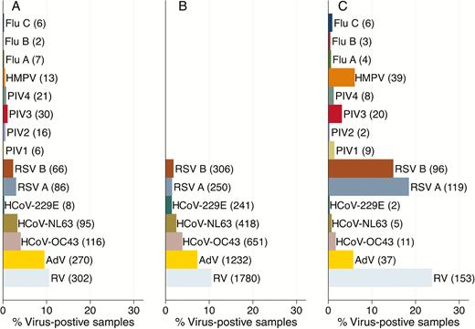
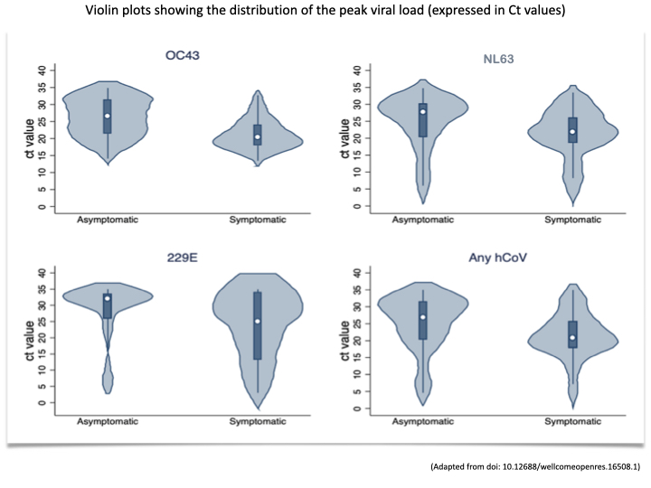

# The Respiratory Tract Microbiota with a Focus on Coronaviruses

> **Entire page is in early work**

> The page is partly explorative. Not all parts are well cited and some content needs to be checked and confirmed.

The prevalence of microbiota living in the respiratory tract. A special focus is on 
* which viruses are prevalent in health and which in disease.
* the prevalence of coronaviruses in health and disease.
* The microorganisms interact both with each other and with host. So not all combinations are equally likely.

* [Summary](#summary)
* [Introduction](#introduction)
* [Relevance](#relevance)
  * [Terminology](#terminology)
  * [Mucosal Microbiota](#mucosal-microbiota)
* [Detecting Virobiota](#detecting-virobiota)
* [Microbiota in Health and Disease](#microbiota-in-health-and-disease)
  * [Commensal Microorganisms](#commensal-microorganisms)
  * [Viruses in Health and Disease](#viruses-in-health-and-disease)
  * [Bocaviruses](#bocaviruses)
* [Coronaviruses in Health and Disease](#coronaviruses-in-health-and-disease)
  * [Coronavirus Viral Loads](#coronavirus-viral-loads)
  * [Coronavirus Viral Load Interpretation](#coronavirus-viral-load-interpretation)
* [References](#references)
  * [Refs Virome by Sequencing](#refs-virome-by-sequencing)
  * [Refs Viruses in Health and Disease](#refs-viruses-in-health-and-disease)
  * [Refs Viruses in Health and Disease Reviews](#refs-viruses-in-health-and-disease-reviews)
  * [Refs Respiratory Viruses in Kilifi](#refs-respiratory-viruses-in-kilifi)
  * [Refs Coronaviruses in Health and Disease](#refs-coronaviruses-in-health-and-disease)
  * [Refs Symptomatic Coronavirus Infections](#refs-symptomatic-coronavirus-infections)
  * [Refs Respiratory Viruses Viral Load](#refs-respiratory-viruses-viral-load)
  * [Refs Microbiome Variations](#refs-microbiome-variations)

## Summary
Multicellular organisms are permanently and temporarily inhabited by a variety of microorganisms. Most microorganisms inhabiting organisms are commensal and some are beneficial and required. However if the microorganisms are out of balance and a certain type replicates to high numbers, a disease can be caused.
Normally the immune system controls the microorganisms. In the case of viruses, most are below the detection limit of common diagnosis methods such as PCR. The commensal microorganisms are subject to fluctuations during lifetime. When the immune system diminished and/or at high age, the immune system may fail at control commensal microorganism. Uncontrolled replication can result in severe diseases. Uncontrolled replication is especially a problem if a significantly different microorganism arrives e.g. SARS-CoV-2 or a if an influenza A strain changed much.

Coronaviruses cause often persistent infections at low viral load and thereby are part of the virome of the respiratory tract in the healthy state. Mostly the they are beneficial e.g. by protecting against more pathogenic viruses such as RSV or influenza A. Coronaviruses can cause symptoms or even a moderate to deadly diseases when they reach to high/much too high numbers. For young people this is rarely a problem since their strong innate immune system detects them reliably.

## Introduction
Life form interactions are ubiquitous on earth. Some interactions are lineage permanent (i.e. stable across generations), some lifetime permanent and some vary throughout lifetime. The mitochondria in eukaryotic cells is an example of a lineage permanent coupling. An other example of a lineage permanent coupling are the retroviruses integrated inside the genome of eukaryotes. The transition from infections with permanent coupling to loose coupling is continuous: Many plant viruses are transmitted vertically (from one generation to the next generation) and also in the case of animals vertical transmission is prevalent e.g. herpes viruses often are transmitted vertically.

## Relevance
The virobiota and their interactions are relevant for measures influencing the virobiota and the viruses we are exposed to:
* Vaccine Effects on Endemic Coronaviruses: The vaccine induced immune response is cross-reactive to the endemic coronaviruses (e.g. through cross reactive CD4 and CD8 T cells). This effect can induce increased immune responses against the endemic human coronaviruses living as commensal viruses in the respiratory tract and diminish them. 

### Terminology

The microorganisms living with an organism form the microbiota of the organism:

> ###### Microbiota
> The microbiota are the microorganisms in a certain environment. The environment can be an organisms.

Related to microbiota is the microbiome:

> ###### Microbiome
> The microbiome is either used to denote the microbiota or specifically denote the combined genes of all microorganisms in a certain environment. The environment can be an organisms.

In literature, sometimes microbiome is used only to denote the combined genes, so microbiome be viewed as derived from gen-ome. Sometimes microbiome denotes the organisms themselves in the sense composition from micro and biome. 

> // As of 4.11. on this page, when the focus is on the *microorganisms*, microbiota is used. When the focus is on the host organisms with (genes of) microorganisms, microbiome is used.

The coupling between and the reliance from the members of the microbiota on the host and the host on members of the microbiota vary. In the case of bacteria or fungi the coupling often is not that tight and they kept the ability to live outside of multicellular hosts, the hosts on the other hand need bacteria (e.g. for proper digestion) but the bacteria are often replaceable. However not all bacteria are able to live outside of the host e.g. some bacteria are obligate intracellular. The mitochondria are even permanently associated to their host organism - one of the few permanent couplings which arouse from previously self contained life forms. Viruses, by definition without ribosomes are always intracellular and require a host. 

> The term virus is not uniquely defined in science. On this page viruses are defined as life forms which depend on external ribosomes ([Chapter Intro to Viruses](../2_biological/viruses.md#virus)).

The viruses inhabiting an organism are the virobiota:

> ###### Virobiota
> The virobiota are the viruses in the microbiota.

> ###### Virome
> The viruses associated to an organism with a focus on their combined genes.

### Mucosal Microbiota
Both the inner part and the outer surfaces of multicellular organism are inhabited by microorganisms. Special locations of multicellular organisms are the surfaces of the respiratory tract and the gastrointestinal tract. These surfaces can be both viewed as being on the outside since these surface can be reached without breaching a cell layer and on the inside when considering the 3 dimensional arrangement or the control of accessibility. For most parts these surfaces are covered with protecting mucus and thus they are called mucosal surfaces. These surfaces and the spaces they enclose provide a habitat for a variety of microorganisms forming the mucosal microbiome. The mucosal microbiome consists of different life forms such as bacteria, viruses and fungi. Positive stranded RNA viruses such as coronaviruses or rhinoviruses are part of the respiratory tract virome.

## Detecting Virobiota
Virus infections can be detected by a variety of methods such as laboratory methods detecting virus components, inspecting tissues for changes, or immune responses induced upon infection. Nearly all methods are for diagnosing diseases: Symptom analyses or detection of tissue damage nearly exclusively work if there is a disease. To investigate the virome in the healthy state is difficult since 1) there's usually no (visible) tissue change, 2) the viral load is usually low and 3) the immune response very subtle. Diagnosis with a focus on the diagnosis of the Covid-19 disease is discussed in the chapter ([Chapter Diagnosis and Viral Load](../3_medical/diagnosis_and_viral_load.md)).

To detect the virome in healthy state, PCR tests can be used, when accounting for the low sensitivity at low viral loads. At low viral loads which correspond to high CT values (usually above 35) the PCR sensitivity starts to decrease (chapter on [PCR](../3_medical/pcr_diagnosis.md)). The sensitivity is a challenge to detect infections, especially in healthy state, since:
* *Low Viral Load:* Even at the location of infection in healthy state, the viral load is mostly below 10^3 virions per milliliter of respiratory tract fluid.
* *Infection Locations:* Some viruses, e.g. coronaviruses, infect frequently the conducting airways. The conducting airways in the lower respiratory tract are not easy accessible for specimen collection, for this reason mostly the nose or the mouth are sampled. The latter works quite well for high viral loads, since to some extent the virions get distributed. For low virus counts, the counts are further decreased upon distribution and often are below the limit of detection.

## Microbiota in Health and Disease

### Commensal Microorganisms

> ###### Commensalism
> One organisms benefits from a host while not doing harm to the host.

Commensal microorganisms usually do not cause a disease. However if they replicate to very high numbers or at the wrong locations they can cause a disease. So the questions are: 
* How many members of a certain type cause a disease?
* At which locations which commensal microorganisms are healthy and which locations they cause a disease?

Commensal microorganism are not strictly specified, in the sense some microorganisms can be commensal in some individuals while harmful in others.

### Viruses in Health and Disease
[in work and to check]
Some viruses are more frequently detected in disease and some viruses are more frequently detected in health. In the following graphics from [Munywoki et al](#munywoki) the columns A and B show viruses  detected in healthy people, while in C samples from diseased people are analysed:

Some viruses such as RSV or HMPV are strongly associated with a disease, while other viruses namely coronaviruses are more frequently detected in health. 

Consistent with the observations above, in meta-analysis [Shi et al](#shi) find:

Virus Type| OR of ALRI
--|--
RSV | 9.79
IFV A | 5.97
IFV B | 2.7
MPV | 3.76
AdV | 1.13
CoV all| 1.03
HKU1 | 0.61
NL63 | 0.68
229E | 1.47
OC43 | 0.91

(ALRI = Acute lower respiratory infection)

### Bocaviruses

## Coronaviruses in Health and Disease

### Coronavirus Viral Loads
Similarly to SARS-CoV-2, the endemic coronaviruses just cause symptoms at high viral loads. The violin plots of the viral loads by symptom status, show the association between high viral load (low Ct values) and symptoms. The values shown are from the [sampling in Kilifi](#kil), Kenya and the graphics is from the paper by [Nyaguthii et al](#nyaguthii):

### Coronavirus Viral Load Interpretation

Amount | #copies per ml | ~ Ct Value | Significance 
--|--|--|--
'Very Few'| < 100 | > 40 | This viral load is mostly not detected. Whether healthy people can be persistently infected with such low viral loads is possible but hardly investigated. Such infections are not clinically relevant but may have an epidemiological relevance since the viruses evolve.// As of early November 2021 nearly nothing is published about viral loads below 100 copies/ml. I consider low number persistent infections as likely and also as healthy.
'Few' | 1000 | 35 | Mostly asymptomatic. Sometimes people are persistently infected with such intermediate viral loads. The risk for such infections is higher in immunocompromised and there is also evidence that the currently prevalent muscular administrated vaccines, sometimes induce a dumb immune responses which enable persistent infection with such viral loads [to cite].
'Intermediate' | 10^6 | 25 | With a million virions per milliliter, there are usually symptoms i.e. there is a disease. 
'High' | 10^9 | 15 | With a billion of viruses per milliliter (!) one is usually severely sick.

Comments:
* The relation between the virions number and the Ct value depends on the exact PCR method including the primer(s) used.
* The above values are the viral load in the upper respiratory tract samples. In the upper respiratory tract the viral load is highly variable.
* In the lower respiratory tract fluids the viral load tends to be more stable than in the URT. In the lower respiratory tract already a viral load above 10^6 virions per milliliter is a severe disease and may cause pneumonia and require hospitalization [to confirm and cite].

## References

### Refs Virome by Sequencing

#### Wang
Wang, Y., Zhu, N., Li, Y., Lu, R., Wang, H., Liu, G., Zou, X., Xie, Z., & Tan, W. (2016). Metagenomic analysis of viral genetic diversity in respiratory samples from children with severe acute respiratory infection in China. Clinical microbiology and infection : the official publication of the European Society of Clinical Microbiology and Infectious Diseases, 22(5), 458.e1–458.e4589. https://doi.org/10.1016/j.cmi.2016.01.006

#### Kumata
Kumata, R., Ito, J., Takahashi, K., Suzuki, T., & Sato, K. (2020). A tissue level atlas of the healthy human virome. BMC biology, 18(1), 55. https://doi.org/10.1186/s12915-020-00785-5

#### Romero-Espinoza
Virome and bacteriome characterization of children with pneumonia and asthma in Mexico City during winter seasons 2014 and 2015
Romero-Espinoza JA, Moreno-Valencia Y, Coronel-Tellez RH, Castillejos-Lopez M, Hernandez A, et al. (2018) Virome and bacteriome characterization of children with pneumonia and asthma in Mexico City during winter seasons 2014 and 2015. PLOS ONE 13(2): e0192878. https://doi.org/10.1371/journal.pone.0192878

#### van Rijn
van Rijn AL, van Boheemen S, Sidorov I,Carbo EC, Pappas N, Mei H, et al. (2019) The respiratory virome and exacerbations in patients with chronic obstructive pulmonary disease. PLoS
ONE 14(10): e0223952. 
<https://doi.org/10.1371/journal.pone.0223952>

// No (obvious) correlation between viral reads and chronic obstructive pulmonary disease is found. However all of the patients used to smoke either sometimes or daily.

### Refs Viruses in Health and Disease

### Refs Viruses in Health and Disease Reviews

#### Shi
Shi, T., McLean, K., Campbell, H., & Nair, H. (2015). Aetiological role of common respiratory viruses in acute lower respiratory infections in children under five years: A systematic review and meta-analysis. Journal of global health, 5(1), 010408. 
<https://doi.org/10.7189/jogh.05.010408>

// Meta-analysis showing the disease associations of a variety of viruses including the human covs.

#### Refs Viral Load in Health and Disease

#### Chonmaitree
Chonmaitree, T., Alvarez-Fernandez, P., Jennings, K., Trujillo, R., Marom, T., Loeffelholz, M. J., Miller, A. L., McCormick, D. P., Patel, J. A., & Pyles, R. B. (2015). Symptomatic and asymptomatic respiratory viral infections in the first year of life: association with acute otitis media development. Clinical infectious diseases : an official publication of the Infectious Diseases Society of America, 60(1), 1–9. https://doi.org/10.1093/cid/ciu714

##### Notes
* Coronaviruses are found more frequently in monthly testing than in testing associated to upper respiratory tract infection episodes.
* Across viruses, the viral load is significantly higher during URTI than in monthly screening.

#### Granados
Granados, A., Goodall, E. C., Luinstra, K., Smieja, M., & Mahony, J. (2015). Comparison of asymptomatic and symptomatic rhinovirus infections in university students: incidence, species diversity, and viral load. Diagnostic microbiology and infectious disease, 82(4), 292–296. 
<https://doi.org/10.1016/j.diagmicrobio.2015.05.001>

##### Methods
"We tested all symptomatic students and randomly sampled participants who remained asymptomatic (n = 25/week, over 8 weeks each study year) on a weekly basis by real-time PCR and sequenced HRV positives."

##### Results
"HRV was identified in 33/400 (8.3%) and 85/92 (92.4%) of the asymptomatic and symptomatic students, respectively. We identified a higher than previously reported rate of HRV-B in both groups, although the distribution of HRV species was similar (P = 0.37). Asymptomatic viral load averaged 1.2 log10 copies/mL lower than symptomatic HRV (P b 0.001)."

### Refs Respiratory Viruses in Kilifi

#### Sampling in Kilifi
In Kilifi Kenya multiple house hold surveys for respiratory viruses have been carried out:
* First sampling round was from December 2009 to June 2010. These samples are used in:
  * [Nyaguthii](#nyaguthii)

#### Nyaguthii
Nyaguthii DM, Otieno GP, Kombe IK et al. Infection patterns of endemic human coronaviruses in rural households in coastal Kenya [version 1; peer review: 1 approved] Wellcome Open Research 2021, 6:27 
<https://doi.org/10.12688/wellcomeopenres.16508.1>

#### Munywoki
Patrick K Munywoki, Dorothy C Koech, Charles N Agoti, Patricia A Cane, Graham F Medley, D James Nokes, Continuous Invasion by Respiratory Viruses Observed in Rural Households During a Respiratory Syncytial Virus Seasonal Outbreak in Coastal Kenya, Clinical Infectious Diseases, Volume 67, Issue 10, 15 November 2018, Pages 1559–1567, https://doi.org/10.1093/cid/ciy313

### Refs Coronaviruses in Health and Disease

#### Prill
Prill, M. M., Iwane, M. K., Edwards, K. M., Williams, J. V., Weinberg, G. A., Staat, M. A., Willby, M. J., Talbot, H. K., Hall, C. B., Szilagyi, P. G., Griffin, M. R., Curns, A. T., Erdman, D. D., & New Vaccine Surveillance Network (2012). Human coronavirus in young children hospitalized for acute respiratory illness and asymptomatic controls. The Pediatric infectious disease journal, 31(3), 235–240. https://doi.org/10.1097/INF.0b013e31823e07fe

#### Baillie
Baillie,V.L.;Moore,D.P.; Mathunjwa, A.; Park, D.E.; Thea, D.M.; Kwenda, G.; Mwananyanda, L.; Madhi, S.A. Epidemiology and Seasonality of Endemic Human Coronaviruses in South African and Zambian Children: A Case-Control Pneumonia Study. Viruses 2021, 13, 1513. https://doi.org/10.3390/ v13081513

#### Nokso-Koivisto
Nokso-Koivisto, J., Kinnari, T. J., Lindahl, P., Hovi, T., & Pitkäranta, A. (2002). Human picornavirus and coronavirus RNA in nasopharynx of children without concurrent respiratory symptoms. Journal of medical virology, 66(3), 417–420. https://doi.org/10.1002/jmv.2161

### Refs Symptomatic Coronavirus Infections

#### Monto 2020
Coronavirus Occurrence and Transmission Over 8 Years in the HIVE Cohort of Households in Michigan
##### Methods
"Annually, 890 to 1441 individuals were followed and contacted weekly to report ARIs. Specimens collected during illness were tested for human coronaviruses (HCoV) types OC43, 229E, HKU1, and NL63."
##### Findings
* "When year-round surveillance was in place in the 2015–2016 through 2017–2018 study years, only 9 (2.5%) of the total 364 coronavirus-associated ARI occurred from June through September."
* "The serial interval between index and household-acquired cases ranged from 3.2 to 3.6 days and the secondary infection risk ranged from 7.2% to 12.6% by type."

### Refs Respiratory Viruses Viral Load 
#### Clark
Clark, T. W., Ewings, S., Medina, M. J., Batham, S., Curran, M. D., Parmar, S., & Nicholson, K. G. (2016). Viral load is strongly associated with length of stay in adults hospitalised with viral acute respiratory illness. The Journal of infection, 73(6), 598–606. 
<https://doi.org/10.1016/j.jinf.2016.09.001>

##### Findings
"High viral load was associated with a longer duration of hospitalisation for all patients (p < 0.0001)."

#### Jacot
Jacot, D., Greub, G., Jaton, K., & Opota, O. (2020). Viral load of SARS-CoV-2 across patients and compared to other respiratory viruses. Microbes and infection, 22(10), 617–621. 
<https://doi.org/10.1016/j.micinf.2020.08.004>

#### Feikin
Daniel R. Feikin, et al, for the PERCH Study Group, *Is Higher Viral Load in the Upper Respiratory Tract Associated With Severe Pneumonia?* Findings From the PERCH Study, Clinical Infectious Diseases, Volume 64, Issue suppl_3, 15 June 2017, Pages S337–S346, https://doi.org/10.1093/cid/cix148

### Refs Microbiome Variations

#### Fan
Fan, C., Guo, L., Gu, H., Huo, Y., & Lin, H. (2020). Alterations in Oral-Nasal-Pharyngeal Microbiota and Salivary Proteins in Mouth-Breathing Children. Frontiers in microbiology, 11, 575550. 
<https://doi.org/10.3389/fmicb.2020.575550>

#### Bogaert
Variability and Diversity of Nasopharyngeal Microbiota in Children: A Metagenomic Analysis
Bogaert D, Keijser B, Huse S, Rossen J, Veenhoven R, et al. (2011) Variability and Diversity of Nasopharyngeal Microbiota in Children: A Metagenomic Analysis. PLOS ONE 6(2): e17035. 
<https://doi.org/10.1371/journal.pone.0017035>

#### Summary Carlson-Jones
Carlson-Jones, J., Kontos, A., Kennedy, D., Martin, J., Lushington, K., McKerral, J., Paterson, J. S., Smith, R. J., Dann, L. M., Speck, P., & Mitchell, J. G. (2020). The microbial abundance dynamics of the paediatric oral cavity before and after sleep. Journal of oral microbiology, 12(1), 1741254. https://doi.org/10.1080/20002297.2020.1741254

##### Methods 
"Using flow cytometry, bacterial and virus-like particle (VLP) abundances were enumerated for 6 oral microhabitats before and after sleep in 10 healthy paediatric sleepers."

##### Results
* Both bacteria and viral like particles live in micro habitats in the mouth. The habitats are more connected before sleep than after sleep (which is expected due the reduced saliva flow at night).  Shown in Figure 8. 
* During sleep there about a 4 to 10 fold increase in *viral particles* in the mouth (shown in Table 2). E.g. 
  * at the back of the tongue from 2.2 * 10 ^ 7 to 9.2 * 10 ^ 7 
  * at the posterior buccal vestibule from 5.7 * 10^6 to 5.7 * 10^7
* During sleep there about a 3 to 6 fold increase in *bacteria* in the mouth (shown in Table 1). E.g. 
  * at the back of the tongue from 2.9 * 10 ^ 7 to 1.3 * 10 ^ 8 
* The viral like particles are more homogenously distributed throughout the habitats than the bacteria (Table 1 and Table 2):
  * VLPs: maximal a 12 fold difference before sleep, max 6 fold diff after sleep
  * Bacteria: maximal a 40 fold difference before sleep, max 30 fold diff after sleep