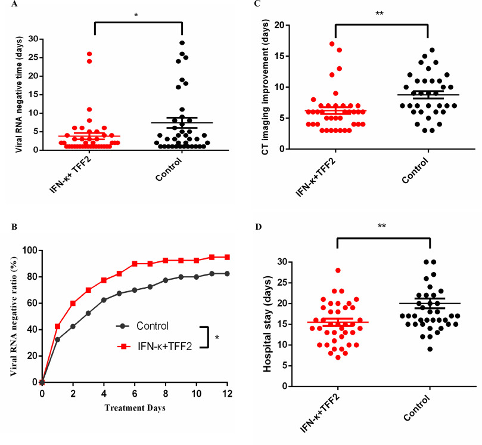

# Interferon Treatment

> 24.-27.11.: entire page is in *work and incomplete*. Many parts need checking.

> Early administrated interferons look very promising to prevent disease progression including severe Covid and death.

* [Conceptual Summary](#conceptual-summary)
* [Summarized Observations](#summarized-observations)
* [Introduction](#introduction)
* [Overview Topical IFN](#overview-topical-ifn)
  * [Overview Topical IFN Alpha](#overview-topical-ifn-alpha)
  * [Overview Topical IFN Beta](#overview-topical-ifn-beta)
  * [Overview Topical IFN Kappa](#overview-topical-ifn-kappa)
* [Overview Systemic IFN](#overview-systemic-ifn)
  * [Overview Systemic IFN Alpha](#overview-systemic-ifn-alpha)
  * [Overview Systemic IFN Beta](#overview-systemic-ifn-beta)
  * [Overview Systemic IFN Lambda](#overview-systemic-ifn-lambda)
* [IFN Medications used](#ifn-medications-used)
  * [IFN-alpha 2b](#ifn-alpha-2b)
* [Considerations on the Treatment Start](#considerations-on-the-treatment-start)
  * [Why the Treatment Start is relevant](#why-the-treatment-start-is-relevant)
  * [Criteria to categorize Treatment Starts](#criteria-to-categorize-treatment-starts)
  * [Treatment Start Categories](#treatment-start-categories)
* [Motivation to Use Interferon Treatments](#motivation-to-use-interferon-treatments)
* [References Topical IFN](#references-topical-ifn)
  * [Refs Topical IFN Alpha](#refs-topical-ifn-alpha)
  * [Refs Topical IFN Beta](#refs-topical-ifn-beta)
  * [Refs Topical IFN-K](#refs-topical-ifn-k)
* [Refs Systemic IFN](#refs-systemic-ifn)
  * [Refs Subcutaneous IFN Alpha](#refs-subcutaneous-ifn-alpha)
  * [Refs Systemic IFN Beta](#refs-systemic-ifn-beta)
  * [Refs Subcutaneous IFN Beta](#refs-subcutaneous-ifn-beta)
  * [Refs IFN Lambda](#refs-ifn-lambda)
* [Refs IFN Reviews and Overviews](#refs-ifn-reviews-and-overviews)
  * [Refs General IFN Treatment](#refs-general-ifn-treatment)
  * [Refs IFN Alpha Review](#refs-ifn-alpha-review)
  * [Refs IFN Beta Review](#refs-ifn-beta-review)
* [Refs IFN other Viruses](#refs-ifn-other-viruses)
  * [Refs IFN other CoVs](#refs-ifn-other-covs)

## Conceptual Summary
Interferons (IFNs) are signalling proteins which induce an antiviral state in their target cells. Interferons also can induce tissue inflammation - either directly or through a cascade of ongoing signals. Most interferons can be produced artificially. IFNs can be administrated either topically (=locally, e.g. aerosolized or by spray to the respiratory tract or as cream) or systemically (subcutaneous, intramuscular, intravenously).

Interferon treatments inhibit the replication of SARS-CoV-2 viruses in the respiratory tract and thereby if administrated before there are many viruses prevent disease progression: Early initiated interferon treatments have been shown to reduce the Covid mortality by over 75%. When patients are already at an advanced disease stage, systemically administrated interferons often have adverse effects on the outcome due to the mentioned inflammatory effects. For topical application even some benefits in mid to advanced disease stages are observed. 

## Summarized Observations

##### Summary Topical IFN Treatment

Overall topically administrated IFNs show improved outcomes, especially if the treatment is started early. At late disease stage the benefits are less though unlike systemic IFNs, for topical application no adverse outcomes are observed.

*Topical IFN Alpha:* Topical IFN alphas (all of subtype alpha-2b) reduce the mortality by 80% if early administrated. Even at mid disease stage an unfavorable disease progression is prevented in 50% of the cases. Treatments later than 10 days after symptom onset the beneficial effects are reduced, however no adverse effects on the outcomes are observed. -> [Overview Topical IFN alpha](#overview-topical-ifn-alpha)
> mostly based on retrospective uncontrolled (many different treatment combinations) studies with patients treated in early or mid 2020.

*Topical IFN Beta:* Nebulized IFN beta-1a reduces the progression to severe Covid by roughly 50% in a RCT by [Monk et al](#summary-monk) in the UK. Another RCT by [Khamis et al](#summary-khamis) with IFN beta-1b found no effect. -> [Overview Topical IFN beta](#overview-topical-ifn-beta)

*Topical IFN K:* Early topical IFN K increases the viral clearance and accordingly the clinical improvement is faster. -> [Overview Topical IFN K](#refs-topical-ifn-k)

##### Summary Systemic IFN Treatment

Systemic IFNs show benefits if given very early in a mild disease stage. At later stage no effect or even adverse effects are observed.

*Systemic IFN alpha:* Early IFN-α2b treatment induces a faster viral load clearance and a favorable disease progression. -> [Overview Systemic IFN alpha](#overview-systemic-ifn-alpha)

*Systemic IFN beta:* If administrated at severe disease stage (oxygen needed or even ventilated), systemic IFN beta treatment often increases the occurrence of adverse events and the mortality. If administrated upon exposure or in the mild disease stage beneficial effects are observed such as better prognosis and faster viral clearance. -> [Overview Systemic IFN beta](#overview-systemic-ifn-beta)

*Systemic IFN lambda:* For early administration in mild SARS-CoV-2 infections, a shortened time to viral clearance has been observed. -> [Overview Systemic IFN lambda](#overview-systemic-ifn-lambda)

## Introduction
[in work]

The induction of interferons is one of the first immune responses upon a viral infection. Interferons induce an antiviral state of the cells. For many epithelial cells the metabolisms is slowed down or even paused [to specify and cite] and interferons activate the immune system. The timing for the treatment start is thus relevant and always specified as a category early, mid or late ([Consideration on the Treatment Start](#considerations-on-the-treatment-start)).

## Overview Topical IFN

> ###### Topical Administration
> Topical administration can be done:
> * nebulized/aerosolized to the entire respiratory tract,
> * sprayed to the upper and to some extent to the respiratory tract 
> * and as cream IFNs can be applied to the upper respiratory tract.

### Overview Topical IFN Alpha

Author | Type | Treatment |Treatment_Start (days from symptoms/admission; disease stage) | Effects Early Administration| Effects Mid Administration | Effects Late Administration | Notes_and_Comments
--|--|--|--|--|--|--|--
[Yu](#summary-yu)| retrospective, 1401 patients of which 852 with IFN | 5 mio U of IFN-α-2b twice daily | from symptom onset: early <=2;mid 3 to 8; late>= 9 days| -85 %  ICU, -90%  life threating events | -60 %  ICU, -50%  life threating events| -25 %  ICU, -35%  life threating events | large cohort and analysed by days after symptom onset ([Yu et al](#summary-yu))
[Nan Wang](#summary-nan-wang)| retrospective, 446 patients|  IFN-α-2b for 10 days | from admission: early less than 5 days; late = after 5 days | -80% mortality; not much change on discharge time and CT improvement | - | late IFN increased mortality and discharge time | data fairly heterogenous with different treatment combinations, not all efficacies observed are consistent; umifenovir has a similar efficacy profile as IFN
[Liu](#summary-liu)|  retrospective, 103 case matched to 103 as control | 89 patients: IFN-α2b 5 mIU as spray, 15 patients: IFN-α1b subcutaneous|  not specified, at wave peak -> mostly pneumonia cases in hospitals |- | -50% critical cases; -80% mortality| - | Wave peak in Wuhan
[Chkihis](#chkihis)| retrospective, 37 IFN, 36 control  | IFN α 2b 10 mio IU spray 2 times a day for 5 days | early after admission, mostly moderate pneumonia | - | -60% ventilation |  - |  inclusion criteria: SpO2 <90%, bilateral lung lesions, cough, fever
[Mordyk](#summary-mordyk)|  prospective, comparative, controlled study, each group 70 patients | IFN α 2b: rectal 3 mio IU three 3/day and gel 36K IU/g 5/day for nasal mucosa and tonsils for 14 days. | patients were quite sick (fatigue, cough, shortness of breath common). | - | -25% time to viral clearance; much better CT outcome; up to 50% faster symptom resolution| - | unique administration: cream for nose and mouse, systemic via rectal depository

### Overview Topical IFN Beta

Author | Type | Treatment | Status at Treatment Start | Eff Early Adm | Effects Mid Administration | Eff Late Adm  | Notes_and_Comments
--|--|--|--|--|--|--|--
[Monk](#summary-monk)| randomised, double-blind, placebo-controlled, phase 2 pilot trial at 9 UK sites | SNG001 (6 MIU interferon beta-1a)| median duration of symptoms was 10 days | - | -50% progression to severe Covid (OSCI>=5) | - |  Mortality: 0 of 48 in IFN group an 3 of 49 in control
[Khamis](#summary-khamis) | randomized, open-label controlled trial |  interferon beta-1b at a dose of 8 million IU (0.25 mg) twice a day | less than 10 days after symptom onset | - | no effect on ICU and mortality | - | only study where topical IFN are not beneficial - possible cause: convalescent plasma administrated to more than 50% of the patients and most patients already had bilateral pneumonia (86%).

### Overview Topical IFN Kappa

Author | Type | Treatment | Status at Treatment Start  | Effects Early Administration | Notes
--|--|--|--|--|--|
[Fu Trial](#summary-fu-trial)| Open-label, randomized, clinical trial | 5 mg TFF2 plus 2 mg IFN-k via nasal mask | SpO2 > 94% and moderate pneumonia | -50% reduction time to viral clearance,  -25% time to CT improvement and  -25% hospital stay time

## Overview Systemic IFN

### Overview Systemic IFN Alpha

Author | Type | Treatment | Status_at_Treatment Start | Effects Early Administration| Effects Mid Administration | Effects Late Administration | Notes_______
--|--|--|--|--|--|--|--
[Bhushan](#bhushan)|phase 3, multi-centric, randomized, comparator-controlled, open-label trial | PEG IFN-α2b (1 μg/kg subcutaneous injection, single dose)  | moderate pneumonia, respiratory rate ≥24 breaths/min, SpO2 90–94%| - | faster viral load clearance (odds ratio 2.75), lower median oxygen support duration| - | 2 Covid deaths in IFN group, 0 in control
[Pereda](#pereda)| population cohort | LPV/RTV + CQ + IFN-α2b | for risk groups start upon exposure, else upon positive test | Cuban Overall CFR was 3.70% and 0.92% for this group => -75% mortality|||start upon exposure is great for IFN!! 
[Bo Wang](#bo-wang)| | Subcutaneous injection of IFN alpha-2b (3 million IU/ dose), until viral clearance| at admission patients moderately ill; early: 11 patients within 72 h of admission; 8 patients after 72 horus | -50% hospital duration | slight increase in hospital duration | - | IFN treatment yielded faster viral clearance (early and late combined) compared to control

### Overview Systemic IFN Beta

Author | Type | Treatment | Status_at_Treatment_Start | Effects Early Administration| Effects Mid Administration | Effects Late Administration | Notes
--|--|--|--|--|--|--|--
[WHO Solidarity Trial](#who-solidarity-trial-consortium)| Multicentre (across the world) randomized open label trial |  44 μg of subcutaneous interferon beta-1a on day 0,3,6 (for severe cases sometimes intravenously) | early: no oxygen; mid: oxygen; late: ventilation. //Classification into early/mid/late to fit table, the disease stages are more like: early to mid/late/very late| early to mid:-20% mortality | mid to late:+10% mortality | very late:+30% mortality and increase of other adverse events| very heterogenous since centres from across the world; better outcome for patients older than 65 
[Kalil](#summary-kalil)| double-blind, randomised, placebo-controlled trial at 63 hospitals (56 in the USA). | 4 doses of 44 μg interferon beta-1a subcutaneously every other day; both groups intravenous remdesivir |*Grouping:* mid: patients ordinal score of 4 or 5 (~450 patients per group); late: patients with score 6 (~35 patients; mostly with oxygen);  //Patients included:  symptom duration ~8.5 days; SaO2: 94% or less or oxygen but no ventilation; | - | overall not much effect; recovery rate ratio: ~1 | +75% mortality (up to 7 from 4 in the control); recovery rate ratio: 0.4 | slight overall benefit for patients older than 65;
[Davoudi-Monfared](#davoudi-monfared)| randomized clinical trial in early 2020 |  44-microgram/ml (12 million IU/ml) dose of IFN beta-1a  subcutaneously, 3 times per week for 2 weeks| at admission mostly ill patients and 8 days post symptom onset. Administration was done early and late during hospitalization (early classified here as mid since patients quite sick)| - | -75% mortality | increased mortality | 
[Hung](#summary-hung)|  multicentre, prospective, open-label, randomised, phase 2 trial | subcutaneous_injection of beta-1b, 8 mio IU per dose; 2 doses for start on day 4, 1 dose for start on day 5/6 (=>no dose post day 7 | mostly mild illness (fever and cough common); no IFN post day 7 of symptom onset| -50% duration to SOFA==0 (3 days instead of 7) and -50% days in hospital (8 instead of 15) | - | - | -

### Overview Systemic IFN Lambda

Author | Type | Treatment | Status_at_Treatment Start | Effects_Mid_Administration| Effects Late_Administration | Notes
--|--|--|--|--|--|--
[Jagannathan](#summary-jagannathan)| single-blind, placebo- controlled trial |   single, 180 mcg subcutaneous dose of Peginterferon Lambda |120 (60 per group) outpatients with mild to moderate COVID-19, outpatients with mean of 4 symptom days; seropositivity in treatment-group 35% and in control 47% | -|viral shedding was 7 days (hazard ratio [HR] = 0.81; 95% confidence interval [CI] 0.56 to 1.19). Symptoms resolved in 8 (Lambda) and 9 (placebo) (HR 0.94; 95% CI 0.64 to 1.39)| classified as late administration due to high seroprevalence 
[Feld](#summary-feld)|  double-blind, placebo-controlled trial |  subcutaneous injection of peginterferon lambda 180 μg | outpatients with mean of 4.3 symptom days; seropositivity in treatment-group 0% and in control 21%| viral load declines faster (difference of 2·42 log copies per mL at day 7); undetectable virus by day 7 more likely (odds ratio [OR] 4·12 [95% CI 1·15–16·73| ||

## IFN Medications used
[in work]
### IFN-alpha 2b
* usually nebulized with 5 mio unit is standard (200K - 400K IU/kg each dose, two time a day) [to confirm and cite]
* rectal depository and as cream for the nose and tonsils in [Mordyk et al](#summary-mordyk) 

## Considerations on the Treatment Start

### Why the Treatment Start is relevant 
The timing and the disease stage at the treatment start is relevant, since IFNs are most beneficial when administrated early. Interferons stimulate the immune response and thereby prevent reaching high viral loads or induce an earlier viral load clearance. If a strong immune response is already in place, interferons are usually not beneficial and can increase inflammation, especially observed for systemic administration.

### Criteria to categorize Treatment Starts
Different studies use different measurements: 1) days after symptom onset, 2) days after hospital admission and 3) the disease stage/clinical appearance. 

Here the following criteria are used to categorize the treatment starts:
* When available days after symptom onset and clinical appearance (symptoms, O2 saturation including whether O2 is supplemented and CT findings are used). Mild clinical appearance can either mean an early disease stage or just a mild disease.
* Treatment is most important for patients with possibly unfavorable disease progression. Therefore the state of the sub-cohort at risk is considered as the state of the entire cohort. 

### Treatment Start Categories
* Early treatment start: The viral load is increasing and patients in the cohort progress possibly to a more severe disease state.
* Mid treatment start: The viral load is still increasing or plateauing. For severe Covid cases the viral load in the lungs can stay at high values for a long time ([Viral Load by during Covid](./../3_medical/diagnosis_and_viral_load.md#variation-by-time-and-location)). The patients can progress to a more severe state if the viral load stays high.
* Late treatment start: The viral load is decreasing and/or the lung is already very inflamed. 

## Motivation to Use Interferon Treatments
Interferon treatment is also motivated by the observation that a dSARS-CoV-2 a major risk factor for severe disease is a disrupted interferon response [to cite].

## References Topical IFN

### Refs Topical IFN Alpha 

#### Summary Yu
Yu J, Lu X, Tong L, Shi X, Ma J, Lv F, Wu J, Pan Q, Yang J, Cao H, Li L. Interferon‐α‐2b Aerosol Inhalation is Associated with Improved Clinical Outcomes in Patients with Coronavirus Disease‐2019. British Journal of Clinical Pharmacology. 2021 May 13.

##### Methods
* *Type:* multicentre retrospective
* "A total of 1401 patients were enrolled, with 852 (60.8%) patients receiving 5 000 000 U of IFN-α-2b via aerosol inhalation twice daily."
* *Study Population:* "Patients with COVID-19 who were older than 18 years and without mechanical ventilation on the day of admission from centres in Zhejiang and Jiangsu Provinces between 17 January and 19 February 2020.
* "The onset of COVID-19 was defined as the time when symptoms were first noticed."

##### Treatment 
5 000 000 U of IFN-α-2b via aerosol inhalation twice daily.

##### Situation at Treatment Start
Grouped by time after symptom onset. 

Characteristics at admission (patients with all symptom onsets included):

Group\Status| Age| Days of symptoms| Temperature| % Fever | % Cough | % Muscle ache|% Fatigue| Shortness of Breath
--|--|--|--|--|--|--|--|--
Intervention | 48.06 (14.33)|4 (2–7) | 37.93 (0.84) | 692 (81.2%) | 509 (59.7%)| 86 (10.1%)| 187 (22.0%)|  37 (4.3%)
Control | 49.73 (15.42)|5 (2–7)| 37.82 (0.86) | 417 (76.0%)|288 (52.5%)| 54 (9.8%) | 134 (24.4%)| 49 (8.9%)

<!--ta: symptoms by symptom onset time!! -->

##### Outcomes
* *Composite Endpoint:* "The composite endpoint was defined as at least one of the following: (1) respiratory failure requiring mechanical ventilation, (2) other organ failure and need for intensive care unit (ICU) monitoring and treatment, and (3) death."
* ICU admission
* Mechanical Ventilation

##### Settings 
It is  a retrospective study and there are differences in the medical characteristics and demographics of the patients across the groups. Examples of uneven grouping (Table 2 and Table S4 in the paper): 
* early treatment onset is associated to younger age (45 years for those at 0 -2 days, 51 years for >=12 days and 49.7 years for the control group)
* 77% of the IFN alpha treatment patients received Lopinavir/ritonavir whereas only 30.8% in the control. //Since lopinavir/ritonavir seems to have not much effect on Covid [to cite] and does not interfere with IFN treatment (Figure 3), lopinavir/ritonavir treatment is not considered as relevant here.

##### Results
"The risk probability for crude endpoints was lower in the IFN-α-2b group (3.8%) than in the non-IFN-α-2b group (9.3%, P < .001). After adjusting the confounding factors, IFN-α-2b therapy achieved a reduction of 64% in occurrence of endpoint events (hazard ratio, 0.36; 95% confidence interval [CI], 0.21–0.62)."

Outcome by time of Treatment start after symptom onset (Data from Table 2 and Table S4 in the paper):

Symptom onset to treatment start|All treated|0 - 2 days|3 - 5 days |6 - 8 days |9 - 11 days|>=12 days |Control
--|--|--|--|--|--|--|--
Patients|852|208|279|206|109|50|549
Mechanical ventilation |25|2|8|10|3|2|35
ICU admission          |23|2|6|7|5|3|40
Composite endpoint     |32|2|9|12|6|3|51
Mechanical ventilation in %|2.9%|1.0%|2.9%|4.9%|2.8%|4.0%|6.4%
ICU admission in %         |2.7%|1.0%|2.2%|3.4%|4.6%|6.0%|7.3%
Composite endpoint in %    |3.8%|1.0%|3.2%|5.8%|5.5%|6.0%|9.3%
Reduction Mechanical ventilation |54%|85%|55%|24%|57%|37%|0%
Reduction ICU admission          |63%|87%|70%|53%|37%|18%|0%
Reduction Composite endpoint     |60%|90%|65%|37%|41%|35%|0%

// The data above are all unadjusted. The different patients cohorts don't differ that much (Table 2 and S4) and accordingly the adjustments don't change the overall interpretation (e.g. overall reduction of composite endpoint is 64% with adjustments in the paper and 60% without as in the table above.). The patients treated with later treatment starts had some increased risk factors both compared to those with earlier treatment starts and the control, thus the efficacies for the later stages are possibly underestimated without adjustments. The patients with early treatments had marginally reduced risk factors, thus a slight overestimation of efficacies is possible. // Patients characteristics are discussed in the sections above.

> => Efficacy of aerosolized IFN-α-2b is up to 90% if started within the first few days of symptom onset. Topical IFN-α-2b treatment is beneficial even in the later disease stage, however at much less than when started early.

---

#### Summary Zhou
Zhou Q, Chen V, Shannon CP, Wei X-S, Xiang X, Wang X, Wang Z-H, Tebbutt SJ, Kollmann TR and Fish EN (2020) Interferon-α2b Treatment for COVID-19. Front. Immunol. 11:1061. doi: 10.3389/fimmu.2020.01061

##### Methods
* *Type:* uncontrolled, exploratory study
* 77 adults hospitalized with confirmed COVID-19 were assigned to treatments as follows: 
  * 7 persons: nebulized IFN-α2b (5 mU b.i.d.) (41 year average, 14% with comorbidities, initial fever 57%)
  * 46 persons: arbidol (200mg t.i.d.) (40 year average, 15% with comorbidities, initial fever 59%)
  * 24 persons: combination of IFN-α2b plus arbidol. (65 year average, 54% with comorbidities, initial fever 71%)
* "Viral clearance was defined as two consecutive negative PCR tests at least 24h apart (5)."
##### Results
"Treatment with IFN-α2b with or without arbidol significantly reduced the duration of detectable virus in the upper respiratory tract and in parallel reduced duration of elevated blood levels for the inflammatory markers IL-6 and CRP." // large differences in risk factors between IFN and no IFN groups. Analyses adjusted to some extent though.

<!--fig 1 and 2-->

---

#### Summary Nan Wang
Wang N, Zhan Y, Zhu L, Hou Z, Liu F, Song P, Qiu F, Wang X, Zou X, Wan D, Qian X. Retrospective multicenter cohort study shows early interferon therapy is associated with favorable clinical responses in COVID-19 patients. Cell host & microbe. 2020 Sep 9;28(3):455-64.

##### Methods
* *Type:* retrospective multicenter cohort study (nonrandomized assignment of therapies)
* *Patients:* 446 COVID-19 patients in Hubei, China. 
* "Regarding clinical features at admission, the early and no IFN groups had comparable prevalence of high respiratory rate and low O2 saturation within 24 h of admission, whereas the late IFN group had higher prevalence than both early and no IFN groups."

##### Treatment 
* IFN-α-2b administered to the airway directly via an aerosol nebulizer for roughly 10 days.
* Additionally: lopinavir/ritonavir (LPV/ r), and umifenovir (UFV). 

##### Situation at Treatment Start
Early start is defined as treatment start within 5 days of hospital admission and late start after 5 days. The 'late group' was both more severe at admission compared to the 'early IFN' and control and additionally the IFN treatment was initiated later than the 'early IFN' (Table 1 in the paper). E.g. the O2 Saturation by group at admission (not at treatment start [to confirm]):

O2 Saturation\Group | Early IFN | Control | Late IFN
--|--|--|--|
<90% | 9 (4.2)| 14 (6.9) |4 (15.4) 
90–93%| 41 (19)| 35 (17.2) |7 (26.9)
\> 93% |166 (76.9) |155 (76) |15 (57.7)

##### Results
* IFN treatment when started within 5 days of admission reduced the mortality by more than 80%. Late IFN increased the mortality (with adjustments) // Table 3, Table 2
* "By using logistic regression, we determined that early IFN therapy was univariably associated with lower mortality (odds ratio [OR] = 0.18, p = 0.029), whereas late IFN therapy (OR = 3.53, p = 0.046), age >60 years (OR = 6.87, p < 0.001), hypertension (OR = 6.87, p < 0.001), diabetes (OR = 8.96, p < 0.001), respiratory rate >22/min at admission (OR = 10.1, p < 0.001), O2 saturation be- tween 90%–93% (OR = 11.8, p < 0.001), or <93% (OR = 25.2, p < 0.001) were univariably associated with higher mortality (Figure S2)."
* "After adjusting for gender, age, hypertension, diabetes, O2 saturation at admission, symptom count at admission, and symptom onset to admission >7 days, early IFN therapy was estimated to have adjusted HR of 1.14 (95% CI, 0.93–1.41) for hospital discharge and 1.00 (95% CI, 0.81–1.22) for CT scan improvement in comparison with no IFN therapy, whereas late IFN therapy was estimated to have adjusted HR of 0.69 (95% CI, 0.44–1.08) for hospital discharge and 0.50 (95% CI, 0.32– 0.80) for CT scan improvement in comparison with no IFN therapy (Table 2)." // Figure 2 in the paper visualizes the effects of early and late IFN.

<!--perm fig2 -->

> => 80% mortality reduction for an early treatment start.

---

#### Summary Liu
Liu H, Ruan Z, Yin Z, Wu D, Zhu H. Association of administration of IFN-α with mortality among patients hospitalized with coronavirus disease 2019. Future Virology. 2021 Mar;16(3):201-9.

##### Methods
"In this retrospec- tive study, 103 of 1555 hospitalized COVID-19 patients were treated with IFN-α, and the others matched through propensity score matching."

##### Treatment
* IFN-α1b for injection (Shenzhen Kexing Biotech Co., Ltd Shenzhen, China). Administered as an intramuscular injection once a day. (15 patients)
* IFN-α2b spray (Tianjin Sinbobioway Biology). IFN-α2b 5 mIU was sprayed into the nose two-times a day for a total of 10 mIU per day. (89 patients)

<!-- In the tables 1 and 2, IFN-α1b is named as spray, which is inconsistent with the above treatment description. 1 patient seems to have received both treatments as the numbers to add to 103.-->

##### Results
* IFN-α2b was associated with about 50% reduction in critical cases.
* 3 deaths in the IFN group compared to 18 in matched cases => indicates a mortality reduction of 83%.

#### Xu
Xu P, Huang J, Fan Z, Huang W, Qi M, Lin X, Song W, Yi L. Arbidol/IFN-α2b therapy for patients with corona virus disease 2019: a retrospective multicenter cohort study. Microbes and infection. 2020 May 1;22(4-5):200-5.

#### Chkihis
Chkhis A, Abdulrazzaq N, Mokhtar S, Al Jasmi A. Efficacy of High-Dose Nebulized Interferon α 2b in Severe COVID-19 Pneumonia. Turk Toraks Dergisi/Turkish Thoracic Journal. 2021 May 1;22(3).
##### Methods
* *Type:* retrospective
* *Dates:* April 9 to June 17, 2020. 
* *Location:* Al Kuwait Hospital, Dubai
* *Patients:* Mostly rather severe Covid-19: often SpO2 < 90% and bilateral pneumonia. 37 in intervention group and 36 in control.
##### Treatment
Intervention: Nebulized IFN α 2b at a dose of 10 million IU. Patients received 2 doses a day for 5 days.
Additional care for intervention and control group: Mostly hydroxychloroquine, lopinavir/ritonavir  or Favipiravir. Antibiotics.
##### Situation at Treatment Start
Intervention was applied early.
##### Results
14 of 36 patients in the control group required mechanical ventilation, whereas only 6 of 37 in the intervention group. // => 58% reduction in mechanical ventilation by early treatment with IFN alpha 2b.

> about 60% reduction for ventilation

#### Summary Mordyk
Mordyk A.V., Ivanova O.G., Samsonov K.Yu., Sitnikova S.V., Zenkova L.A. Interferon alpha-2b in comprehensive treatment of patients with COVID-19. Infekc. bolezni (Infectious diseases). 2021; 19(1): 16–25. (In Russian). DOI: 10.20953/1729-9225-2021-1-16-25

##### Methods
* *Type:* "This prospective, comparative, controlled study included 140 patients with COVID-19 randomized in two groups."
* *Location and Date of Study:* Omsk, 2020

##### Treatment
* Interferon alpha-2b (VIFERON®) as one rectal suppository 3,000,000 IU three times a day and gel 36,000 IU/g 5 times a day applied to the nasal mucosa and palatine tonsils for 14 days.
* standard therapy for both groups

##### Patients

Group\Status| % Concomitant diseases, total | % Arterial Hypertension | % Allergy 
--|--|--|--
Intervention | 61 | 47 | 10 
Control | 50 |41 | 4 

##### Situation at Treatment Start

Group\Status| % Dry Cough | % Muscle ache|% Fatigue| Shortness of Breath | 26-50% Lung Involvement in %| 51-75% Lung Involvement in %
--|--|--|--|--|--|--
Intervention  | 56 | 83 |100 | 77 | 59 | 19 
Control | 59 | 63 | 100 | 60 | 53 | 7

##### Results
* Patient with more than 50% lung tissue affected decreased from 19% to 1% in the treatment group during the 14 days of treatment, in the control group there is an increase from 7% to 13%. (Table 4.)
* The longest lasting symptoms such as loss of small/taste, fatigue and mild cough resolved on average about 50% faster. (Fig 1.)
* From day 7 on a faster viral load clearance is observed. The average time to viral clearance is about 25% lower.

### Refs Topical IFN Beta

#### Summary Monk
Monk PD, Marsden RJ, Tear VJ, Brookes J, Batten TN, Mankowski M, Gabbay FJ, Davies DE, Holgate ST, Ho LP, Clark T. Safety and efficacy of inhaled nebulised interferon beta-1a (SNG001) for treatment of SARS-CoV-2 infection: a randomised, double-blind, placebo-controlled, phase 2 trial. The Lancet Respiratory Medicine. 2021 Feb 1;9(2):196-206

##### Methods
* "We did a randomised, double-blind, placebo-controlled, phase 2 pilot trial at nine UK sites. Adults aged 18 years or older and admitted to hospital with COVID-19 symptoms, with a positive RT-PCR or point-of-care test, or both, were randomly assigned (1:1) to receive SNG001 (6 MIU) or placebo by inhalation via a mouthpiece daily for 14 days."
* *Founding:* Synairgen Research
* *Patients:* 48 IFN; 49 control

##### Treatment
"SNG001 (6 MIU interferon beta-1a) or placebo were delivered via the I-neb nebuliser (Philips Respironics, Murrysville, PA, USA) once daily for up to 14 days (appendix p 4)."

##### Situation at Treatment Start
"In our study, patients had a median duration of symptoms of 10 days at recruitment and SNG001 was given daily for 14 days."

##### Outcome
* "The OSCI is a 9-point scale, where 0 corresponds to no infection and 8 corresponds to death."
* *Recovered* is defined as having an unchanged post-baseline OSCI score of 0 or 1

##### Setting
"66 (67%) patients required oxygen supplementation at baseline: 29 in the placebo group and 37 in the SNG001 group."

##### Results

Outcome\Group | IFN beta-1a (48)| control (49)
--|--|-- 
Recover (OSCI<=1) on Day 14 | 21(44%) | 11(22%)
Recover (OSCI<=1) on Day 28 | 28 (58%) | 17 (35%)
Severe disease on Day 16 (OSCI>=5)| 6 (13%) | 11 (22%)
Deaths | 0 of 48 | 3 of 49

* The percentages recovered (OSCI<=1) were from day 3 on much higher in the treatment group (odds ratio mostly above 3 (Figure 2); recovery graph shown in Figure 3).
* The percentages discharged from hospital were (only) marginally higher in the IFN group (Figure 4).

> => 
> * About 50% reduction in severe disease despite the treatment start was quite late with a median symptom duration of 10 days. 3 deaths without IFN and 0 with IFN indicates a death rate reduction >=70%.
> * The probability to be recovered was about two times higher in the IFN group from day 5 to day 28.

##### Adverse Events
"SNG001 was well tolerated. The most frequently reported treatment-emergent adverse event was headache (seven [15%] patients in the SNG001 group and five [10%] in the placebo group). There were three deaths in the placebo group and none in the SNG001 group."
##### Comments
" The optimal route and specific type of interferon might depend on the stage of disease, the spread of viral infection beyond the lung, and the ease of administration in different clinical settings."

---

#### Summary Khamis
Khamis F, Al Naabi H, Al Lawati A, Ambusaidi Z, Al Sharji M, Al Barwani U, Pandak N, Al Balushi Z, Al Bahrani M, Al Salami I, Al-Zakwani I. Randomized controlled open label trial on the use of favipiravir combined with inhaled interferon beta-1b in hospitalized patients with moderate to severe COVID-19 pneumonia. International Journal of Infectious Diseases. 2021 Jan 1;102:538-43

##### Methods
* *Patients:* between 18–75 years, confirmed SARS-CoV-2 infection by RT-PCR test, moderate to severe COVID-19 pneumonia according to the WHO interim guidelines, the interval between symptoms onset and randomization is not >10 days. 89 patients in total: 44 randomly assigned to the treatment arm, favipiravir and interferon beta-1b, and 45 assigned to HCQ as a standard of care control group.
* *Type:* randomized, open-label controlled trial
* "Patients were randomly assigned to receive either a combination of favipiravir with interferon beta-1b by inhalation aerosol or hydroxychloroquine (HCQ)."
* Convalescent plasma by 29 in control and 23 in intervention arm; steroid in 34 of the control and 26 of the intervention group.

##### Treatment 
* *Intervention:* "This arm included the treatment with favipiravir 1600 mg on day 1 followed by 600 mg twice a day for a maximum of 10 days, and interferon beta-1b at a dose of 8 million IU (0.25 mg) twice a day was given for 5 days through a vibrating mesh aerogen nebulizer (Aerogen Solo)."
* *Control:* "The standard arm included the care based on the national guidelines that had HCQ 400 mg twice per day on day 1, then 200 mg twice per day for 7 days."

##### Results
* From both groups 8 needed ICu, SaO2 was 95% in the control and 94% in the intervention, 6 in the control and 5 in the intervention died.
* "There were no significant differences in the inflammatory biomarkers at hospital discharge between the two groups; C-reactive protein (p = 0.413), ferritin (p = 0.968), lactate dehydrogenase (p = 0.259) and interleukin 6 (p = 0.410). There were also no significant differences between the two groups with regards to the overall LOS (7 vs 7 days; p = 0.948), transfers to the ICU (18.2% vs 17.8%; p = 0.960), discharges (65.9% vs 68.9%; p = 0.764) and overall mortality (11.4% vs 13.3%; p = 0.778)."

---

### Refs Topical IFN-K

#### Summary Fu Pilot
Fu, W., Liu, Y., Xia, L., Li, M., Song, Z., Hu, H., ... & Lu, H. (2020). A clinical pilot study on the safety and efficacy of aerosol inhalation treatment of IFN-κ plus TFF2 in patients with moderate COVID-19. EClinicalMedicine, 25, 100478.

// basis for the [follow up trial](#summary-fu-trial)

#### Summary Fu Trial
Fu W, Liu Y, Liu L, Hu H, Cheng X, Liu P, Song Z, Zha L, Bai S, Xu T, Yuan S. An open-label, randomized trial of the combination of IFN-κ plus TFF2 with standard care in the treatment of patients with moderate COVID-19. EClinicalMedicine. 2020 Oct 1;27:100547.

##### Methods
* *Date and Location:* March 23 and May 23 of 2020 in Shanghai
* *Patients:* 40 patients in the intervention group and 40 patient in the treatment group.
* *Type:* Open-label, randomized, clinical trial.

##### Treatment
"In addition, both proteins (5 mg TFF2 plus 2 mg IFN-k) were dissolved in 5 mL sterilized water, and the combination aerosol was delivered to the patient for 20 -30 min by a nasal mask driven by a medical compressed air atomizer (YUWELL, 403M). The aerosol inhalation treatment started from the first day of hospitalization and was administered 6 times every 24 h."

##### Situation at Treatment Start
Patients with peripheral capillary oxygen saturation (SpO2) was > 94% on room air at screening and moderate pneumonia.

##### Medical Analysis of Treatment Effects
* Plasmas were analyzed for 10 biomarkers (IFN-g, IL-1b, IL- 4, IL-5, IL-6, IL-8, IL-10, IL-12P70, IL-22, TNF-a) using the Simoa Cor- Plex Human Cytokine Panel 1 kit (Cat No: 85-0329).
* "All recruited patients underwent daily collection of nasopharyngeal swabs, throat swabs, and stool swabs to test for the presence of SARS-CoV-2 by RT- PCR until discharged from hospital."
* "Lymphocyte subset counting was performed. CD3+T, CD4+T, CD8+T, and CD16+CD56+natural killer (NK) cells were stained by using BD MultitestTM 6-color TBNK reagent in Trucount tubes and analyzed using the BD FACS-CantoTM II flow cytometer."

##### Outcomes
* "The primary endpoint was the timing to achieve viral RNA negative conversion for SARS-CoV-2 in all three specimens, including nasopharyngeal swabs, throat swabs and stool swabs."
* "The secondary clinical endpoint was the timing when CT imaging improvement was observed, which was mainly based on the size and density reduction of lesions."

##### Results
Both the average time for the primary endpoint negative viral RNA conversion and the secondary endpoint improvement in lung CTs were shorter in the treatment group:

> => Nearly 50% reduction for the average time to viral clearance, about 25% reduced time for CT improvement and about 25% reduced hospital stay.

Notes:
* On the cytokines the treatment had no much influence except a IFN gamma peak around day 2 was only observed in the control group (Fig 5).
* The T cell counts remained similar (Fig. 4.).

## Refs Systemic IFN
### Refs Subcutaneous IFN Alpha

#### Bhushan 
Bhushan SB, Wanve S, Koradia P, Bhomia V, Soni P, Chakraborty S, Khobragade A, Joshi S, Mendiratta SK, Kansagra KK, Parihar A. Efficacy and safety of pegylated interferon-α2b in moderate COVID-19: a phase 3, randomized, comparator-controlled, open-label study. International Journal of Infectious Diseases. 2021 Oct 1;111:281-7.

##### Methods
* *Type and Goal:* "This phase 3, multi-centric, randomized, comparator-controlled, open-label study evaluated the efficacy and safety of a single dose of PEG IFN-α2b in the treatment of adult patients diagnosed with SARS-CoV-2."
* *Patients:*  age ≥18 years, RT-PCR-confirmed SARS-CoV-2 infection, a negative pregnancy test. 
* 119 in the IFN intervention group and 123 in the control group completed the study (initially 120 for IFN and 130 for control).
* *Founding:* sponsored and funded by Cadila Healthcare Ltd., Ahmedabad, India.  and grant

##### Treatment
PEG IFN-α2b (1 μg/kg subcutaneous injection, single dose) + standard care for both groups
##### Situation at Treatment Start
moderate pneumonia, respiratory rate ≥24 breaths/min, SpO2 90–94% 
##### Outcome
"The primary endpoint was a two-point improvement in clinical status on Day 11, measured by the World Health Organization’s seven-point ordinal scale."
##### Measuring 
* Viral load from pharyngeal swabs by RT-PCR at screening, Day 7, Day 11, Day 15 and Day 29.
* Clinical assessment and treatments needed (including oxygen support)

##### Results
* The viral clearance was faster in the IFN group. On day 7 10 (8.9%) in IFN group were positive, whereas 23 (21%) in the control group, odds ratio = 2.75 //Table 3 also values for day 11 and 15
* The IFN group has a lower median duration of oxygen support. However a both the maximal and the minimal duration of oxygen support increased, especially the increase in the maximal duration indicates that for some patients there can be diametral effects. The latter is supported by two Covid related deaths in the IFN group, whereas zero deaths occurred in the control [to confirm].

<!--f2-->

#### Pereda
Therapeutic effectiveness of interferon alpha 2b treatment for COVID-19 patient recovery

##### Method
* For persons at risk for severe Covid (age 50 or older and subjects below age 50 with comorbidities), the antiviral treatment ( with LPV/RTV + CQ + IFN-α2b) was initiated directly after exposure. 
* otherwise treatment was started within 48 hours after a positive RT-PCR confirming SARS-CoV-2 infection

##### Treatment 
* "IFN-α2b human recombinant (Heberon® Alpha R) by intramuscular injection 3 million IU 3 times per week, for 4 weeks" //+ LPV/RTV + CQ
* "To treat pediatric cases, all drugs were adjusted for age and weight or body surface (i.e. IFN: 100.000 IU/Kg) and use subcutaneous route for IFN-α2b."

##### Findings
"On the cut-off date analyzed in this report, the Cuban Overall CFR was 3.70% and 0.92% for patients treated with IFN alpha-2b."

> => The study indicates a mortality reduction by 75% for an early started systemic IFN alpha 2b treatment.

#### Bo Wang
Wang B, Li D, Liu T, Wang H, Luo F, Liu Y. Subcutaneous injection of IFN alpha-2b for COVID-19: an observational study. BMC infectious diseases. 2020 Dec;20(1):1-6.

##### Methods
* "Patients diagnosed with laboratory-confirmed COVID-19 infection in Wuhan Red Cross hospital during the period from January 23, 2020 to March 19, 2020 were included. The length of stay, the time to viral clearance and adverse reactions during hospitalization were compared between patients using oral LPV/r and combined therapy of LPV/r and subcutaneous injection of IFN alpha-2b."
* "A total of 22 patients were treated with LPV/r alone and 19 with combined therapy with subcutaneous injection of IFN alpha-2b."

##### Treatment
* *Both groups:* Lopinavir/ritonavir tablets (Abb-Vie Ltd., North Chicago, IL, USA; 200 mg/50 mg/ pill), 400 mg/ time, twice a day
* *IFN group:* Subcutaneous injection of IFN alpha-2b (3SBIO Inc., Shenyang, China; 3 million IU/ dose), 3 million IU/time, qod, in addition to LPV/r treatment. 

##### Situation at Treatment Start
* at baseline (hospital admission, Table 1): mostly cough (55%), shortness of breath (25%), fatigue (40%).
* Early intervention: 11 patients received IFN alpha-2b within 72 h of admission.
* Delayed intervention: 8 patients received IFN alpha-2b after 72h of admission.

##### Outcome
"The primary outcomes were the length of hospitalization and the time to viral clearance of SARS-CoV-2 in the upper respiratory tract from hospital admission."

##### Results
* IFN alpha-2b treatment reduced the average viral clearance time. 
* Early intervention reduced the hospital stay by about 50% to about 10 days, while late intervention slightly increased the hospital stay (from about 23 days for the control to about 25 days for the late interferon groups). (td:add Fig 2)

### Refs Systemic IFN Beta

#### WHO Solidarity Trial Consortium
WHO Solidarity Trial Consortium. Repurposed antiviral drugs for COVID-19—interim WHO SOLIDARITY trial results. New England journal of medicine. 2021 Feb 11;384(6):497-511

> The subgroup analyses give some hints in which situations the medication could be useful and in which they could be harmful.

##### Methods
* *Type:* Multicentre (across the world) randomized open label trial of repurposed medicaments.
* "The trial drugs were remdesivir, hydroxychloro- quine, lopinavir, and interferon beta-1a (given with lopinavir until July 4). The hydroxychloroquine, lopinavir, and interferon regimens were discon- tinued for futility on, respectively, June 19, July 4, and October 16, 2020."
* The death counts are dominated by results from Asia and Africa (53%) and South America (32%), participants in Europe account for  15% of the deaths.
* The death counts are dominated by patient at serious disease state at entry. Most requiring oxygen or even mechanical ventilation: Most patients already required oxygen at entry: 63% of entry, 67% of deaths; 8% required mechanical at entry, 26% of deaths; 28% of patients without supplemental oxygen accounted for 6.2% of deaths. // Medicaments reducing the viral replication are excepted to be effective when started early.

##### Treatment 
* Interferon: "The regimen for interferon (mainly subcutaneous) was three doses over a period of 6 days (the day of randomization and days 3 and 6) of 44 μg of subcutaneous interferon beta-1a; where intravenous interferon was available, patients receiving high-f low oxygen, ventilation, or extra-corporeal membrane oxygenation (ECMO) were instead to be given 10 μg intravenously daily for 6 days."

##### Outcome
in-hospital mortality regardless of time point.

##### Results
* IFN treatment when the patients were on ventilation at treatment start: The death rate *increased* by about 29% from 30.7% (40/130, control) to 39.6% (55/139, treatment)
* IFN treatment when the patients were on oxygen support: The death rate *increased* by 9% from 11.3% (163/1430, control) to 12.5% (178/1429, treatment) 
* IFN treatment when the patients didn't require oxygen: The death rate *decreased* by about 22% from 2.7% (13/490, control) to 2.1% (10/482, treatment).

> => 
> * As observed by other studies systemic IFN has an adverse effect at severe disease stages. 
> * If Subcutaneous IFN treatment started when no oxygen support was needed, the death rate decreased by roughly 20%.

### Refs Subcutaneous IFN Beta

#### Summary Hung
Hung IF, Lung KC, Tso EY, Liu R, Chung TW, Chu MY, Ng YY, Lo J, Chan J, Tam AR, Shum HP. Triple combination of interferon beta-1b, lopinavir–ritonavir, and ribavirin in the treatment of patients admitted to hospital with COVID-19: an open-label, randomised, phase 2 trial. The Lancet. 2020 May 30;395(10238):1695-704.

##### Methods
* *Type:* "This was a multicentre, prospective, open-label, randomised, phase 2 trial in adults with COVID-19 who were admitted to six hospitals in Hong Kong."
* 127 Patients were randomly assigned (2:1) to the intervention (86) and to the control (41). // 52 IFN intervention and 24 in control (Table 3)

##### Treatment
* *Base Treatment:* "Patients assigned to the control group received only oral lopinavir–ritonavir (lopinavir 400 mg and ritonavir 100 mg) every 12 h for 14 days."
* *Intervention: Base + Interferon + Ribavirin:* In addition to base, subcutaneous injection of one to three doses of interferon beta-1b 1 mL (8 million international units [IU]) on alternate days but no later than day 7 (start on day 1–2 from symptom onset: 3 doses, start on day 3–4: 2 doses; start on day 5–6: 1 dose). For those entering the trial later than 7 days after onset, interferon was omitted to avoid proinflammatory effects. Ribavirin 400 mg every 12 h.

> => all IFN doses within the first 7 days of symptoms. Later doses were omitted.

##### Situation at Treatment Start 
Baseline Status:

Group\Status| Age| Days of symptoms| % Fever | % Chills | % Cough | % Myalgia|% Malaise
--|--|--|--|--|--|--|--
Intervention | 51 | 5 (4–7)| 70 (81%) |13 (15%) |45 (52%) |10 (12%)| 19 (22%)
Control | 52 | 4 (3–8)| 32 (78%)|6 (15%)|23 (56%)|8 (20%)| 5 (12%)

##### Outcome
"The primary endpoint was the time to providing a nasopharyngeal swab negative for severe acute respiratory syndrome coronavirus 2 RT-PCR, and was done in the intention-to-treat population."

##### Assessment of Progression
"Daily nasopharyngeal swab, posterior oropharyngeal saliva, throat swab, stool or rectal swabs, and urine if available, were obtained until discharge, for quantification of viral load and genetic mutation testing (appendix pp 20–23)."

##### Findings
> all results left side table 3 (Table 2 and Figure 2: not all have IFN since some post day 7)
* Average days to negative in post. saliva for the IFN group: 6·0 (2·0–7·0) and control: 8·5 (5·3–11·8) (Table 3)
* Days to SOFA 0: 3 days for IFN and 7 for control (Table 3).
* Days in hospital: IFN: 8 (6–12·5) and control: 15 (9–16)

##### Adverse Events
" Adverse events included self-limited nausea and diarrhoea with no difference between the two groups."

> => -50% duration to SOFA==0 (3 days instead of 7) and -50% days in hospital (8 instead of 15)

#### Summary Kalil
Kalil AC, Mehta AK, Patterson TF, Erdmann N, Gomez CA, Jain MK, Wolfe CR, Ruiz-Palacios GM, Kline S, Pineda JR, Luetkemeyer AF. Efficacy of interferon beta-1a plus remdesivir compared with remdesivir alone in hospitalised adults with COVID-19: a double-bind, randomised, placebo-controlled, phase 3 trial. The Lancet Respiratory Medicine. 2021 Oct 18.

##### Methods
* *Type and Setting:* "This double-blind, randomised, placebo-controlled trial was done at 63 hospitals in Japan (one site), Mexico (two sites), Singapore (two sites), South Korea (two sites), and the USA (56 sites)."
* *Patients:* "Patients also had to meet one of the following criteria suggestive of lower respiratory tract infection at the time of enrolment: the presence of radiographic infiltrates on imaging; a peripheral oxygen saturation on room air of 94% or less; or requiring supplemental oxygen. Patients already on mechanical ventilation were excluded due to concerns of exacerbating the pulmonary inflammation." //  452 (IFN)/448 (control) with an ordinal score of 4 or 5 and 35 (IFN)/ 34 (control) with an ordinal score of 6

##### Treatment
"Hospitalised patients received up to four doses of either 44 μg interferon beta-1a or matched normal saline placebo administered subcutaneously every other day. The dose chosen was based on the bioavailability of interferon beta- 1a, which is approximately 30% after subcutaneous administration, with peak serum concentrations being reached with in several hours of receiving a dose.Serum concentrations of interferon beta-1a typically peak 3–15 h after intramuscular administration. Interferon beta-1a is excreted by hepatic and renal pathways. All hospitalised patients also received intravenous remdesivir as a 200 mg loading dose on day 1 followed by a 100 mg maintenance dose administered daily for up to 9 days. All patients received standard supportive care by the trial site hospital, including glucocorticoids, but other experimental treatments for COVID-19 were prohibited."

##### Results
* Patients with an ordinal score of 6 at baseline: 7 (20%) of 35 patients in the IFN group died  and 4 (12%) of 34 patients in the control. //Table 2
* Patients with an ordinal score of 4 or 5 at baseline: 14 (2.9%) of 487 in the IFN group died and 12 (2.5%) of 482 in the control group. //Table 2
* Subgroup analyses (Figure 3 in the paper) indicate: A slight overall benefit for patients older than 65 and slightly adverse for those younger. 
* Decreased recovery for patients with an initial ordinal score of 6 (ratio .4)

> => Subcutaneous IFN beta-1a has an adverse effect on patients with an ordinal score of 6 at treatment start. The treatment showed no benefit for patients at ordinal score scales 4 or 5.

#### Davoudi-Monfared
Davoudi-Monfared E, Rahmani H, Khalili H, Hajiabdolbaghi M, Salehi M, Abbasian L, Kazemzadeh H, Yekaninejad MS. A randomized clinical trial of the efficacy and safety of interferon β-1a in treatment of severe COVID-19. Antimicrobial agents and chemotherapy. 2020 Aug 20;64(9):e01061-20.

##### Setting
* "Between 29 February and 3 April 2020, 92 patients were recruited, and a total of 42 patients in the IFN group and 39 patients in the control group completed the study."
* randomized clinical trial,

##### Treatment 
"Each 44-microgram/ml (12 million IU/ml) dose of interferon beta-1a (ReciGen, CinnaGen Co., Iran) was subcutaneously injected three times weekly for two consecutive weeks." // medications in Table 3; of note Corticosteroid were given to 62% of IFN treated while only to 44% in the control

##### Situation at Treatment Start
Symptoms at baseline (from Table 1 in the paper):

Group\Status| Symptoms in days|% cough|% fever|% dyspnea|% myalgia
--|--|--|--|--|--
IFN Group | 8.3 | 88 | 71|69| 38
Control |  6.57 |64|51| 69|51

##### Results
* "The 28-day overall mortality was significantly lower in the IFN than the control group (19% versus 43.6%, respectively, P = 0.015)."
* "Regarding the time of IFN initiation, the analysis showed that early administration significantly reduced mortality (OR, 13.5; 95% CI, 1.5 to 118). However, late administration of IFN did not show significant effects (OR, 2.1; 95% CI, 0.48 to 9.6)."

> => accounting the 4 dead dropouts from FIG 1 which likely belong to the late IFN group, late IFN seems to have an adverse effect. In the early/mid IFN group on the other hand, the death rates seems to be around 10% (inferred from OR 13.5 and control group death rate) which indicates a mortality reduction of 75%.

#### Darazam April 20
Darazam IA, Shokouhi S, Pourhoseingholi MA, Irvani SS, Mokhtari M, Shabani M, Amirdosara M, Torabinavid P, Golmohammadi M, Hashemi S, Azimi A. Role of interferon therapy in severe COVID-19: the COVIFERON randomized controlled trial. Scientific reports. 2021 Apr 13;11(1):1-1.

##### Methods
 * "A total of 60 severely ill patients with positive RT‐PCR and Chest CT scans underwent randomization (20 patients to each arm)."
 * *Type:*  investigator-initiated, three-armed, parallel-group, individually-randomized, open-labeled, controlled trial 
 * *Goal:* Evaluation of the safety and efficacy of IFNβ1a and IFNβ1b versus an active control group in severe COVID-19 patients.
 * *Date:* Early 2020
##### Treatment
"Patients were randomly assigned in a 1:1:1 ratio to IFNβ1a (subcutaneous injections of 12,000 IU on days 1, 3, 6), IFNβ1b (subcutaneous injections of 8,000,000 IU on days 1, 3, 6), or the control group." // + standard care in both groups
##### Situation at Treatment Start
The patients had an oxygen saturation between 80 and 90% (Table 1 list baseline characteristics):
* group IFN beta-1a: 87.0 (82.5–89.0)
* group IFN beta-1b: 85.0 (82.0–88.7)
* control: 88.0 (85.0–89.7)
##### Results
* "The mortality was numerically lower in both of the intervention groups (20% in the IFNβ1a group and 30% in the IFNβ1b group vs. 45% in the control group)."
* The time to clinical improvements was 5 days in both IFN beta-1a/b intervention groups and 7 days in the control group.

> Unlike in most other studies, in this study, treatment with subcutaneous IFN beta-1a/b reduced the mortality and improved the clinical state even for severely sick patients. //The trial was carried out in early 2020 when hospitals were at their limits in many locations around the world, thus a possible bias could have occurred: e.g. since the IFN investigator team provided additional support to the standard care team, could be a factor for the better outcome in the intervention groups.

#### Darazam June 21
Darazam IA, Hatami F, Rabiei MM, Pourhoseingholi MA, Shabani M, Shokouhi S, Mardani M, Moradi O, Gharehbagh FJ, Mirtalaee N, Negahban H. An investigation into the beneficial effects of high-dose interferon beta 1-a, compared to low-dose interferon beta 1-a in severe COVID-19: The COVIFERON II randomized controlled trial. International Immunopharmacology. 2021 Oct 1;99:107916.

##### Methods and Treatment
"The intervention group was treated with high-dose IFN-β 1a (Recigen) (Subcutaneous injections of 88 μg (24 million IU) on days 1, 3, 6) + lopinavir /ritonavir (Kaletra) (400 mg/100 mg twice a day for 10 days, orally) and the control group was treated with low-dose IFN-β 1a (Recigen) (Subcutaneous injections of 44 μg (12 million IU) on days 1, 3, 6) + lopinavir /ritonavir (Kaletra) (400 mg/100 mg twice a day for 10 days, orally)."

##### Situation at Treatment Start
All patients with oxygen support and mostly saturation below 90%.

##### Results
"Median Time To Clinical Improvement (TTIC) for cases treated with low-dose IFN-β1a was shorter than that for cases treated with high-dose IFN-β1a (6 vs 10 days; P = 0.018). The mortality rates in intervention and control group were 41% and 36.5%, respectively."

> => in severely sick patients, the dose increase of IFN-beta1a had adverse effects.

#### Seyfi
Seyfi S, Latifi K, Zavareh MS, Ezoji K, Mohammadnia-Afrozi M. Comparing the Outcomes of Treatment with INF-β 1-a (interferon beta-1a) and IFN-β 1-b (interferon beta-1b) among COVID-19 Inpatients. International Immunopharmacology. 2021 Oct 15:108241.

##### Methods
"Methods: In this study, we retrospectively evaluated the clinical treatment outcomes of 100 patients with COVID- 19 who received IFN-β 1-a and IFN-β 1-b during their hospitalization period."
##### Results
"Mortality rate was also estimated as 10% among IFN-β 1-a recipients and 14% among IFN-β 1-b recipients, which was not statistically significant (p = 0.190). ICU hospitalization rate for the IFN-β 1-a recipients and IFN-β 1-b recipients was 26% and 36%, respectively."

> => beta 1-a seems better than beta 1-b regarding mortality and ICU 

### Refs IFN Lambda
#### Summary Jagannathan
Jagannathan P, Andrews JR, Bonilla H, Hedlin H, Jacobson KB, Balasubramanian V, Purington N, Kamble S, de Vries CR, Quintero O, Feng K. Peginterferon Lambda-1a for treatment of outpatients with uncomplicated COVID-19: a randomized placebo-controlled trial. Nature communications. 2021 Mar 30;12(1):1-0.

##### Methods
* *Type:* randomized, single-blind, placebo-controlled trial (NCT04331899)
* *Patients:* 120 outpatients with mild to moderate COVID-19 
* *Dates:* April 25 and July 17, 2020
##### Treatment
Single, 180 mcg subcutaneous dose of Peginterferon Lambda-1a (Lambda) within 72 hours of diagnosis
##### Situation at Treatment Start

Group\Status|Age|BMI|Days since symptom onset| Baseline SARS-2 IgG+ | Viral load| CT value
--|--|--|--|--|--|--
Trial |37 (18–66) |27.6|4 (3–6)| 21 (35.0%)| 4.2 (3.3–5.5)|30.9(26.4–33.8)
Control|34 (20–71)|28.5|5 (3–5)| 28 (46.7%)| 4.7 (3.2–5.5)|29.3(26.4–34.3)

> * Quite low viral loads/high Ct values. Some randomness is excepted due to [PCR accuracy/sensitivity](./../3_medical/pcr_diagnosis.md).
> * Seropositivity quite high already which possibly ameliorates IFN effects and indicates that some patients are already in the recovery phase.

<!--
Quite many cycles (~31) to amplify 4 copies. -->

* In the treatment group the prevalence of Fatigue,Cough, Headache and Myalgias was about 50%. SaO2: 98%,
* Viral load prevalence (<40) and (<30) decreases in both groups from day 0 ~> already in the recovery phase. 

##### Outcomes
1. Duration of detectable oropharyngeal viral load.
2. duration of symptoms.

##### Results
"In both the 60 patients receiving Lambda and 60 receiving placebo, the median time to cessation of viral shedding was 7 days (hazard ratio [HR] = 0.81; 95% confidence interval [CI] 0.56 to 1.19). Symptoms resolved in 8 and 9 days in Lambda and placebo, respectively, and symptom duration did not differ significantly between groups (HR 0.94; 95% CI 0.64 to 1.39)."

> => Nearly 50% seropositivity in the control group, suggests the patients are in the recovery phase, which is consistent with the vanishing viral loads.

---

#### Summary Feld
Feld JJ, Kandel C, Biondi MJ, Kozak RA, Zahoor MA, Lemieux C, Borgia SM, Boggild AK, Powis J, McCready J, Tan DH. Peginterferon lambda for the treatment of outpatients with COVID-19: a phase 2, placebo-controlled randomised trial. The Lancet Respiratory Medicine. 2021 May 1;9(5):498-510.

##### Methods 
* *Type:* double-blind, placebo-controlled trial
* "Between May 18, and Sept 4, 2020, we recruited 30 patients per group."

###### Treatment
Single subcutaneous injection of peginterferon lambda 180 μg or placebo
##### Situation at Treatment Start

Group\Status|Age|BMI|Days since symptom onset| Baseline SARS-2 IgG+ | Viral load
--|--|--|--|--|--
Trial |48 (30–53) | 27·3 (5·2)| 4·3 (1·7)| 0/27| 6·16 (3·14)
Control|39 (33–55)|26·1 (4·2)|4·7 (1·7)| 5/24 (21%)| 4·87 (3·68)

* Regarding respiratory symptoms, in the treatment group: roughly 20% no symptoms, 60% mild, 20% moderate (Figure 4).
* Viral load in control is constant from day 0 to day 1 and decrease from day 1 onwards. => indicate treatment started around the viral load peak.

##### Results
* "The decline in SARS-CoV-2 RNA was greater in those treated with peginterferon lambda than placebo from day 3 onwards, with a difference of 2·42 log copies per mL at day 7 (p=0·0041). By day 7, 24 (80%) participants in the peginterferon lambda group had an undetectable viral load, compared with 19 (63%) in the placebo group (p=0·15). After controlling for baseline viral load, patients in the peginterferon lambda group were more likely to have undetectable virus by day 7 than were those in the placebo group (odds ratio [OR] 4·12 [95% CI 1·15–16·73; p=0·029)."
* "Of those with baseline viral load above 106 copies per mL, 15 (79%) of 19 patients in the peginterferon lambda group had undetectable virus on day 7, compared with six (38%) of 16 in the placebo group (OR 6·25 [95% CI 1·49–31·06]; p=0·012)."
* Overall symptom and respiratory symptoms decreased faster in control (Figure 4).

> => Viral load declined faster in interferon lambda group. Overall symptoms and respiratory symptoms declined somewhat slower in the IFN group. // start of treatment is around viral load peak of control group => some inflammatory effects possible.

##### Adverse Events
"Peginterferon lambda was well tolerated, and adverse events were similar between groups with mild and transient aminotransferase, concentration increases more frequently observed in the peginterferon lambda group."

## Refs IFN Reviews and Overviews

### Refs General IFN Treatment
#### Sodeifian
Sodeifian F, Nikfarjam M, Kian N, Mohamed K, Rezaei N. The role of type I interferon in the treatment of COVID‐19. J Med Virol. 2021;1‐19. https://doi.org/10.1002/jmv.27317

### Refs IFN Alpha Review 

#### Nakhlband
Nakhlband A, Fakhari A, Azizi H. Interferon‐alpha position in combating with COVID‐19: A systematic review. Journal of Medical Virology. 2021 Jun 8.

### Refs IFN Beta Review

#### Kumar 
Kumar S, Saurabh MK, Narasimha VL, Maharshi V. Efficacy of Interferon-β in Moderate-to-Severe Hospitalised Cases of COVID-19: A Systematic Review and Meta-analysis. Clinical Drug Investigation. 2021 Oct 23:1-0.

Includes 8 studies:
* [Darazam](#darazam-april-20)
* [Davoudi-Monfared](#davoudi-monfared)
* [Khmais](#summary-khamis)
* [Monk](#summary-monk)
* Rahmani
* [WHO Solidarity Trial Consortium](#who-solidarity-trial-consortium)

## Refs IFN other Viruses
### Refs IFN other CoVs
